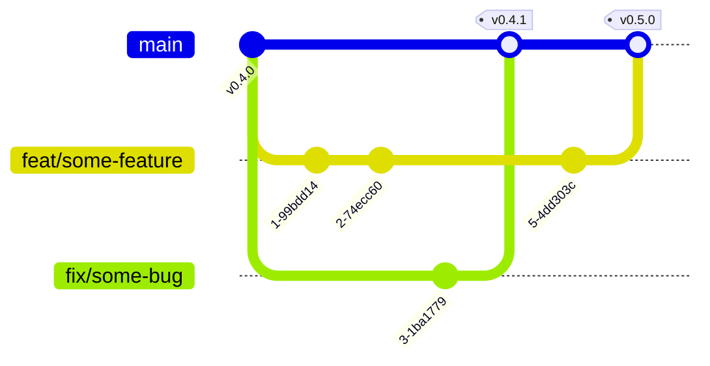

# Contributing to Methane Detection

After cloning, read this before touching anything — this repo runs **two isolated
Python environments** and one **never-edit** rule that shapes most of `src/`.

*Commit using [Conventional Commits](https://www.conventionalcommits.org/en/v1.0.0/) —
this repo's release automation (python-semantic-release) parses your commit type
directly into version bumps and `CHANGELOG.md` entries.*

## Development

### Environments

- **Baseline env** (`vendor/starcop/.venv`, Python 3.10, torch 1.13.1) — the
  original STARCOP stack, reference-only.
- **Research env** (`.venv`, Python 3.12, torch ≥2.5) — active development;
  where the actual thesis solution is built.
- **No separate third environment** — `hls4ml`/Vitis AI on-board-deployment
  work (see the MkDocs site's roadmap) requires Linux and does not support
  Windows/macOS natively, but folds into whichever Linux setup D-07 resolves
  to rather than a dedicated environment.

```bash
# Clone (includes STARCOP submodule)
git clone --recurse-submodules https://github.com/douglas-martins/methane-detection
# or, if you already cloned without --recurse-submodules:
git submodule update --init

# Baseline env — STARCOP original
cd vendor/starcop
uv venv --python 3.10
uv pip install -r requirements.txt
uv pip install -e .
cd ../..

# Research env — MLOps project
uv venv --python 3.12
uv sync
```

### Scripts

| Command | What it does |
|---|---|
| `make test-baseline` | Run the baseline env suite |
| `make test-research` | Run the research env suite |
| `make test` | Run both suites (`test-baseline` + `test-research`) |
| `make coverage` / `make coverage-research` | Run with coverage, write junit + coverage XML |
| `make badges` / `make badges-research` | Regenerate `docs/badges/*.svg` |
| `make lint` | `ruff check` + `ruff format --check` (research env) |
| `make docstring-coverage` | `interrogate` docstring-coverage check (research env) |
| `make test-scripts` | Run the `bats` suite for `scripts/` in Docker |
| `make docs-serve` | Serve the MkDocs site locally |
| `make docs-build` | Build the MkDocs site (`--strict`) |

### Testing conventions

- **Test-first (RED → GREEN → REFACTOR)** — this repo's established pattern for
  every non-trivial change.
- **Real fixtures over mocks** — prefer a real tmp-path DVC repo, a real tiny
  GeoTIFF, a real sqlite-backed MLflow store over `Mock()`/interaction checks.
  Fakes (small hand-written stand-ins exposing only the used surface) are fine;
  broad mocking is not.
- Tests live in `__tests__/` folders next to the module they cover; shared
  fixtures in the root `conftest.py`.

### Mutation testing (rolling out)

> [!NOTE]
> This gate is rolling out module by module, not repo-wide yet — no
> `make mutation-*` target exists until the first module lands.

Coverage proves a line executed, not that a test would catch a change to it.
This repo is layering [mutmut](https://mutmut.readthedocs.io/) mutation
testing on top of the existing coverage gates: mutmut mutates the source
(flips a comparison, changes a constant, drops a statement) and reruns the
tests, and any mutant that survives is a behavior change nothing would have
caught. Once a module is added to `[tool.mutmut] only_mutate` in
`pyproject.toml`, every surviving mutant in it must be killed with a
new/stronger test or explicitly justified (`# pragma: no mutate` or a
`do_not_mutate` entry with a one-line reason) — never left unexplained, and
the gate's scope or settings are never weakened just to make it pass. See
[`AGENTS.md`](AGENTS.md) for the agent-facing rule and procedure.

## Architecture

> [!IMPORTANT]
> **`vendor/starcop/` is never edited — not even transiently, not even to write a
> test.** It's a pinned git submodule. Everything that needs to change STARCOP's
> behavior does it from outside: subclassing, runtime attribute overrides, or
> `types.MethodType` monkeypatching on one instance. See the Pipeline Overview
> page on the [documentation site](https://douglas-martins.github.io/methane-detection/)
> for the full rationale (once that page's content lands).

- No `__init__.py` in `src/` — flat import convention throughout.
- `_vendor_starcop*.py` seam modules are the only files allowed to configure the
  upstream checkout on `sys.path`; each consuming directory has its own uniquely
  named seam.
- Read [`src/README.md`](src/README.md) for the complete ownership map. In short:
  project-owned STARCOP integration lives under `src/baselines/starcop/`, reusable
  MLflow/DVC/registry/drift helpers remain in top-level shared directories,
  independent models belong under `src/models/<candidate>/`, and cross-model
  reports belong under `src/comparison/`.
- `src/serving/` contains shared drift statistics only; the BentoML inference
  service is baseline-owned at `src/baselines/starcop/serving/`.

## Documentation

- **Public docs** (`docs/`, published via MkDocs to
  [GitHub Pages](https://douglas-martins.github.io/methane-detection/)) —
  architecture, methodology, dataset, results, model registry policy. Stable,
  reader-facing only.
- **Internal docs** (`internal-docs/`) — implementation journal, decision log,
  credentials-adjacent setup guides, runbooks, and the live model-experiments
  tracker. Not published, but not secret — it's a curation boundary, not an
  access-control one.
- Use GitHub-style alerts (`[!NOTE]`, `[!TIP]`, `[!IMPORTANT]`, `[!WARNING]`,
  `[!CAUTION]`) and Mermaid diagrams where they clarify structure or flow.

To preview docs locally: `make docs-serve`.

## Opening a Pull Request

This is a small research/thesis project on **trunk-based development against a
single long-lived branch, `main`** — no `alpha`/`beta` release channels (there's
no published package with pre-release consumers). Branch from `main`, PR back to
`main`, delete the branch after merge.



- `main` is protected against direct pushes — always PR, and at least one
  approving review is required before merge.
- CI (`lint.yml`, `tests.yml`, `scripts-tests.yml`, `commitlint.yml`) must pass,
  and all review conversations must be resolved, before merge.
- On merge, `release.yml` (python-semantic-release) computes the version bump
  from Conventional Commit types (`feat`→minor, `fix`/`perf`→patch), regenerates
  `CHANGELOG.md`, tags, and publishes a GitHub Release — automatically, no
  manual version bookkeeping.

## Publishing

The documentation site (`docs.yml` → GitHub Pages) publishes automatically from
`main`. Application deployment is deliberately separate: `.github/workflows/cd.yml`
runs only through an explicit `workflow_dispatch`, then builds and pushes the Bento
image and calls the Coolify deploy webhook. A merge or semantic-release tag does
not authorize or trigger application deployment.
