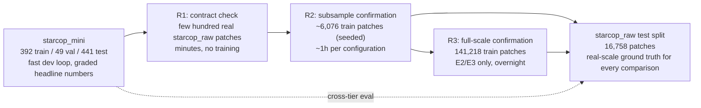
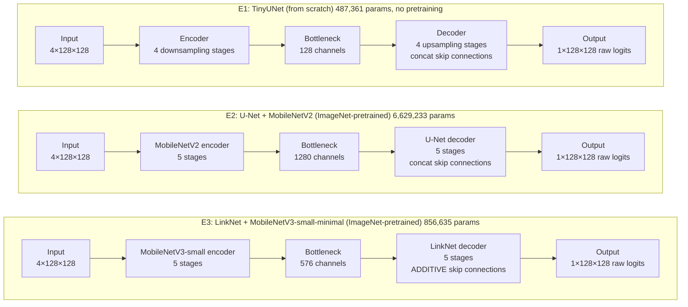
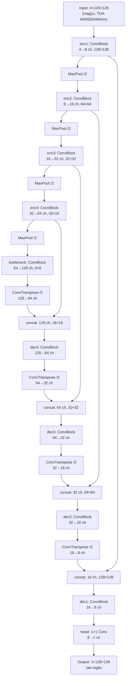
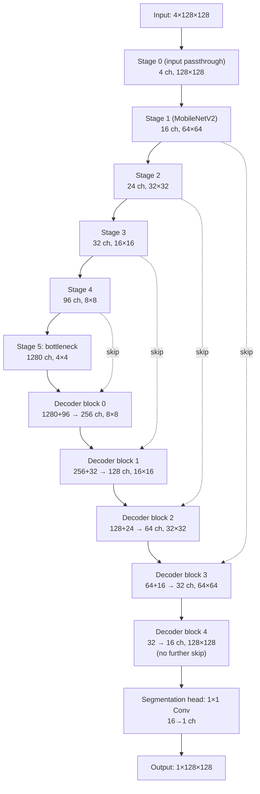
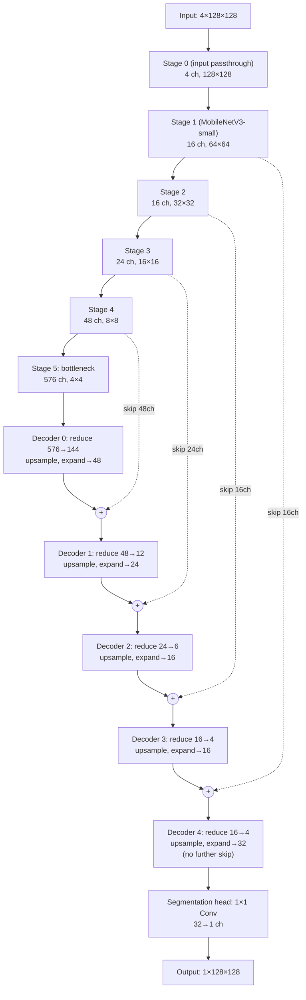
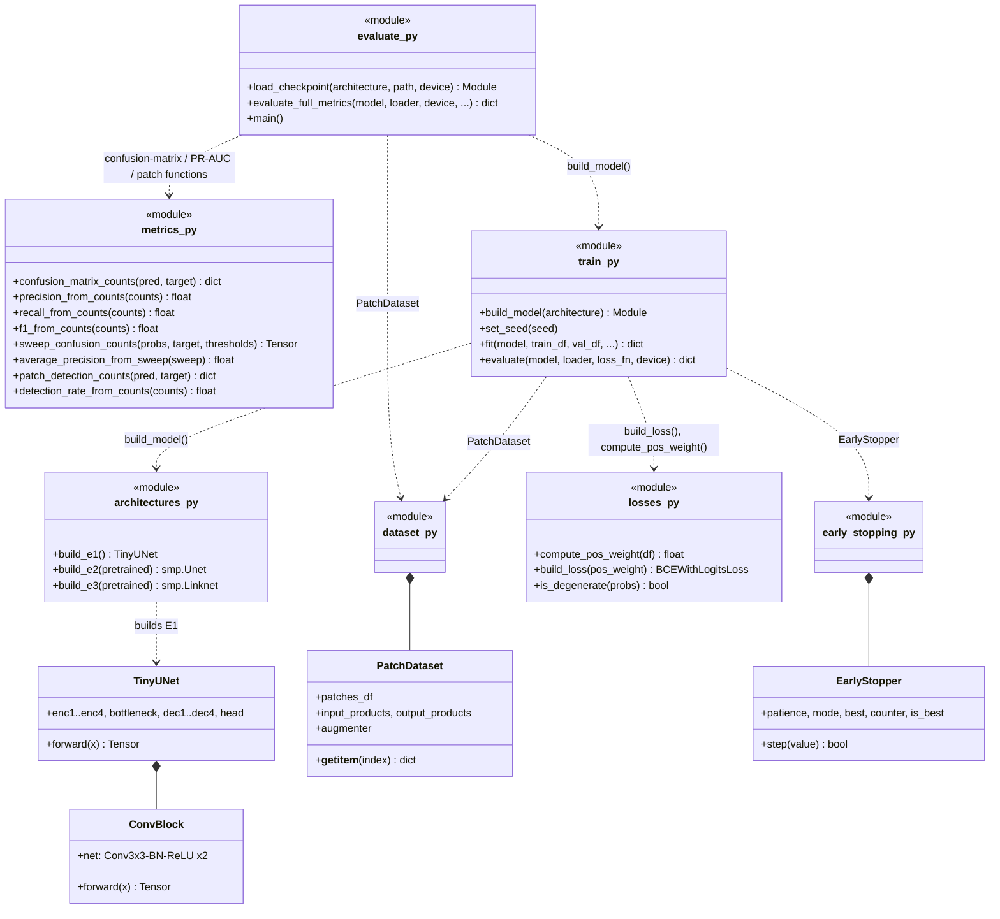
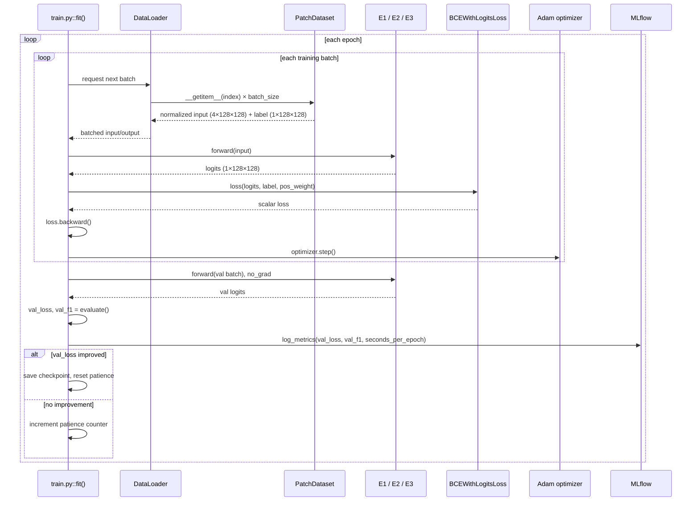
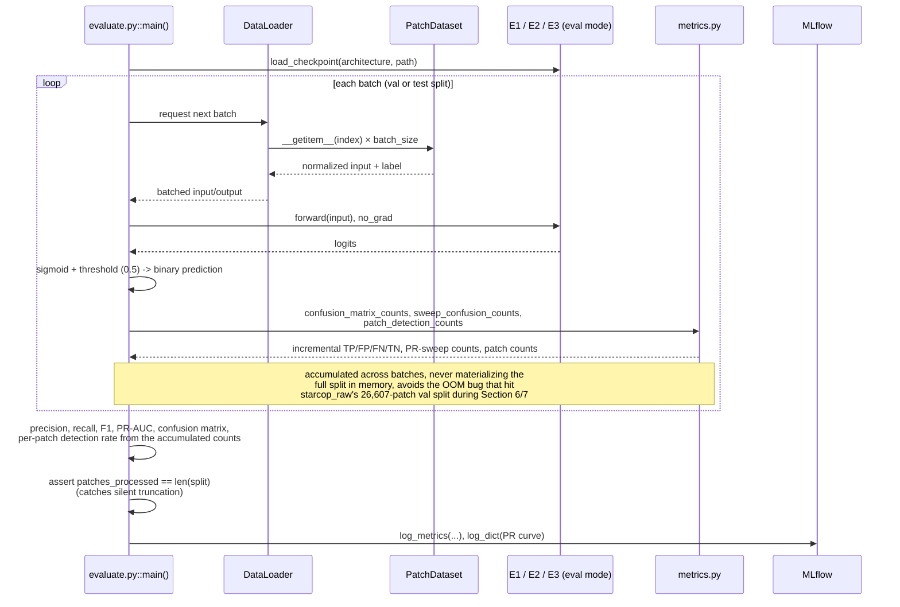
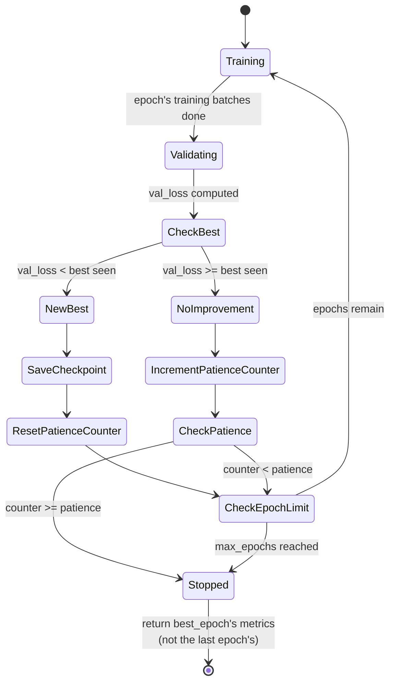

# First run: Architecture & Results 

## 0. Glossary

| Term | Meaning |
| --- | --- |
| **E1** | `TinyUNet`: a small U-Net built from scratch for this course project, no pretraining. |
| **E2** | U-Net decoder + **MobileNetV2** encoder, ImageNet-pretrained the existing STARCOP baseline architecture. |
| **E3** | LinkNet decoder + **MobileNetV3-small-minimal** encoder, ImageNet-pretrained a much smaller candidate (reproduced from Herec et al.'s on-board methane detection work). |
| **`starcop_mini`** (**mini** tier) | Small, curated subset of STARCOP (392 train / 49 val / 441 test patches) fast iteration loop, source of the graded headline comparison. |
| **`starcop_raw`** | The full STARCOP dataset (141,218 train / 26,607 val / 16,758 test patches) used to confirm mini-scale conclusions hold at real scale. |
| **R1** | *Contract confirmation*: does the code run correctly on real `starcop_raw` data (shapes, dtypes, no OOM)? Minutes, no training. |
| **R2** | *Subsample confirmation*: E1/E2/E3 trained on a seeded ~6,076-patch subsample of `starcop_raw`'s train split. |
| **R3** | *Full-scale confirmation*: E2/E3 trained on `starcop_raw`'s entire 141,218-patch train split (E1 skipped, least informative, by design). |
| **PR-AUC** | Area under the Precision-Recall curve, computed over a 101-point decision-threshold sweep, threshold-independent, unlike a single Precision/Recall/F1 number at a fixed cutoff. |
| **`pos_weight`** | Background:positive pixel ratio fed into the loss (`BCEWithLogitsLoss`) to counter class imbalance, differs per tier since imbalance itself differs (mini ≈87, R2 ≈270, R3 ≈314). |
| **"Detected at all"** | Per-patch metric: among patches with ≥1 true methane pixel, how many got ≥1 predicted positive pixel, a coarser, "did it notice anything" companion to the pixel-level metrics. |
| **TOA** | Top-Of-Atmosphere reflectance the satellite/airborne sensor's raw calibrated measurement, before atmospheric correction. |
| **`mag1c`** | A physically-derived methane concentration-enhancement product one of this project's 4 input channels, not a raw reflectance band. |

## 1. Domain context: STARCOP and `mag1c`

**STARCOP** (Růžička et al., 2023, *Scientific Reports*) is a benchmark for
automated detection of methane point-source plumes from airborne
imaging-spectrometer data (AVIRIS-NG overflights). The task this project
tackles is **per-pixel binary segmentation**: for each pixel of a
128×128 patch, does it show part of a methane plume?

Each scene provides several candidate input products; this project uses
**4 as the model's input channels**:

- **`mag1c`**: a matched-filter-family algorithm (alongside classical
  alternatives like MF/CEM/ACE) that estimates a per-pixel methane
  concentration-enhancement signal directly from the spectrometer's
  spectral bands, *before* any learning happens. It's a
  physically-motivated feature, not a raw reflectance value, and by far
  the single strongest predictor of plume location, but it can be noisy
  or miss real plumes on its own.
- **`TOA_AVIRIS_640/550/460nm`**: three visible-wavelength reflectance
  bands, standing in for a simple RGB-like composite. These give the
  model context to reject false positives that the `mag1c` signal alone
  can't distinguish (e.g. certain bright/dark surfaces that confuse the
  matched filter).

All three architectures compared here (E1/E2/E3) take the **same
4-channel input contract** and produce a **single-channel raw-logit
output** (sigmoid + a 0.5 decision threshold applied downstream, for the
headline numbers), the input/output shape is held fixed; what differs is
everything in between.

## 2. Project scope, in one picture

> [!NOTE]
> `starcop_mini` develops and produces the graded numbers; `starcop_raw` is
> used throughout as a confirmation dataset, at three increasing levels of
> rigor:

## 3. Architectures: macro comparison

> [!IMPORTANT]
> The one structural difference worth remembering: E1/E2 merge encoder
> skip connections by **concatenation** (U-Net style); E3 merges them by
> **addition** (LinkNet style) cheaper, and part of why E3's decoder is
> so much smaller relative to its encoder.

## 4. Architectures: micro view (real, code-verified structure)

### 4.1 E1: TinyUNet

Every block is a `_ConvBlock` = two (Conv3×3 → BatchNorm → ReLU) layers
(`architectures.py`). Built entirely from scratch, no pretrained weights
anywhere in this graph.

### 4.2 E2: U-Net + MobileNetV2

Encoder/decoder channel counts read directly from the instantiated model
(`build_e2().encoder.out_channels` / `.decoder.blocks`), not estimated.

### 4.3 E3: LinkNet + MobileNetV3-small-minimal

Same verification approach. Note the **additive** merge (`+`) instead of
`concat`, LinkNet's decoder blocks are 1×1-reduce → transpose-conv
upsample → 1×1-expand, then add the same-resolution encoder skip.

**Why E3's total param count (856,635) sits between E1 and E2, despite the
smallest encoder**: its decoder+head (427,603 params) is almost exactly
balanced with its encoder (429,032) LinkNet's additive, narrow decoder
is cheap. E2's decoder+head alone (4,405,073 params) is **~2× its own
encoder** (2,224,160) and **~5× E3's entire decoder**, U-Net's
concatenative decoder is the expensive half of that architecture, not the
pretrained encoder.

## 5. Code structure

## 6. Data flow

### 6.1 Training (`train.py::fit`)

### 6.2 Inference / evaluation (`evaluate.py::main`)

> [!IMPORTANT]
> No backward pass, no gradients here the key structural difference.
> This is also where the GPU-vs-CPU throughput numbers in
> [Section 9.5](#95-gpu-vs-cpu-inference-throughput) come from: timing
> wraps this whole loop (data loading + forward + metric accumulation),
> matching how `wall_clock_seconds` is already defined for training in
> [Section 6.1](#61-training-trainpyfit).

## 8. Training loop as a state machine (`EarlyStopper`)

> [!NOTE]
> `patience=10` for every configuration/tier, the one hyperparameter held
> fixed everywhere, so no configuration gets an unfair extra-patience
> advantage. Only the epoch cap and learning rate are allowed to differ
> (E1: 1e-3 from scratch; E2/E3: 1e-4 fine-tuning a pretrained encoder)
> both differences are principled (fine-tuning warrants a smaller LR), not
> ad hoc tuning per configuration.

## 9. Results

### 9.1 Architecture summary

| Config | Full name | Params | Encoder | Params vs. E1 |
| --- | --- | ---: | --- | ---: |
| **E1** | TinyUNet | 487,361 | none (from scratch) | 1.0× (baseline) |
| **E2** | U-Net + MobileNetV2 | 6,629,233 | ImageNet-pretrained | 13.6× |
| **E3** | LinkNet + MobileNetV3-small-minimal | 856,635 | ImageNet-pretrained | 1.76× |

### 9.2 `mini` tier: val and test (graded headline comparison)

| Config | Split | Precision | Recall | F1 | PR-AUC | Detected patches |
| --- | --- | ---: | ---: | ---: | ---: | ---: |
| E1 | val (49) | **0.4569** | **1.0000** | **0.6272** | **0.8599** | 9/9 |
| E1 | test (441) | **0.9328** | 0.6960 | **0.7972** | **0.8314** | 113/125 |
| E2 | val (49) | 0.1878 | 0.9954 | 0.3160 | 0.6170 | 9/9 |
| E2 | test (441) | 0.6811 | 0.8165 | 0.7427 | 0.8031 | 115/125 |
| E3 | val (49) | 0.0098 | 0.9969 | 0.0194 | 0.7196 | 9/9 |
| E3 | test (441) | 0.1925 | **0.9296** | 0.3190 | 0.6766 | **125/125** |

*Bold = best in its column, compared within the same split (val vs. test
compared separately different scale, not a fair cross-comparison). Val's
"Detected patches" is a 3-way tie (9/9 for all three) not bolded, since
nothing wins there. E1 sweeps every val column; on test, E1 still leads
Precision/F1/PR-AUC but E3 takes Recall and detects every positive patch.*

### 9.3 Cross-tier: `mini`-trained checkpoints scored on `starcop_raw`'s real test split (16,758 patches)

| Config | Precision | Recall | F1 | PR-AUC | Detected patches |
| --- | ---: | ---: | ---: | ---: | ---: |
| E1 | **0.7247** | 0.3816 | **0.5000** | **0.4835** | 966/1,706 |
| E2 | 0.5071 | 0.4664 | 0.4859 | 0.3997 | 936/1,706 |
| E3 | 0.0369 | **0.8253** | 0.0706 | 0.2562 | **1,706/1,706** |

*Bold = best per column across all three rows (same split for all three,
so directly comparable).*

E1 > E2 > E3 by F1: **same ordering as `mini`'s own test split**
([Section 9.2](#92-mini-tier-val-and-test-graded-headline-comparison)),
despite training on a completely different, much smaller dataset.

### 9.4 `raw` tier: R2/R3, on `starcop_raw`'s real test split (16,758 patches)

| Config | Tier | Precision | Recall | F1 | PR-AUC | Detected patches |
| --- | --- | ---: | ---: | ---: | ---: | ---: |
| E1 | R2 (6,076 train patches) | 0.0823 | 0.9770 | 0.1518 | 0.2610 | 1,668/1,706 |
| E2 | R2 | 0.0614 | **0.9847** | 0.1156 | 0.1783 | 1,636/1,706 |
| E3 | R2 | 0.0895 | 0.9594 | 0.1637 | 0.2968 | **1,686/1,706** |
| E2 | R3 (141,218 train patches) | **0.1524** | 0.9739 | **0.2636** | **0.4445** | 1,671/1,706 |
| E3 | R3 | 0.1302 | 0.9826 | 0.2300 | 0.4389 | 1,684/1,706 |

*Bold = best per column across all five rows (same split throughout, R2
and R3 directly comparable).* E2-R3 takes Precision/F1/PR-AUC, E2-R2 edges
out Recall, and E3-R2 edges out detection rate, individual columns are
close, but:

> [!IMPORTANT]
> **R3 clearly beats R2 as a group** on the identical test split (E2's F1
> more than doubles: 0.1156 → 0.2636) the cleanest "more real training
> data helps" evidence produced this session.

> [!WARNING]
> All five rows above are precision ≤0.15 with recall ≥0.96, read at
> face value, that looks like every `raw`-trained model badly
> over-predicts. It's largely a **threshold-calibration artifact, not a
> quality gap**: `pos_weight` (the loss's imbalance correction) scales
> hard with tier, mini≈87, R2≈270, R3≈314 ([Section 0](#0-glossary)), so
> the fixed 0.5 decision threshold stops being well-calibrated for models
> trained under a much larger `pos_weight`. PR-AUC (threshold-independent)
> tells a fairer story here than this table's fixed-threshold columns
> alone, see the PR curve discussion in
> [Section 9.5](#95-gpu-vs-cpu-inference-throughput) for the same effect,
> visualized.

### 9.5 GPU vs. CPU inference throughput

Same checkpoints, same `num_workers=4` data-loading config, only
`device` varied. Classification metrics matched to 3-4 decimals between
GPU/CPU runs; only speed differs.

| Config | Scale | GPU (patches/s) | CPU (patches/s) | Speedup |
| --- | --- | ---: | ---: | ---: |
| E1 | mini test (441) | 212.4 | 76.5 | 2.78× |
| E2 | mini test (441) | **217.3** | 47.4 | **4.59×** |
| E3 | mini test (441) | 215.9 | **78.1** | 2.76× |
| E1 | raw test (16,758) | **224.9** | 78.6 | 2.86× |
| E2 | raw test (16,758) | 223.8 | 48.5 | **4.62×** |
| E3 | raw test (16,758) | 224.1 | **83.9** | 2.67× |

*Bold = best per column, compared within the same scale (mini vs. raw
rows compared separately). "Best speedup" here just marks the largest
GPU/CPU ratio E2, the biggest model, benefits most because it's the
least I/O-bound of the three.*

**GPU throughput is nearly identical across all three architectures**
(~212-225 patches/s) despite a 13.6× spread in parameter count, the GPU
runs are **I/O-bound** (limited by data loading), not compute-bound. CPU
throughput, by contrast, clearly tracks model size: E2 is ~1.6-1.7×
slower than E1/E3 on CPU.

> [!CAUTION]
> Don't read the "Speedup" column above as a FLOPs/compute-efficiency
> comparison, it mostly measures "how much the GPU hides compute behind
> I/O" for each architecture, not raw arithmetic throughput. Because GPU
> time here is dominated by `num_workers=4` data loading rather than the
> model itself, E2's higher speedup (~4.6×) reflects it having the *most*
> compute to hide, not the GPU handling it more efficiently than E1/E3's
> compute. A `num_workers=0` "pure compute" rerun would isolate the real
> per-architecture GPU/CPU gap, uncontaminated by I/O.

### 9.6 Everything on one line per configuration

| Config | Params | Best test F1 (mini) | Best test PR-AUC (mini) | GPU throughput (raw) | CPU throughput (raw) |
| --- | ---: | ---: | ---: | ---: | ---: |
| E1: TinyUNet | 487,361 | 0.7972 | 0.8314 | 224.9 p/s | 78.6 p/s |
| E2: U-Net + MobileNetV2 | 6,629,233 | 0.7427 | 0.8031 | 223.8 p/s | 48.5 p/s |
| E3: LinkNet + MobileNetV3-small | 856,635 | 0.3190 | 0.6766 | 224.1 p/s | 83.9 p/s |

## 10. Key findings, condensed

- **PR-AUC vs. fixed-threshold F1 tell different stories.** At threshold
  0.5, `raw`-trained models (R2/R3) show high recall / low precision
  (`pos_weight` scales hard with tier: mini≈87, R2≈270, R3≈314) PR-AUC
  (threshold-independent) is the fairer comparison across tiers
  ([Section 9.4](#94-raw-tier-r2r3-on-starcop_raws-real-test-split-16758-patches)).
- **R3 ≫ R2 on the same real test split**: more real training data
  measurably helps, and R2's own small/curated val split had understated
  how poorly it generalizes
  ([Section 9.4](#94-raw-tier-r2r3-on-starcop_raws-real-test-split-16758-patches)).
- **The mini-tier F1 ordering (E1 > E2 > E3) survives cross-tier
  evaluation** on a completely different, much larger dataset
  ([Section 9.3](#93-cross-tier-mini-trained-checkpoints-scored-on-starcop_raws-real-test-split-16758-patches)),
  real evidence the small-scale comparison isn't purely a data-size
  artifact.
- **E3 "detects" every positive patch at raw scale (1,706/1,706) only
  because it over-triggers almost everywhere** (FP=15.1M vs. TP=579K,
  cross-tier), "detects at all" and "detects precisely" are different
  claims
  ([Section 9.3](#93-cross-tier-mini-trained-checkpoints-scored-on-starcop_raws-real-test-split-16758-patches)
  / [9.4](#94-raw-tier-r2r3-on-starcop_raws-real-test-split-16758-patches)).
- **GPU inference is I/O-bound at this patch/model scale**: near-equal
  throughput across a 13.6× parameter-count spread on GPU, but clearly
  compute-bound on CPU
  ([Section 9.5](#95-gpu-vs-cpu-inference-throughput)). A pure-compute
  (`num_workers=0`) variant would isolate the real per-architecture GPU speedup further, if useful
  later.
