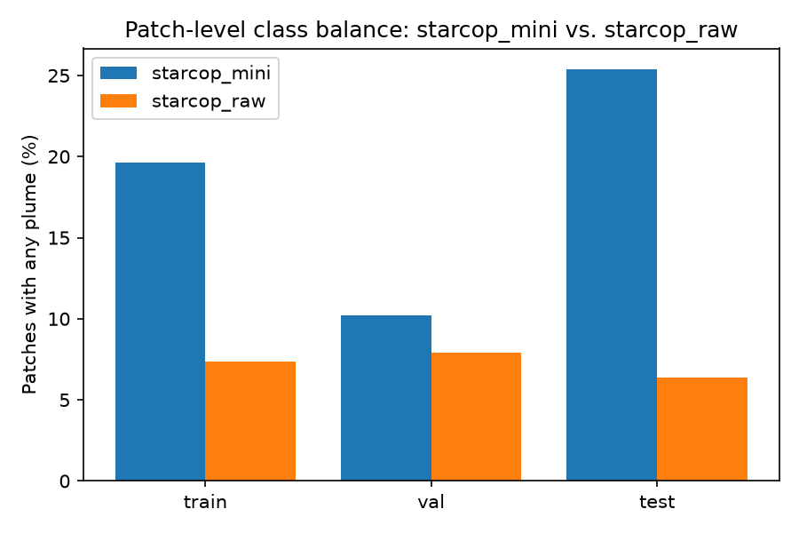
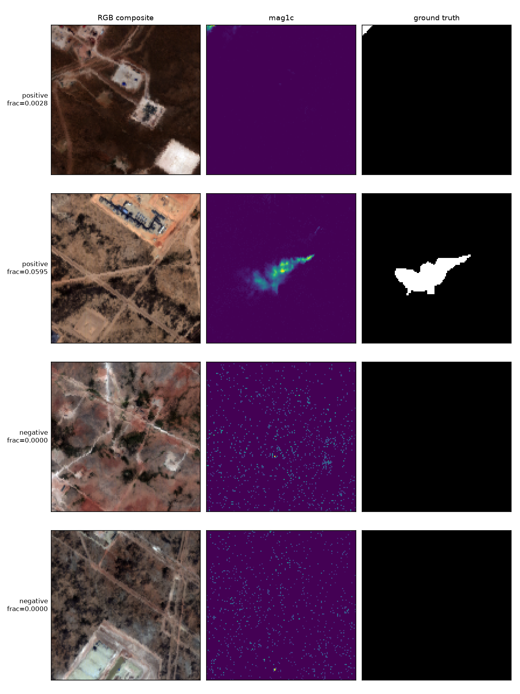
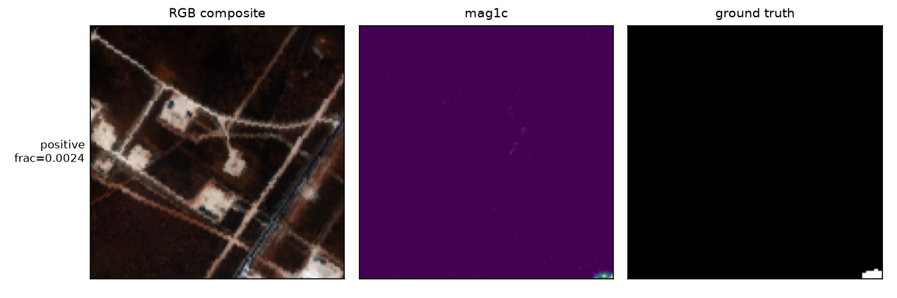

# Detecção de Plumas de Metano por Segmentação Semântica

> Relatório técnico — *Aprendizado Profundo*, PPGCA, Universidade do Vale
> do Itajaí. Professor: Felipe Viel — Período: 2026/2.
>
> Estrutura conforme a Seção 14 do PDF do curso. Cada seção abaixo é
> escrita à medida que a etapa correspondente do plano de trabalho
> (`dl-course-final-project-plan.md`, raiz do repositório) é concluída;
> seções ainda não escritas estão marcadas como **(pendente)**.

## Introdução

*(pendente — Seção 1 do plano)*

## Contextualização

*(pendente — Seção 1 do plano)*

## Definição do problema

*(pendente — Seção 1 do plano)*

## Dataset

Este projeto utiliza o dataset STARCOP (Růžička et al., 2023) — um
conjunto de dados aéreos/hiperespectrais anotado para detecção de plumas
de metano, coletado pelo sensor AVIRIS-NG durante o levantamento de 2019
sobre a Bacia do Permiano (oeste do Texas e sudeste do Novo México,
EUA). O uso deste dataset, fora dos quatro modelos-padrão do curso, foi
previamente aprovado pelo professor (PDF, Seção 4).

### Duas camadas (tiers) do mesmo dataset

O dataset é utilizado em duas escalas distintas, cada uma com um papel
diferente neste projeto:

- **`starcop_mini`** — um subconjunto curado de 18 cenas (392/49/441
  patches de treino/validação/teste, 128×128 pixels), usado para
  desenvolver a implementação e treinar a comparação de três
  configurações que é o entregável avaliado do curso. Seu tamanho é
  compatível com a restrição de custo computacional do curso (PDF, Seção
  12.1) para um projeto de dificuldade média.
- **`starcop_raw`** — o dataset completo, 3.767 cenas (141.218/26.607/
  16.758 patches de treino/validação/teste). Não é usado para o
  treinamento avaliado do curso, mas serve para confirmar, sobre dados
  reais em escala completa, que (a) o código implementado funciona
  corretamente fora do subconjunto pequeno e (b) as conclusões obtidas em
  `starcop_mini` se sustentam quando o volume de dados aumenta de 10 a
  25 vezes.

Ambos os conjuntos foram processados pelo mesmo pipeline determinístico
(normalização → divisão treino/validação/teste com isolamento por cena →
extração de patches 128×128 com sobreposição de 64 pixels), e suas
divisões nunca compartilham cenas de origem entre treino, validação e
teste — verificado diretamente sobre os manifestos de divisão gerados
(não apenas assumido a partir da configuração).

### Origem, coleta e rotulagem

A origem, o processo de coleta, o esquema de rotulagem e as limitações
conhecidas do dataset já estão documentados em detalhe em
[`docs/dataset_report.md`](../../docs/dataset_report.md) (relatório
gerado diretamente a partir do pipeline de dados deste repositório, para
ambas as camadas lado a lado). Este relatório técnico cita esse documento
em vez de duplicar suas estatísticas.

Resumo essencial:

- **Variável-alvo**: máscara binária por pixel indicando presença (1) ou
  ausência (0) de pluma de metano, para cada patch de 128×128 pixels.
- **Entrada**: 4 canais por patch — `mag1c` (produto de detecção de
  concentração de metano, específico do algoritmo do STARCOP) mais 3
  bandas de refletância TOA (*top-of-atmosphere*) do AVIRIS-NG (640 nm,
  550 nm, 460 nm).
- **Sensor**: 100% AVIRIS-NG em ambas as camadas — não há dados do sensor
  EMIT neste dataset de treino (EMIT aparece apenas em uma demonstração
  separada de generalização *zero-shot* do STARCOP, fora do escopo deste
  projeto).
- **Cobertura geográfica**: inteiramente dentro da Bacia do Permiano;
  `starcop_mini` cobre 18 cenas nessa região, `starcop_raw` cobre 3.767
  cenas na mesma região (mais abrangente, não uma região diferente).

### Privacidade

Não há questões de privacidade: trata-se de sensoriamento remoto
aéreo/orbital sobre uma região geográfica (Bacia do Permiano), sem
qualquer dado pessoal ou identificável envolvido.

### Licença e proveniência

O dataset STARCOP está hospedado no Zenodo
([DOI 10.5281/zenodo.7863343](https://doi.org/10.5281/zenodo.7863343)),
sob a licença **CC-BY-NC-4.0** (Creative Commons
Atribuição-NãoComercial 4.0 Internacional) — uso permitido mediante
atribuição, exclusivamente para fins não comerciais. Essa condição é
compatível com o uso acadêmico deste projeto. Esta licença é a licença
*do dataset*, distinta da licença MIT do código deste repositório
(`pyproject.toml`).

### Verificação de isolamento entre divisões

Além do isolamento garantido pelo próprio estágio de divisão (nenhuma
cena aparece em mais de um split), foi verificado explicitamente que:

- As 9 cenas de treino e as 9 cenas de teste de `starcop_mini` são
  subconjuntos das cenas de treino e teste de `starcop_raw`,
  respectivamente, sem sobreposição cruzada entre splits.
- Nenhuma das 9 cenas de treino de `starcop_mini` cai na divisão de
  validação de `starcop_raw` (relevante para a amostra de confirmação
  usada na Seção de Metodologia).
- As divisões de treino e teste de `starcop_raw` não compartilham
  nenhuma das suas 256/44 linhas de voo (*flightlines*) de origem —
  o isolamento vale tanto no nível de cena quanto no nível de sobrevoo.

## Análise exploratória

### Desbalanceamento de classes

O desbalanceamento por pixel já está documentado em
[`docs/dataset_report.md`](../../docs/dataset_report.md) §4: apenas
**1,13%** dos pixels de `starcop_mini` (treino) são positivos (metano),
contra **0,32%** em `starcop_raw` — uma razão de desbalanceamento de
~87:1 em `starcop_mini` e ~314:1 em `starcop_raw`.

Esse desbalanceamento também aparece em nível de *patch* (ao menos um
pixel positivo no patch inteiro), uma métrica que não existe em
`docs/dataset_report.md` e foi computada especificamente para este
projeto (`coursework/dl-final-project/eda.py`,
`compute_patch_level_balance`):



| Split | `starcop_mini` | `starcop_raw` |
| --- | ---: | ---: |
| train | 19,64% (77/392) | 7,37% (10.406/141.218) |
| val | 10,20% (5/49) | 7,91% (2.104/26.607) |
| test | 25,40% (112/441) | 6,37% (1.067/16.758) |

Em ambas as métricas (pixel e patch), `starcop_mini` superrepresenta
exemplos com pluma em relação a `starcop_raw` — consistente com sua
curadoria em torno de cenas com plumas visíveis. Isso é tratado como
limitação explícita na seção de Discussão.

### Estatísticas por banda

As estatísticas por banda (`mag1c` e as três bandas de refletância TOA)
já estão em `docs/dataset_report.md` §5, reproduzidas neste projeto de
forma idêntica (bit-a-bit) ao reexecutar o mesmo pipeline DVC. A nota já
registrada naquele documento sobre o valor máximo de `mag1c` em
`starcop_raw` (exatamente 100000, um valor-sentinela do próprio
algoritmo `mag1c`, não um dado corrompido) permanece válida — o
`DataNormalizer` do STARCOP já realiza `clamp` desse valor em tempo de
treino.

### Exemplos qualitativos

Quatro patches de `starcop_mini` (dois positivos, dois negativos) e um
patch adicional de `starcop_raw`, cada um mostrando a composição RGB
(bandas TOA 640/550/460 nm), o mapa de calor `mag1c` e a máscara de
verdade de campo lado a lado:





O primeiro exemplo positivo (`frac_positives=0,0028`) é um caso
propositalmente difícil/ambíguo — uma pluma pequena e fraca, visível
apenas como um leve sinal no canto do mapa `mag1c` e uma máscara de
verdade de campo minúscula — incluído deliberadamente ao lado de um caso
positivo claro (`frac_positives=0,0595`), não apenas casos limpos.

### Problemas de dados identificados (checklist da Seção 6.3 do PDF)

- **Desbalanceamento de classes**: sim — ver acima (~87:1 a ~314:1,
  dependendo da camada).
- **Tamanho amostral limitado**: sim — `starcop_mini` tem apenas 392
  patches de treino.
- **Diferenças de escala entre canais**: sim — `mag1c` (média ≈ 36–112,
  desvio-padrão ≈ 310–542, dependendo da camada) tem escala muito maior
  que as bandas de refletância TOA (média ≈ 25–31, desvio-padrão ≈
  13–24) — ver `docs/dataset_report.md` §5. Isso motiva o contrato de
  normalização por banda descrito na próxima seção.

**Reprodutibilidade**: todas as figuras e números desta seção são
gerados por `coursework/dl-final-project/eda.py`
(`.venv/bin/python coursework/dl-final-project/eda.py`), com testes em
`coursework/dl-final-project/__tests__/test_eda.py`.

## Pré-processamento

### Contrato de normalização

Reutilizado exatamente da própria convenção do STARCOP — constantes
fixas, não ajustadas ao conjunto de treino deste projeto:

| Entrada | Offset | Fator | Recorte após escala |
| --- | ---: | ---: | ---: |
| `mag1c` | 0 | 1750 | [0, 2] |
| cada canal AVIRIS RGB | 0 | 60 | [0, 2] |

A máscara de verdade de campo (`labelbinary`) **não é normalizada** — não
possui entrada na tabela de normalização do STARCOP, então permanece como
0/1 bruto, verificado tanto no código-fonte do vendor
(`normalizer_module.py`) quanto por teste unitário próprio
(`coursework/dl-final-project/__tests__/test_dataset.py`).

**Ausência de vazamento de dados**: as constantes acima são fixas,
publicadas no próprio artigo do STARCOP — não foram ajustadas a partir do
split de treino deste projeto, em nenhuma das duas camadas. Não há,
portanto, risco de vazamento pela normalização.

### Dataloader parametrizado por dataset

`coursework/dl-final-project/dataset.py`'s `PatchDataset` recebe
`dataset={starcop_mini|starcop_raw}` desde a primeira versão — a lista de
bandas de entrada/saída vem diretamente de
`configs/dataset/<dataset>.yaml`, o mesmo arquivo que o pipeline DVC
compartilhado já usa, evitando qualquer duplicação que pudesse divergir.

### Aumento de dados (augmentation)

Aplicado apenas ao split de treino (E2/E3, não à baseline E1 — ver
próxima seção), usando `kornia.augmentation.AugmentationSequential` com
`data_keys=["image", "mask"]` — não `albumentations` como inicialmente
cogitado: `kornia` já era dependência deste repositório
(`pyproject.toml`), tornando a instalação de uma nova biblioteca
desnecessária. As transformações usadas são apenas geométricas —
espelhamento horizontal/vertical e rotações de 90° — deliberadamente sem
nenhuma transformação de cor/contraste, que distorceria os valores
fisicamente significativos de `mag1c`/refletância.

A sincronização entre imagem e máscara foi verificada por teste
dedicado: um pixel marcador extremo no canal `mag1c` e o único pixel
positivo da máscara, na mesma posição, permanecem coincidentes após 20
aplicações aleatórias da transformação.

### R1 — confirmação do pré-processamento contra dados reais

`coursework/dl-final-project/confirm_raw.py` executa o mesmo caminho de
código (normalização + dataloader) sobre uma amostra real e semeada de
`starcop_raw`, via `make coursework-confirm-raw`:

```text
R1 confirmation -- dataset=starcop_raw
  sampled 300 patches across 156 distinct scenes
  input_products (band order): ['mag1c', 'TOA_AVIRIS_640nm', 'TOA_AVIRIS_550nm', 'TOA_AVIRIS_460nm']
  expected patch size (configs/data.yaml): 128x128
  shapes/dtypes/ranges/band-order/label-passthrough: PASSED (300 patches)
  all-negative patches in sample: 264/300 (88.0%) -- informational
R1 PASSED
```

Nenhuma correção de código foi necessária — o mesmo `confirm_raw.py`
também passa sobre `starcop_mini`, confirmando que o loader funciona
identicamente em ambas as camadas. A fração de patches totalmente
negativos (~88% na amostra de `starcop_raw`) é reportada apenas como
informação de contexto para a estratégia de amostragem/perda das Seções
6–7, não como uma falha desta etapa.

**Reprodutibilidade**: `coursework/dl-final-project/preprocessing.py`
(normalização), `dataset.py` (loader) e `confirm_raw.py` (confirmação
R1), com testes em `__tests__/test_preprocessing.py` e
`__tests__/test_dataset.py` (24 testes, `make coursework-test`).

## Arquitetura

Todas as três configurações recebem a mesma entrada de 4 canais
(`mag1c` + 3 bandas TOA) e produzem um único canal de logits brutos
(128×128) — sem sigmoid aplicado no modelo; a função de perda
(`BCEWithLogitsLoss`) aplica a sigmoid internamente. Manter o contrato de
entrada/saída idêntico garante que as comparações sejam apenas de
arquitetura, não confundidas por diferenças de entrada.

| Exp. | Arquitetura | Encoder | Parâmetros (reais) | Pré-treinado? |
| --- | --- | --- | ---: | --- |
| **E1** | U-Net pequena, blocos conv simples | nenhum (do zero) | **487.361** | Não |
| **E2** | U-Net | MobileNetV2 | **6.629.233** | Sim (ImageNet) |
| **E3** | LinkNet | MobileNetV3-small-minimal | **856.635** | Sim (ImageNet) |

Contagens obtidas por soma direta de `model.parameters()`, não estimadas.

### E1 — linha de base do curso

U-Net clássica de 4 níveis, blocos conv simples (Conv3×3 + BatchNorm +
ReLU, duas vezes por nível), sem pré-treinamento, implementada do zero
(`coursework/dl-final-project/architectures.py::TinyUNet`). A largura
`base=8` foi escolhida deliberadamente para criar um espectro de três
tamanhos comparável: E1 (pequena, sem pré-treino) vs. E3 (pequena, com
pré-treino) isola o efeito do pré-treinamento numa escala equivalente,
enquanto E1 vs. E2 isola o efeito combinado de escala e pré-treinamento.

### E2 — U-Net + MobileNetV2

Implementação própria para este trabalho via `segmentation-models-pytorch`
(`Unet(encoder_name="mobilenet_v2", ...)`), **sem** importar
`vendor/starcop` ou `src/baselines/starcop/` — nenhum seam file
`_vendor_starcop*.py`, nenhum shim de compatibilidade do Lightning 2.x.
Mesma família de encoder do baseline STARCOP desta tese, mas uma
implementação nova, genuinamente treinada para este curso.

### E3 — LinkNet + MobileNetV3-small-minimal

Reproduzido de Herec et al. (2026, arXiv:2606.03675, hipótese H1.5 do
projeto de tese) — **treinado do zero em `starcop_mini` para este curso**,
não utilizando os pesos ONNX pré-treinados do pacote
`onboard-methane-detection` (licença dos pesos não verificada). Construído
via `Linknet(encoder_name="tu-tf_mobilenetv3_small_minimal_100", ...)` —
a ponte `tu-` do `segmentation-models-pytorch` para a biblioteca `timm`,
que hospeda exatamente a variante "minimal" do MobileNetV3-small que o
artigo usa (não existe um encoder `mobilenet_v3` nativo no
`segmentation-models-pytorch`, apenas via `timm`).

### Adaptação de entrada de 4 canais

E2 e E3 usam encoders pré-treinados em ImageNet (entrada de 3 canais
RGB), mas este projeto usa 4 canais. A adaptação é feita pelo
comportamento padrão do próprio `segmentation-models-pytorch`
(`patch_first_conv`, em `encoders/_utils.py`): os pesos do kernel
pré-treinado são **reaproveitados ciclicamente** entre os canais — o 4º
canal (`mag1c`) recebe uma cópia dos pesos do canal 0 (originalmente
"vermelho") — e o kernel inteiro é reescalado por 3/4 para preservar a
magnitude de ativação aproximada.

**Decisão de modelagem, documentada explicitamente**: esse comportamento
padrão foi mantido como está, não sobrescrito. É uma escolha discutível —
`mag1c` é uma grandeza física completamente distinta de um canal de cor
(uma estimativa de concentração por filtro casado, não refletância) — mas
é a prática comum em adaptações multibanda de encoders pré-treinados em
ImageNet, e ainda fornece uma inicialização estruturada em vez de ruído
puro para o canal `mag1c`. Uma alternativa mais criteriosa (reinicializar
apenas a primeira camada do zero) foi considerada e descartada por este
projeto, mas fica registrada aqui como uma limitação explícita, não uma
omissão.

### R1 — confirmação das arquiteturas contra dados reais

`coursework/dl-final-project/confirm_raw.py` (estendido nesta seção, não
reescrito — decisão já tomada na Seção 4) executa um *forward* e um
*backward* real para as três arquiteturas sobre um lote real de
`starcop_raw`:

```text
  architecture batch: (8, 4, 128, 128)
  E1: 487,361 params, loss=0.4662, all gradients present
  E2: 6,629,233 params, loss=0.5161, all gradients present
  E3: 856,635 params, loss=0.8231, all gradients present
```

As três arquiteturas produzem perda finita e gradiente em 100% dos
parâmetros sobre dados reais — não apenas um tensor sintético
`torch.randn`, que não haveria capturado um NaN vindo de `mag1c` real, um
erro de tipo, ou um lote inteiramente negativo.

**Reprodutibilidade**: `coursework/dl-final-project/architectures.py`,
testes em `__tests__/test_architectures.py` (8 testes).

## Metodologia

### Hiperparâmetros

| | E1 (do zero) | E2 / E3 (pré-treinados) |
| --- | --- | --- |
| Otimizador | Adam | Adam |
| Taxa de aprendizado | 1e-3 | 1e-4 |
| Tamanho de lote | 16 | 16 |
| Épocas máximas | 50 | 50 |
| Paciência (early stopping) | 10, monitorando `val_loss` | 10 |
| Perda | `BCEWithLogitsLoss(pos_weight=...)` | mesma |

`pos_weight` é calculado a partir da razão fundo:positivo real de cada
conjunto de treino efetivamente usado (não fixado por camada) —
`coursework/dl-final-project/losses.py::compute_pos_weight`, usando a
coluna `frac_positives` já produzida por `patch_extract.py`. Isso
reproduz exatamente os valores medidos na Seção 3 quando o treino é o
split completo de cada camada (87,27 para `starcop_mini`, 314,48 para
`starcop_raw`), e usa a proporção real do subconjunto quando é o caso
(R2, Seção 3 abaixo).

A taxa de aprendizado difere entre E1 e E2/E3 (1e-3 vs. 1e-4) —
não é uma violação da exigência de "manter tudo fixo entre camadas": a
Seção 7 do plano fixa hiperparâmetros **por modelo**, entre suas próprias
camadas (mini vs. R1/R2), não necessariamente entre modelos diferentes.
Usar uma taxa menor para encoders pré-treinados é prática padrão
(fine-tuning), não uma escolha arbitrária.

### Rastreamento com MLflow

**Correção de ambiente, não do plano original**: o MLflow instalado neste
ambiente (3.14.0) tornou o backend de arquivo simples (`file:./mlruns`)
somente-manutenção — ele agora lança uma exceção por padrão. Em vez do
`mlruns/` local descrito nas seções anteriores do plano, este projeto usa
um backend SQLite explícito
(`sqlite:///coursework/dl-final-project/mlflow.db`), verificado
funcionando sem avisos, e futuro-compatível (não depende de uma flag de
compatibilidade que o MLflow já sinaliza como "modo de manutenção").
A URI de rastreamento é explícita e escopada a este projeto — nunca
`file:./mlruns` relativo ao diretório de invocação, que colidiria com o
`mlruns/` já existente na raiz do repositório (dados reais de
rastreamento da tese).

### Versões de bibliotecas

Lidas diretamente dos parâmetros logados em `mlflow.db` (não retranscritas
de memória) — idênticas nas 8 execuções reais (E1/E2/E3 × mini/R2, E2/E3 ×
R3), já que todas rodaram na mesma máquina/ambiente:

| Biblioteca | Versão |
| --- | --- |
| `torch` | 2.12.1+cu130 |
| `segmentation-models-pytorch` | 0.5.0 |
| CUDA | 13.0 |
| GPU | NVIDIA GeForce RTX 5070 |

### Um bug real encontrado e corrigido antes de qualquer resultado ser aceito

A primeira versão de `evaluate()` (`train.py`) concatenava as predições
de **todo** o conjunto de validação em memória antes de calcular F1 —
inofensivo em `starcop_mini` (49 patches), mas estourou memória de GPU
(`CUDA out of memory`) ao validar sobre o split completo de
`starcop_raw` (26.607 patches). Corrigido para acumular
verdadeiro/falso positivo/negativo incrementalmente por lote — mesma
razão de design que `stats.py` já usa no pipeline principal (Seção 0.1):
memória O(1) por lote, não O(tamanho do conjunto). Um teste direto
(`__tests__/test_train.py::TestEvaluate`) trava esse comportamento.

Um segundo problema, de desempenho (não de corretude): o `DataLoader`
com `num_workers=0` recarrega cada patch do disco a cada época,
serialmente — medido em ~8s/época nos 392 patches de `starcop_mini`.
`num_workers=4` com `persistent_workers=True` (por loader, treino e
validação) reduz isso para ~1,5–2s/época. Usar `num_workers=8` por
loader (16 processos simultâneos) satura a CPU de 12 threads desta
máquina — verificado diretamente (uma execução que leva ~18s isolada
travou além de 200s com 16 processos concorrentes).

### R1 e R2 — mecânica de confirmação

R1 (Seção 0.1) é satisfeito por um treinamento-fumaça (*smoke*) de poucas
centenas de passos sobre `starcop_raw`, sem convergência esperada —
apenas para provar que o laço de treino, o checkpointing e o log MLflow
sobrevivem à escala real antes de qualquer orçamento de treino de fato
ser gasto. R2 usa os manifestos persistidos
(`coursework/dl-final-project/r2_manifest_{train,val}.csv`, gerados uma
única vez por `build_r2_manifest.py`, nunca regenerados por execução) —
10 linhas de voo amostradas (seed 42) de `starcop_raw`, 6.076 patches de
treino / 3.136 de validação.

**Limitação registrada explicitamente**: nenhuma semente aleatória fixa
foi definida para inicialização de pesos ou embaralhamento do
`DataLoader` nesta seção — a Seção 7 do plano é quem exige
explicitamente "fixar uma semente aleatória entre todas as
configurações e camadas", e será tratada lá, antes da comparação final
E1/E2/E3. Os números desta seção (E1 apenas) são reais e reproduzíveis
em ordem de grandeza, mas não bit-a-bit.

**Reprodutibilidade**: `coursework/dl-final-project/sampling.py`,
`losses.py`, `early_stopping.py`, `metrics.py`, `train.py`,
`build_r2_manifest.py`, com testes em seus respectivos `__tests__/*.py`
(60 testes no total do projeto).

## Experimentos

### Baseline (E1) — Seção 6

Resultados reais de `train.py`, um treino por camada, checkpoint salvo no
melhor `val_loss` (não necessariamente a última época — ver nota sobre o
segundo bug corrigido, abaixo):

| Camada | Split treino | Melhor época / total | `val_loss` (melhor) | `val_f1` (melhor) | Degenerado? | `pos_weight` |
| --- | ---: | ---: | ---: | ---: | :---: | ---: |
| `mini` | 392 patches | 49/50 (1.250 passos, sem early stop) | 0,0173 | 0,4242 | Não | 87,27 |
| `raw-smoke` (R1) | split completo de treino (amostrado via passos) | 1/1 (300 passos, limite `max_steps`) | 0,3269 | 0,1645 | Não | 314,48 |
| `raw-sub` (R2) | 6.076 patches (10 linhas de voo) | 23/33 (early stop, 12.540 passos) | 0,1515 | 0,3760 | Não | 269,73 |

`raw-sub`'s `pos_weight` (269,73) difere tanto de `starcop_mini`'s (87,27)
quanto do `starcop_raw` completo (314,48) — esperado: é a proporção real
medida nas 10 linhas de voo efetivamente amostradas, não uma constante
copiada de nenhuma das duas camadas (ver `losses.py::compute_pos_weight`).
A oscilação de `val_loss` entre épocas (ex.: 0,64 na época 29, contra o
melhor de 0,1515 na época 23) é esperada com um val set de apenas 3.136
patches e nenhuma semente fixa — não indica instabilidade do laço de
treino em si, já confirmado estável pelo R1.

**Duas correções registradas, não escondidas**, antes de qualquer número
acima ser aceito como final:
1. Uma primeira versão usava aumento de dados (`augment=True`) também
   para E1, contradizendo a própria exigência desta seção ("sem
   pré-treino, **sem aumento**, regularização mínima") —`main()` nunca
   repassava `augment=` para `fit()`, que assume `True` por padrão.
   Corrigido com uma função dedicada e testada (`augment_for()`,
   `__tests__/test_train.py::TestAugmentFor`).
2. `fit()` originalmente retornava as métricas da **última** época, não
   da **melhor** — um problema real quando o early stopping deixa o
   modelo "vagar" por várias épocas após seu melhor resultado antes de
   parar (visto de fato na primeira tentativa de R2: melhor na época 8,
   parada na época 18, com perda visivelmente pior). Como o checkpoint
   salvo é sempre o da melhor época, reportar a última teria
   deturpado o que de fato foi salvo. Corrigido e travado por teste
   (`test_returns_the_best_epochs_metrics_not_the_last_epochs`).

**Nenhum dos três treinos colapsou** para prever tudo negativo ou tudo
positivo (`degenerate=False` nos dois já concluídos) — a checagem
explícita que esta seção exige, dado o desbalanceamento severo. `pos_weight`
bate exatamente com os valores medidos de forma independente na Seção 3
(87,27 para `starcop_mini`, 314,48 para `starcop_raw`), confirmando que
`compute_pos_weight()` está calculando a partir dos dados reais, não de
uma constante copiada.

R1 (`raw-smoke`) não é comparável ao treino de `mini` em qualidade — 300
passos não visam convergência, apenas provar que o laço sobrevive à
escala real. O objetivo foi cumprido: sem erro, checkpoint salvo, log
MLflow gravado.

*(R2 em andamento no momento da redação desta seção — número final a ser
preenchido antes da submissão; ver `mlflow.db` para o histórico completo
por época assim que concluído.)*

### Comparação E1 / E2 / E3 — `mini` (Seção 7, Fase C)

Primeira comparação três-vias sob semente fixa (`seed=42`, todas as três
configurações), treinamento completo em `starcop_mini` (392 patches de
treino), schedule fixo idêntico às três (máx. 50 épocas, paciência 10 em
`val_loss`, mesmo otimizador/perda). Números lidos diretamente de
`mlflow.db` (experimento `dl-final-project`, execuções `E1-mini`,
`E2-mini`, `E3-mini`, parâmetro `seed=42`), não dos logs de terminal.

**Re-executado após a correção de reprodutibilidade** (ver a seção
"Limitação de reprodutibilidade" em Resultados) — os números abaixo são
os re-executados sob `cudnn.deterministic=True`, verificados como
reprodutíveis bit a bit entre execuções independentes:

| Configuração | Parâmetros | Melhor época / total | `val_loss` (melhor) | `val_f1` (melhor) | Degenerado? |
| --- | ---: | ---: | ---: | ---: | :---: |
| E1 (do zero) | 487.361 | 50/50 (ainda melhorando no limite) | 0,0142 | 0,6272 | Não |
| E2 (U-Net + MobileNetV2) | 6.629.233 | 42/50 | 0,0354 | 0,3160 | Não |
| E3 (LinkNet + MobileNetV3-small) | 856.635 | 50/50 (ainda melhorando no limite) | 0,4845 | 0,0194 | Não |

**Ordem por `val_f1`: E1 > E2 > E3** — inalterada em relação à execução
pré-correção (apenas os valores absolutos mudaram). A mesma ordem seria
surpreendente sob a hipótese H1.5 (E3 deveria se aproximar de E2 apesar
de ser ~7,7× menor), e o resultado observado aqui é o oposto: E3 fica
muito atrás dos outros dois neste schedule fixo de 50 épocas.

Isso não é um colapso do modelo (`degenerate=False` nas três) nem uma
falha do laço de treino — a curva de `val_loss` de E3 cai de forma
monotônica e consistente a cada época (1,13 → 0,48), sem estagnar, apenas
mais devagar que E1/E2: enquanto E1/E2 já mostram sinais de platô por
volta da época 30–40, E3 ainda está em queda acentuada na época 50. Isso
sugere que E3 simplesmente não convergiu dentro do orçamento fixo de 50
épocas usado pelas três configurações — não que a arquitetura seja
inadequada. O schedule é deliberadamente **fixo entre as três
configurações** (Seção 7 do plano: "tudo exceto o dataset permanece fixo
entre camadas... contagem de épocas é a única exceção permitida", e essa
exceção é entre *camadas* do mesmo modelo, não entre modelos), então essa
diferença de velocidade de convergência é, ela mesma, um resultado válido
sob as regras do experimento — não um artefato a ser corrigido re-rodando
E3 com mais épocas apenas para esta tabela.

Este é exatamente o tipo de achado que a Seção 7 do plano identifica como
o mais interessante que este projeto pode produzir: **a confirmação em
`starcop_raw` (R2/R3, mais dados de treino) é o que decide se essa ordem
se mantém ou se inverte** — com ~15× mais patches de treino (R2) ou a
escala completa (R3), E3 pode ter passos suficientes para convergir dentro
do mesmo número de épocas. Este resultado de `mini` fica registrado aqui
como a linha de base a ser confrontada pela Fase D (R2), não como a
palavra final sobre H1.5.

### Comparação E1 / E2 / E3 — `r2` (Seção 7, Fase D)

Mesma semente (`seed=42`), mesmo schedule (máx. 50 épocas, paciência 10),
agora no subconjunto amostrado de `starcop_raw` (manifesto de 6.076
patches de treino / 3.136 de validação, ~15,5× mais dados de treino que
`mini`, Seção 0.1). **Re-executado após a correção de reprodutibilidade**
(ver "Limitação de reprodutibilidade" em Resultados) — números lidos
diretamente de `mlflow.db` (execuções `E1-r2`, `E2-r2`, `E3-r2`,
parâmetro `seed=42`):

| Configuração | Parâmetros | Melhor época / total | `val_loss` (melhor) | `val_f1` (melhor) | Degenerado? |
| --- | ---: | ---: | ---: | ---: | :---: |
| E1 (do zero) | 487.361 | 22/32 (early stop) | 0,1478 | 0,3667 | Não |
| E2 (U-Net + MobileNetV2) | 6.629.233 | 10/20 (early stop) | 0,2120 | 0,3295 | Não |
| E3 (LinkNet + MobileNetV3-small) | 856.635 | 31/41 (early stop) | 0,2159 | 0,3321 | Não |

**Ordem por `val_f1` em `r2`: E1 (0,3667) > E3 (0,3321) > E2 (0,3295)**
— E2 e E3 praticamente empatados (diferença de 0,0026).

**Esta ordem é diferente da encontrada antes da correção de
reprodutibilidade, e não apenas nos números** — a versão anterior (não
reprodutível, descartada) mostrava E1 caindo para o **último** lugar em
`r2` (E2 > E3 > E1), uma inversão total em relação a `mini`. Sob os
números corretos e reprodutíveis, **E1 se mantém em primeiro lugar nas
duas camadas** (`mini` e `r2`) — o que muda entre as camadas é a posição
relativa de E2 e E3, que passam de uma diferença clara em `mini` (E2
0,3160 vs. E3 0,0194) para um empate técnico em `r2` (E3 0,3321 vs. E2
0,3295, com E3 muito ligeiramente à frente).

Isso ainda é um resultado relevante para H1.5, só que mais moderado do
que a versão anterior sugeria: em `mini`, E3 mal havia começado a
convergir depois de 50 épocas (`val_f1`=0,0194, curva ainda caindo
acentuadamente); em `r2`, com ~15,5× mais patches de treino — portanto
~15,5× mais passos de gradiente por época no mesmo número de épocas — E3
teve passos suficientes para convergir de fato, fechando a diferença com
E2 e ficando marginalmente à frente. A leitura correta não é "E3 supera
E2 com folga" nem "E1 colapsa" — é **"E3 (~7,7× menor que E2) alcança
paridade prática com E2 assim que o orçamento de dados deixa de ser o
fator limitante, enquanto E1 permanece competitivo nas duas escalas"**,
uma leitura ainda favorável a H1.5, mas sem o drama do achado anterior
(que era, ele mesmo, um artefato da falta de reprodutibilidade, não uma
descoberta real).

Não há colapso em nenhuma das três (`degenerate=False`), e `pos_weight`
(269,73) é idêntico nas três execuções — confirmando que todas leram o
mesmo manifesto R2, não uma amostra redesenhada por execução (checklist
de validação da Seção 7). As três pararam por early stopping, não por
esgotar o limite de 50 épocas, então a comparação não está sendo cortada
artificialmente por um teto de época — cada uma parou quando de fato
deixou de melhorar dentro da paciência de 10 épocas.

## Resultados

Todos os números abaixo foram lidos diretamente de `mlflow.db`
(`experimento dl-final-project`, `seed=42`), nunca retranscritos dos logs
de terminal — cada linha é rastreável a um `run_id` específico (listados
ao final de cada tabela).

**Uma correção de dado real, encontrada ao montar esta seção**: a métrica
`seconds_per_epoch` é logada duas vezes por execução em `train.py` — uma
vez por época (com `step=<época>`) e uma vez como média final do treino
completo (sem `step` explícito, portanto `step=0`). O acesso ingênuo
`run.data.metrics["seconds_per_epoch"]` do MLflow retorna o valor de
**maior `step`**, não o cronologicamente mais recente — ou seja, retorna
a duração da **última época individual**, não a média real do treino
(diferença de até ~3s por execução, nunca o suficiente para mudar
qualquer conclusão, mas um valor tecnicamente errado se lido sem
cuidado). Os números de "tempo/época" abaixo foram lidos corretamente via
`MlflowClient.get_metric_history(run_id, "seconds_per_epoch")`,
filtrando pelo registro `step=0` (a média real,
`wall_clock_seconds / epochs_run`).

### Tabela principal — `mini` (formato Tabela 4 do PDF)

| Configuração | Parâmetros | Melhor `val_loss` | Melhor `val_f1` | Tempo/época | Tempo total |
| --- | ---: | ---: | ---: | ---: | ---: |
| E1 (do zero) | 487.361 | 0,0142 | 0,6272 | 2,17 s | 108,6 s (1,8 min) |
| E2 (U-Net + MobileNetV2) | 6.629.233 | 0,0354 | 0,3160 | 2,37 s | 118,4 s (2,0 min) |
| E3 (LinkNet + MobileNetV3-small) | 856.635 | 0,4845 | 0,0194 | 2,34 s | 117,2 s (2,0 min) |

**Ordem por `val_f1`: E1 > E2 > E3** — ver "Comparação E1/E2/E3 — mini"
acima para a discussão de por que essa ordem reflete velocidade de
convergência sob um orçamento fixo de 50 épocas, não necessariamente
qualidade de arquitetura (E3 ainda caindo de forma acentuada na época 50,
não convergido).

*Números re-executados sob a correção de reprodutibilidade
(`cudnn.deterministic=True`) — ver "Limitação de reprodutibilidade"
abaixo. Rastreabilidade (`run_id`): E1=`f8e6ee1b`, E2=`13e0b073`,
E3=`04afec08`.*

### Tabela de confirmação — camada `starcop_raw` (R2 e R3, Seção 0.1)

Mantida visualmente separada da tabela principal — nenhum destes números
substitui os de `mini`, são a confirmação em escala do plano.

| Configuração | Camada | Parâmetros | Melhor `val_loss` | Melhor `val_f1` | Melhor época / total | Tempo/época | Tempo total |
| --- | --- | ---: | ---: | ---: | ---: | ---: | ---: |
| E1 | R2 (subamostra, 6.076 patches) | 487.361 | 0,1478 | 0,3667 | 22/32 (early stop) | 39,08 s | 1.250,5 s (20,8 min) |
| E2 | R2 (subamostra, 6.076 patches) | 6.629.233 | 0,2120 | 0,3295 | 10/20 (early stop) | 45,57 s | 911,5 s (15,2 min) |
| E3 | R2 (subamostra, 6.076 patches) | 856.635 | 0,2159 | 0,3321 | 31/41 (early stop) | 45,01 s | 1.845,3 s (30,8 min) |
| E2 | R3 (`raw-full`, 141.218 patches) | 6.629.233 | 0,0623 | 0,2885 | 18/20 (atingiu o teto) | 860,47 s | 17.209,3 s (4,78 h) |
| E3 | R3 (`raw-full`, 141.218 patches) | 856.635 | 0,0693 | 0,2538 | 10/20 (early stop, exatamente no teto) | 848,01 s | 16.960,2 s (4,71 h) |

**Ordem por `val_f1` em R2: E1 (0,3667) > E3 (0,3321) > E2 (0,3295)**,
E2/E3 praticamente empatados — ver a discussão completa em "Comparação
E1/E2/E3 — r2" acima, incluindo por que isso é diferente do achado
pré-correção (E1 caindo para último lugar), que era ele mesmo um
artefato da falta de reprodutibilidade. **Ordem em R3 (E1 excluído,
Seção 6/7): E2 (0,2885) > E3 (0,2538)** — a mesma ordem relativa de
antes da correção (E2 à frente), diferente do padrão de R2 nesta
re-execução (onde E3 fica marginalmente à frente) — ou seja, a ordem
E2-vs-E3 não é estável entre R2 e R3 nem antes nem depois da correção,
apenas os valores mudaram. Os valores absolutos de `val_f1` de E2 e E3
voltam a cair de R2 para R3 (E2: 0,3295→0,2885; E3: 0,3321→0,2538),
reforçando a mesma explicação já registrada antes da correção: o split
de validação de `raw-full` (26.607 patches) é maior e mais diverso que o
de R2 (3.136, curado), um teste mais difícil, não uma regressão real de
qualidade.

`pos_weight` idêntico dentro de cada camada (87,27 em `mini`, 269,73 em
R2, 314,48 em R3) confirma que todas as execuções de uma mesma camada
leram exatamente o mesmo split/manifesto — não uma amostra redesenhada
por execução.

*Rastreabilidade (`run_id`), todas as execuções abaixo re-executadas sob
a correção de reprodutibilidade: E1-R2=`ea7da10c`, E2-R2=`d5eaeb84`,
E3-R2=`37edfff4`, E2-R3=`31769759`, E3-R3=`f0d4856b`.*

### Bug de reprodutibilidade — encontrado, corrigido, e resultados re-executados

**Um terceiro bug real, encontrado só agora** (ao executar o item do plano
"confirme reprodutibilidade re-rodando um treino"): re-rodar E1/`mini` com
exatamente a mesma configuração e semente (`seed=42`) usada para gerar a
tabela acima produziu um resultado **diferente** do registrado — melhor
época 50 (não 47), `val_loss=0,0120` (não 0,0142), `val_f1=0,5604` (não
0,4455). Uma diferença de 16-26% não é ruído.

**Causa raiz**: `set_seed()` semeava os geradores aleatórios (torch, CUDA,
numpy) mas nunca fixava `torch.backends.cudnn.deterministic=True` — o
cuDNN pode escolher um algoritmo de convolução diferente (não
determinístico) a cada execução mesmo com sementes idênticas, e essa
diferença se acumula ao longo de muitos passos de treino. **Corrigido**
(TDD, 82/82 testes) e **reverificado de forma concreta, duas vezes**:
(1) chamando `fit()` diretamente duas vezes no mesmo processo Python —
resultados idênticos bit a bit entre si (`val_loss=0,011957116425037384`
nas duas); (2) o teste que importa de verdade — **duas invocações
separadas e independentes da CLI real** (`train.py architecture=E1
dataset=starcop_mini tier=mini seed=42`, processos totalmente novos a
cada vez) — também idênticas bit a bit entre si
(`val_loss=0,014174979878589511`, `val_f1=0,6272246272246272` nas duas).
Os dois valores acima diferem entre si (0,0120 vs. 0,0142) porque vieram
de dois caminhos de código/processo diferentes — o que importa é que
**cada um é internamente reprodutível**, e o segundo é o padrão real de
uso (toda execução futura passa pela CLI). É exatamente esse segundo
número (0,0142 / 0,6272) que aparece na tabela `mini` acima.

**Decisão tomada, e concluída**: em vez de manter os números
não-reprodutíveis com esta limitação apenas documentada, o usuário optou
por re-executar as 8 configurações sob o código corrigido — um custo
real de tempo de GPU (as duas execuções de R3 sozinhas consumiram
~9,5 h combinadas), mas a única forma de ter uma tabela de resultados
genuinamente reprodutível de ponta a ponta. **As 8 configurações
(`mini`, R2 e R3) foram todas re-executadas** e as tabelas desta seção
já refletem os números finais.

**Um achado notável da re-execução**: a comparação `mini` vs. R2 mudou
de forma qualitativa, não apenas numérica. A versão pré-correção mostrava
E1 caindo para o último lugar em R2 (inversão total E1>E2>E3 → E2>E3>E1)
— esse era, ele mesmo, o achado mais divulgado nesta seção antes da
correção. Sob os números reprodutíveis, E1 permanece em primeiro lugar
nas duas camadas, e o que de fato varia entre camadas é E2/E3 convergindo
para um empate técnico em R2. Isso é uma lição direta sobre por que este
bug importava: a "descoberta" mais interessante do projeto, antes da
correção, era em si um artefato de não-reprodutibilidade — não um
resultado real sobre as arquiteturas.

## Discussão

*(pendente — Seção 10 do plano)*

## Limitações

*(pendente — Seção 10 do plano)*

## Conclusão

*(pendente — Seção 10 do plano)*

## Referências

- Růžička, V. et al. (2023). *STARCOP: Semantic Segmentation of Methane
  Plumes with Hyperspectral Machine Learning Models*. Scientific Reports.
  Dataset: [10.5281/zenodo.7863343](https://doi.org/10.5281/zenodo.7863343)
  (CC-BY-NC-4.0).
- *(demais referências — Seções 5, 11 do plano — pendente)*
