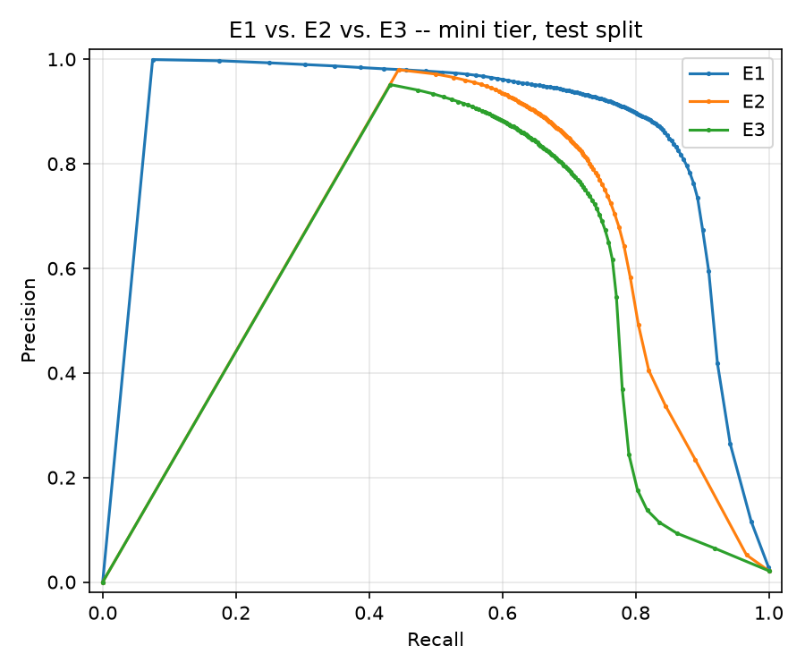
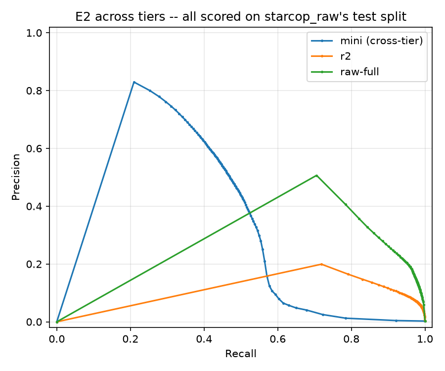
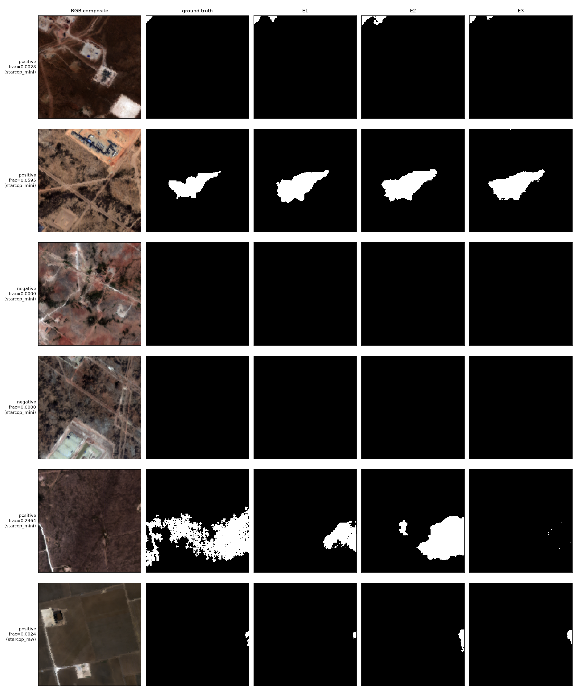

# Detecção de Plumas de Metano por Segmentação Semântica

> Relatório técnico — *Aprendizado Profundo*, PPGCA, Universidade do Vale
> do Itajaí. Professor: Felipe Viel — Período: 2026/2.
>
> Estrutura conforme a Seção 14 do PDF do curso. Cada seção abaixo é
> escrita à medida que a etapa correspondente do plano de trabalho
> (`dl-course-final-project-plan.md`, raiz do repositório) é concluída;
> seções ainda não escritas estão marcadas como **(pendente)**.

## Introdução

*(pendente — Seção 1 do plano)*

## Contextualização

*(pendente — Seção 1 do plano)*

## Definição do problema

*(pendente — Seção 1 do plano)*

## Dataset

Este projeto utiliza o dataset STARCOP (Růžička et al., 2023) — um
conjunto de dados aéreos/hiperespectrais anotado para detecção de plumas
de metano, coletado pelo sensor AVIRIS-NG durante o levantamento de 2019
sobre a Bacia do Permiano (oeste do Texas e sudeste do Novo México,
EUA). O uso deste dataset, fora dos quatro modelos-padrão do curso, foi
previamente aprovado pelo professor (PDF, Seção 4).

### Duas camadas (tiers) do mesmo dataset

O dataset é utilizado em duas escalas distintas, cada uma com um papel
diferente neste projeto:

- **`starcop_mini`** — um subconjunto curado de 18 cenas (392/49/441
  patches de treino/validação/teste, 128×128 pixels), usado para
  desenvolver a implementação e treinar a comparação de três
  configurações que é o entregável avaliado do curso. Seu tamanho é
  compatível com a restrição de custo computacional do curso (PDF, Seção
  12.1) para um projeto de dificuldade média.
- **`starcop_raw`** — o dataset completo, 3.767 cenas (141.218/26.607/
  16.758 patches de treino/validação/teste). Não é usado para o
  treinamento avaliado do curso, mas serve para confirmar, sobre dados
  reais em escala completa, que (a) o código implementado funciona
  corretamente fora do subconjunto pequeno e (b) as conclusões obtidas em
  `starcop_mini` se sustentam quando o volume de dados aumenta de 10 a
  25 vezes.

Ambos os conjuntos foram processados pelo mesmo pipeline determinístico
(normalização → divisão treino/validação/teste com isolamento por cena →
extração de patches 128×128 com sobreposição de 64 pixels), e suas
divisões nunca compartilham cenas de origem entre treino, validação e
teste — verificado diretamente sobre os manifestos de divisão gerados
(não apenas assumido a partir da configuração).

### Origem, coleta e rotulagem

A origem, o processo de coleta, o esquema de rotulagem e as limitações
conhecidas do dataset já estão documentados em detalhe em
[`docs/dataset_report.md`](../../docs/dataset_report.md) (relatório
gerado diretamente a partir do pipeline de dados deste repositório, para
ambas as camadas lado a lado). Este relatório técnico cita esse documento
em vez de duplicar suas estatísticas.

Resumo essencial:

- **Variável-alvo**: máscara binária por pixel indicando presença (1) ou
  ausência (0) de pluma de metano, para cada patch de 128×128 pixels.
- **Entrada**: 4 canais por patch — `mag1c` (produto de detecção de
  concentração de metano, específico do algoritmo do STARCOP) mais 3
  bandas de refletância TOA (*top-of-atmosphere*) do AVIRIS-NG (640 nm,
  550 nm, 460 nm).
- **Sensor**: 100% AVIRIS-NG em ambas as camadas — não há dados do sensor
  EMIT neste dataset de treino (EMIT aparece apenas em uma demonstração
  separada de generalização *zero-shot* do STARCOP, fora do escopo deste
  projeto).
- **Cobertura geográfica**: inteiramente dentro da Bacia do Permiano;
  `starcop_mini` cobre 18 cenas nessa região, `starcop_raw` cobre 3.767
  cenas na mesma região (mais abrangente, não uma região diferente).

### Privacidade

Não há questões de privacidade: trata-se de sensoriamento remoto
aéreo/orbital sobre uma região geográfica (Bacia do Permiano), sem
qualquer dado pessoal ou identificável envolvido.

### Licença e proveniência

O dataset STARCOP está hospedado no Zenodo
([DOI 10.5281/zenodo.7863343](https://doi.org/10.5281/zenodo.7863343)),
sob a licença **CC-BY-NC-4.0** (Creative Commons
Atribuição-NãoComercial 4.0 Internacional) — uso permitido mediante
atribuição, exclusivamente para fins não comerciais. Essa condição é
compatível com o uso acadêmico deste projeto. Esta licença é a licença
*do dataset*, distinta da licença MIT do código deste repositório
(`pyproject.toml`).

### Verificação de isolamento entre divisões

Além do isolamento garantido pelo próprio estágio de divisão (nenhuma
cena aparece em mais de um split), foi verificado explicitamente que:

- As 9 cenas de treino e as 9 cenas de teste de `starcop_mini` são
  subconjuntos das cenas de treino e teste de `starcop_raw`,
  respectivamente, sem sobreposição cruzada entre splits.
- Nenhuma das 9 cenas de treino de `starcop_mini` cai na divisão de
  validação de `starcop_raw` (relevante para a amostra de confirmação
  usada na Seção de Metodologia).
- As divisões de treino e teste de `starcop_raw` não compartilham
  nenhuma das suas 256/44 linhas de voo (*flightlines*) de origem —
  o isolamento vale tanto no nível de cena quanto no nível de sobrevoo.

## Análise exploratória

### Desbalanceamento de classes

O desbalanceamento por pixel já está documentado em
[`docs/dataset_report.md`](../../docs/dataset_report.md) §4: apenas
**1,13%** dos pixels de `starcop_mini` (treino) são positivos (metano),
contra **0,32%** em `starcop_raw` — uma razão de desbalanceamento de
~87:1 em `starcop_mini` e ~314:1 em `starcop_raw`.

Esse desbalanceamento também aparece em nível de *patch* (ao menos um
pixel positivo no patch inteiro), uma métrica que não existe em
`docs/dataset_report.md` e foi computada especificamente para este
projeto (`coursework/dl-final-project/eda.py`,
`compute_patch_level_balance`):


| Split | `starcop_mini` | `starcop_raw` |
| --- | ---: | ---: |
| train | 19,64% (77/392) | 7,37% (10.406/141.218) |
| val | 10,20% (5/49) | 7,91% (2.104/26.607) |
| test | 25,40% (112/441) | 6,37% (1.067/16.758) |

Em ambas as métricas (pixel e patch), `starcop_mini` superrepresenta
exemplos com pluma em relação a `starcop_raw` — consistente com sua
curadoria em torno de cenas com plumas visíveis. Isso é tratado como
limitação explícita na seção de Discussão.

### Estatísticas por banda

As estatísticas por banda (`mag1c` e as três bandas de refletância TOA)
já estão em `docs/dataset_report.md` §5, reproduzidas neste projeto de
forma idêntica (bit-a-bit) ao reexecutar o mesmo pipeline DVC. A nota já
registrada naquele documento sobre o valor máximo de `mag1c` em
`starcop_raw` (exatamente 100000, um valor-sentinela do próprio
algoritmo `mag1c`, não um dado corrompido) permanece válida — o
`DataNormalizer` do STARCOP já realiza `clamp` desse valor em tempo de
treino.

### Exemplos qualitativos

Quatro patches de `starcop_mini` (dois positivos, dois negativos) e um
patch adicional de `starcop_raw`, cada um mostrando a composição RGB
(bandas TOA 640/550/460 nm), o mapa de calor `mag1c` e a máscara de
verdade de campo lado a lado:


O primeiro exemplo positivo (`frac_positives=0,0028`) é um caso
propositalmente difícil/ambíguo — uma pluma pequena e fraca, visível
apenas como um leve sinal no canto do mapa `mag1c` e uma máscara de
verdade de campo minúscula — incluído deliberadamente ao lado de um caso
positivo claro (`frac_positives=0,0595`), não apenas casos limpos.

### Problemas de dados identificados (checklist da Seção 6.3 do PDF)

- **Desbalanceamento de classes**: sim — ver acima (~87:1 a ~314:1,
  dependendo da camada).
- **Tamanho amostral limitado**: sim — `starcop_mini` tem apenas 392
  patches de treino.
- **Diferenças de escala entre canais**: sim — `mag1c` (média ≈ 36–112,
  desvio-padrão ≈ 310–542, dependendo da camada) tem escala muito maior
  que as bandas de refletância TOA (média ≈ 25–31, desvio-padrão ≈
  13–24) — ver `docs/dataset_report.md` §5. Isso motiva o contrato de
  normalização por banda descrito na próxima seção.

**Reprodutibilidade**: todas as figuras e números desta seção são
gerados por `coursework/dl-final-project/eda.py`
(`.venv/bin/python coursework/dl-final-project/eda.py`), com testes em
`coursework/dl-final-project/__tests__/test_eda.py`.

## Pré-processamento

### Contrato de normalização

Reutilizado exatamente da própria convenção do STARCOP — constantes
fixas, não ajustadas ao conjunto de treino deste projeto:

| Entrada | Offset | Fator | Recorte após escala |
| --- | ---: | ---: | ---: |
| `mag1c` | 0 | 1750 | [0, 2] |
| cada canal AVIRIS RGB | 0 | 60 | [0, 2] |

A máscara de verdade de campo (`labelbinary`) **não é normalizada** — não
possui entrada na tabela de normalização do STARCOP, então permanece como
0/1 bruto, verificado tanto no código-fonte do vendor
(`normalizer_module.py`) quanto por teste unitário próprio
(`coursework/dl-final-project/__tests__/test_dataset.py`).

**Ausência de vazamento de dados**: as constantes acima são fixas,
publicadas no próprio artigo do STARCOP — não foram ajustadas a partir do
split de treino deste projeto, em nenhuma das duas camadas. Não há,
portanto, risco de vazamento pela normalização.

### Dataloader parametrizado por dataset

`coursework/dl-final-project/dataset.py`'s `PatchDataset` recebe
`dataset={starcop_mini|starcop_raw}` desde a primeira versão — a lista de
bandas de entrada/saída vem diretamente de
`configs/dataset/<dataset>.yaml`, o mesmo arquivo que o pipeline DVC
compartilhado já usa, evitando qualquer duplicação que pudesse divergir.

### Aumento de dados (augmentation)

Aplicado apenas ao split de treino (E2/E3, não à baseline E1 — ver
próxima seção), usando `kornia.augmentation.AugmentationSequential` com
`data_keys=["image", "mask"]` — não `albumentations` como inicialmente
cogitado: `kornia` já era dependência deste repositório
(`pyproject.toml`), tornando a instalação de uma nova biblioteca
desnecessária. As transformações usadas são apenas geométricas —
espelhamento horizontal/vertical e rotações de 90° — deliberadamente sem
nenhuma transformação de cor/contraste, que distorceria os valores
fisicamente significativos de `mag1c`/refletância.

A sincronização entre imagem e máscara foi verificada por teste
dedicado: um pixel marcador extremo no canal `mag1c` e o único pixel
positivo da máscara, na mesma posição, permanecem coincidentes após 20
aplicações aleatórias da transformação.

### R1 — confirmação do pré-processamento contra dados reais

`coursework/dl-final-project/confirm_raw.py` executa o mesmo caminho de
código (normalização + dataloader) sobre uma amostra real e semeada de
`starcop_raw`, via `make coursework-confirm-raw`:

```text
R1 confirmation -- dataset=starcop_raw
  sampled 300 patches across 156 distinct scenes
  input_products (band order): ['mag1c', 'TOA_AVIRIS_640nm', 'TOA_AVIRIS_550nm', 'TOA_AVIRIS_460nm']
  expected patch size (configs/data.yaml): 128x128
  shapes/dtypes/ranges/band-order/label-passthrough: PASSED (300 patches)
  all-negative patches in sample: 264/300 (88.0%) -- informational
R1 PASSED
```

Nenhuma correção de código foi necessária — o mesmo `confirm_raw.py`
também passa sobre `starcop_mini`, confirmando que o loader funciona
identicamente em ambas as camadas. A fração de patches totalmente
negativos (~88% na amostra de `starcop_raw`) é reportada apenas como
informação de contexto para a estratégia de amostragem/perda das Seções
6–7, não como uma falha desta etapa.

**Reprodutibilidade**: `coursework/dl-final-project/preprocessing.py`
(normalização), `dataset.py` (loader) e `confirm_raw.py` (confirmação
R1), com testes em `__tests__/test_preprocessing.py` e
`__tests__/test_dataset.py` (24 testes, `make coursework-test`).

## Arquitetura

Todas as três configurações recebem a mesma entrada de 4 canais
(`mag1c` + 3 bandas TOA) e produzem um único canal de logits brutos
(128×128) — sem sigmoid aplicado no modelo; a função de perda
(`BCEWithLogitsLoss`) aplica a sigmoid internamente. Manter o contrato de
entrada/saída idêntico garante que as comparações sejam apenas de
arquitetura, não confundidas por diferenças de entrada.

| Exp. | Arquitetura | Encoder | Parâmetros (reais) | Pré-treinado? |
| --- | --- | --- | ---: | --- |
| **E1** | U-Net pequena, blocos conv simples | nenhum (do zero) | **487.361** | Não |
| **E2** | U-Net | MobileNetV2 | **6.629.233** | Sim (ImageNet) |
| **E3** | LinkNet | MobileNetV3-small-minimal | **856.635** | Sim (ImageNet) |

Contagens obtidas por soma direta de `model.parameters()`, não estimadas.

### E1 — linha de base do curso

U-Net clássica de 4 níveis, blocos conv simples (Conv3×3 + BatchNorm +
ReLU, duas vezes por nível), sem pré-treinamento, implementada do zero
(`coursework/dl-final-project/architectures.py::TinyUNet`). A largura
`base=8` foi escolhida deliberadamente para criar um espectro de três
tamanhos comparável: E1 (pequena, sem pré-treino) vs. E3 (pequena, com
pré-treino) isola o efeito do pré-treinamento numa escala equivalente,
enquanto E1 vs. E2 isola o efeito combinado de escala e pré-treinamento.

### E2 — U-Net + MobileNetV2

Implementação própria para este trabalho via `segmentation-models-pytorch`
(`Unet(encoder_name="mobilenet_v2", ...)`), **sem** importar
`vendor/starcop` ou `src/baselines/starcop/` — nenhum seam file
`_vendor_starcop*.py`, nenhum shim de compatibilidade do Lightning 2.x.
Mesma família de encoder do baseline STARCOP desta tese, mas uma
implementação nova, genuinamente treinada para este curso.

### E3 — LinkNet + MobileNetV3-small-minimal

Reproduzido de Herec et al. (2026, arXiv:2606.03675, hipótese H1.5 do
projeto de tese) — **treinado do zero em `starcop_mini` para este curso**,
não utilizando os pesos ONNX pré-treinados do pacote
`onboard-methane-detection` (licença dos pesos não verificada). Construído
via `Linknet(encoder_name="tu-tf_mobilenetv3_small_minimal_100", ...)` —
a ponte `tu-` do `segmentation-models-pytorch` para a biblioteca `timm`,
que hospeda exatamente a variante "minimal" do MobileNetV3-small que o
artigo usa (não existe um encoder `mobilenet_v3` nativo no
`segmentation-models-pytorch`, apenas via `timm`).

### Adaptação de entrada de 4 canais

E2 e E3 usam encoders pré-treinados em ImageNet (entrada de 3 canais
RGB), mas este projeto usa 4 canais. A adaptação é feita pelo
comportamento padrão do próprio `segmentation-models-pytorch`
(`patch_first_conv`, em `encoders/_utils.py`): os pesos do kernel
pré-treinado são **reaproveitados ciclicamente** entre os canais — o 4º
canal (`mag1c`) recebe uma cópia dos pesos do canal 0 (originalmente
"vermelho") — e o kernel inteiro é reescalado por 3/4 para preservar a
magnitude de ativação aproximada.

**Decisão de modelagem, documentada explicitamente**: esse comportamento
padrão foi mantido como está, não sobrescrito. É uma escolha discutível —
`mag1c` é uma grandeza física completamente distinta de um canal de cor
(uma estimativa de concentração por filtro casado, não refletância) — mas
é a prática comum em adaptações multibanda de encoders pré-treinados em
ImageNet, e ainda fornece uma inicialização estruturada em vez de ruído
puro para o canal `mag1c`. Uma alternativa mais criteriosa (reinicializar
apenas a primeira camada do zero) foi considerada e descartada por este
projeto, mas fica registrada aqui como uma limitação explícita, não uma
omissão.

### R1 — confirmação das arquiteturas contra dados reais

`coursework/dl-final-project/confirm_raw.py` (estendido nesta seção, não
reescrito — decisão já tomada na Seção 4) executa um *forward* e um
*backward* real para as três arquiteturas sobre um lote real de
`starcop_raw`:

```text
  architecture batch: (8, 4, 128, 128)
  E1: 487,361 params, loss=0.4662, all gradients present
  E2: 6,629,233 params, loss=0.5161, all gradients present
  E3: 856,635 params, loss=0.8231, all gradients present
```

As três arquiteturas produzem perda finita e gradiente em 100% dos
parâmetros sobre dados reais — não apenas um tensor sintético
`torch.randn`, que não haveria capturado um NaN vindo de `mag1c` real, um
erro de tipo, ou um lote inteiramente negativo.

**Reprodutibilidade**: `coursework/dl-final-project/architectures.py`,
testes em `__tests__/test_architectures.py` (8 testes).

## Metodologia

### Hiperparâmetros

| | E1 (do zero) | E2 / E3 (pré-treinados) |
| --- | --- | --- |
| Otimizador | Adam | Adam |
| Taxa de aprendizado | 1e-3 | 1e-4 |
| Tamanho de lote | 16 | 16 |
| Épocas máximas | 50 | 50 |
| Paciência (early stopping) | 10, monitorando `val_loss` | 10 |
| Perda | `BCEWithLogitsLoss(pos_weight=...)` | mesma |

`pos_weight` é calculado a partir da razão fundo:positivo real de cada
conjunto de treino efetivamente usado (não fixado por camada) —
`coursework/dl-final-project/losses.py::compute_pos_weight`, usando a
coluna `frac_positives` já produzida por `patch_extract.py`. Isso
reproduz exatamente os valores medidos na Seção 3 quando o treino é o
split completo de cada camada (87,27 para `starcop_mini`, 314,48 para
`starcop_raw`), e usa a proporção real do subconjunto quando é o caso
(R2, Seção 3 abaixo).

A taxa de aprendizado difere entre E1 e E2/E3 (1e-3 vs. 1e-4) —
não é uma violação da exigência de "manter tudo fixo entre camadas": a
Seção 7 do plano fixa hiperparâmetros **por modelo**, entre suas próprias
camadas (mini vs. R1/R2), não necessariamente entre modelos diferentes.
Usar uma taxa menor para encoders pré-treinados é prática padrão
(fine-tuning), não uma escolha arbitrária.

### Rastreamento com MLflow

**Correção de ambiente, não do plano original**: o MLflow instalado neste
ambiente (3.14.0) tornou o backend de arquivo simples (`file:./mlruns`)
somente-manutenção — ele agora lança uma exceção por padrão. Em vez do
`mlruns/` local descrito nas seções anteriores do plano, este projeto usa
um backend SQLite explícito
(`sqlite:///coursework/dl-final-project/mlflow.db`), verificado
funcionando sem avisos, e futuro-compatível (não depende de uma flag de
compatibilidade que o MLflow já sinaliza como "modo de manutenção").
A URI de rastreamento é explícita e escopada a este projeto — nunca
`file:./mlruns` relativo ao diretório de invocação, que colidiria com o
`mlruns/` já existente na raiz do repositório (dados reais de
rastreamento da tese).

### Versões de bibliotecas

Lidas diretamente dos parâmetros logados em `mlflow.db` (não retranscritas
de memória) — idênticas nas 8 execuções reais (E1/E2/E3 × mini/R2, E2/E3 ×
R3), já que todas rodaram na mesma máquina/ambiente:

| Biblioteca | Versão |
| --- | --- |
| `torch` | 2.12.1+cu130 |
| `segmentation-models-pytorch` | 0.5.0 |
| CUDA | 13.0 |
| GPU | NVIDIA GeForce RTX 5070 |

### Um bug real encontrado e corrigido antes de qualquer resultado ser aceito

A primeira versão de `evaluate()` (`train.py`) concatenava as predições
de **todo** o conjunto de validação em memória antes de calcular F1 —
inofensivo em `starcop_mini` (49 patches), mas estourou memória de GPU
(`CUDA out of memory`) ao validar sobre o split completo de
`starcop_raw` (26.607 patches). Corrigido para acumular
verdadeiro/falso positivo/negativo incrementalmente por lote — mesma
razão de design que `stats.py` já usa no pipeline principal (Seção 0.1):
memória O(1) por lote, não O(tamanho do conjunto). Um teste direto
(`__tests__/test_train.py::TestEvaluate`) trava esse comportamento.

Um segundo problema, de desempenho (não de corretude): o `DataLoader`
com `num_workers=0` recarrega cada patch do disco a cada época,
serialmente — medido em ~8s/época nos 392 patches de `starcop_mini`.
`num_workers=4` com `persistent_workers=True` (por loader, treino e
validação) reduz isso para ~1,5–2s/época. Usar `num_workers=8` por
loader (16 processos simultâneos) satura a CPU de 12 threads desta
máquina — verificado diretamente (uma execução que leva ~18s isolada
travou além de 200s com 16 processos concorrentes).

### R1 e R2 — mecânica de confirmação

R1 (Seção 0.1) é satisfeito por um treinamento-fumaça (*smoke*) de poucas
centenas de passos sobre `starcop_raw`, sem convergência esperada —
apenas para provar que o laço de treino, o checkpointing e o log MLflow
sobrevivem à escala real antes de qualquer orçamento de treino de fato
ser gasto. R2 usa os manifestos persistidos
(`coursework/dl-final-project/r2_manifest_{train,val}.csv`, gerados uma
única vez por `build_r2_manifest.py`, nunca regenerados por execução) —
10 linhas de voo amostradas (seed 42) de `starcop_raw`, 6.076 patches de
treino / 3.136 de validação.

**Limitação registrada explicitamente**: nenhuma semente aleatória fixa
foi definida para inicialização de pesos ou embaralhamento do
`DataLoader` nesta seção — a Seção 7 do plano é quem exige
explicitamente "fixar uma semente aleatória entre todas as
configurações e camadas", e será tratada lá, antes da comparação final
E1/E2/E3. Os números desta seção (E1 apenas) são reais e reproduzíveis
em ordem de grandeza, mas não bit-a-bit.

**Reprodutibilidade**: `coursework/dl-final-project/sampling.py`,
`losses.py`, `early_stopping.py`, `metrics.py`, `train.py`,
`build_r2_manifest.py`, com testes em seus respectivos `__tests__/*.py`
(60 testes no total do projeto).

## Experimentos

**Versão final dos resultados (2026-09-21).** Os oito modelos deste relatório
(`mini` E1/E2/E3, R2 E1/E2/E3 e R3 E2/E3) foram **retreinados do zero**,
todos com o mesmo código, que agora permite **retomar um treino
interrompido de forma exata** (ver "Retreino limpo com retomada exata",
em Resultados): uma queda de GPU deixou de alterar a trajetória da
semente 42. Todos os números desta seção e das seguintes vêm desse
retreino e foram lidos de `mlflow.db`. Os números da versão anterior
(código sem retomada exata) **não foram apagados**: estão no Apêndice A,
rotulados como históricos e substituídos. Nenhum número novo foi escolhido
entre as duas versões — os novos são os finais, inclusive onde a ordem
dos modelos mudou.

### Baseline (E1) — Seção 6

> **Registro histórico.** Esta seção documenta a primeira execução de E1 (Seção 6
> do plano) e as duas correções feitas na época. Seus números
> (`mini` 49/50 épocas etc.) pertencem a checkpoints **substituídos**; os
> números finais de cada camada estão nas tabelas seguintes.

### Comparação E1 / E2 / E3 — `mini` (Seção 7, Fase C)

Comparação três-vias sob semente fixa (`seed=42`), treino completo em
`starcop_mini` (392 patches de treino), mesma perda (`BCEWithLogitsLoss` com
`pos_weight`=87,27), mesmo otimizador e **mesma regra de parada** nas três:
early stopping com paciência 10 sobre `val_loss`, com teto de 500 épocas
(o teto de 50 do plano original cortava E1 e E3 ainda em melhora; ver
Apêndice A). Números lidos de `mlflow.db`, execuções `E1-mini`, `E2-mini`,
`E3-mini`:

| Configuração | Parâmetros | Melhor época / total | `val_loss` (melhor) | `val_f1` (melhor) | Degenerado? | Parada | `run_id` |
| --- | ---: | ---: | ---: | ---: | :---: | --- | --- |
| E1 (do zero) | 487.361 | 45/55 | 0,0158 | 0,5767 | Não | early stop | `9f771a5e` |
| E2 (U-Net + MobileNetV2) | 6.629.233 | 76/86 | 0,0167 | 0,4250 | Não | early stop | `6a8e88cf` |
| E3 (LinkNet + MobileNetV3-small) | 856.635 | 304/314 | 0,0234 | 0,5146 | Não | early stop | `100be41c` |

**Ordem por `val_f1`: E1 (0,5767) > E3 (0,5146) > E2 (0,4250).**
As três pararam por early stopping (55, 86 e 314 épocas), nenhuma colapsou, e
`pos_weight` é idêntico nas três. E3, o menor modelo (856.635 parâmetros,
~7,7× menos que E2), é de longe o que precisa de mais passos para convergir
(melhor época 304 contra 45 e 76), mas termina à frente de E2 em `val_f1`.
**Essa ordem entre E2 e E3 não se mantém no teste** (E2 0,7636 > E3 0,7348 em F1, ver
"Métricas de avaliação"): o split de validação de `mini` tem uma única cena
(49 patches, 9 com pluma), pequeno demais para fixar a posição relativa de
duas configurações separadas por 0,03 de F1 de teste. Não há, portanto,
evidência de que E3 supere ou perca para E2 em `mini` — só de que fica
próximo (~96% do F1 de teste de E2 com 12,9% dos parâmetros).

**Contra a versão anterior** (Apêndice A, mesmo protocolo, código sem
retomada exata): `val_f1` E1 0,5427→0,5767, E2 0,4698→0,4250,
E3 0,5227→0,5146; F1 de teste E1 0,8423→0,8317, E2 0,7799→0,7636, E3 0,7433→0,7348.
**A ordem não mudou** (E1 > E3 > E2 em val; E1 > E2 > E3 em teste) e as
diferenças (0,01–0,05) têm o tamanho esperado de um sorteio diferente de
embaralhamento e aumento com a mesma semente — uma amostra de ruído de
execução única, não rigorosa (ver Limitações).

### Comparação E1 / E2 / E3 — `r2` (Seção 7, Fase D)

Mesma semente, agora no subconjunto amostrado de `starcop_raw` (6.076 patches
de treino, 3.136 de validação, ~15,5× mais dados que `mini`). Nesta camada a
seleção do checkpoint e a parada usam `val_f1` (com parada dupla: só para
quando `val_f1` **e** `val_loss` esgotam a paciência de 10; ver Metodologia e
Apêndice A), porque `pos_weight` alto (269,73) desacopla `val_loss` de
`val_f1`. Teto inicial de 50 épocas; **E2 e E3 bateram o teto** (melhor época
47 e 48, ainda melhorando) e foram **estendidos para 100 épocas por retomada
exata** — equivalente a um treino direto de 100 épocas, verificado antes na
GPU (ver Resultados). Números de `mlflow.db`:

| Configuração | Parâmetros | Melhor época / total | `val_loss` (melhor) | `val_f1` (melhor) | Degenerado? | Parada | `run_id` |
| --- | ---: | ---: | ---: | ---: | :---: | --- | --- |
| E1 (do zero) | 487.361 | 34/47 | 0,3716 | 0,4859 | Não | early stop | `3ce77d44` |
| E2 (U-Net + MobileNetV2) | 6.629.233 | 64/74 | 1,1333 | 0,5724 | Não | early stop; teto estendido de 50 para 100 por retomada exata | `2ad05082` |
| E3 (LinkNet + MobileNetV3-small) | 856.635 | 48/58 | 0,8077 | 0,5183 | Não | early stop; teto estendido de 50 para 100 por retomada exata | `03db014f` |

**Ordem por `val_f1`: E2 (0,5724) > E3 (0,5183) > E1 (0,4859)**, a mesma ordem do
F1 de teste em limiar 0,5 (E2 0,3358 > E3 0,2834 > E1 0,1888). Diferente de
`mini`, aqui o modelo pré-treinado maior (E2) fica à frente e o E1 do zero em
último. A extensão importou para E2 (`val_f1` 0,5175 na época 47 → 0,5724 na
época 64) e não para E3 (o melhor continuou na época 48).

**Isto inverte a ordem da versão anterior** (Apêndice A: E1 > E3 > E2 em `val_f1`).
As duas versões não são comparáveis por completo — a anterior selecionava por
`val_loss` e parou bem mais cedo (E2 na época 20) —, mas mostra o quanto uma
ordenação de três modelos em uma única semente depende do ponto em que o
treino para. A leitura que este relatório sustenta não é "E2 > E1", e sim
que **a ordem de R2 não é estável**; o que se repete nas duas versões é que
todas as configurações ficam abaixo dos modelos `mini` no teste real, em F1 a
0,5, por causa da calibração (ver "Camada `starcop_raw`").

### Camada R3 (`raw-full`) — E2 e E3

Treino no split de treino completo de `starcop_raw` (141.218 patches,
`pos_weight`=314,48), `monitor=val_f1` com parada dupla, paciência 10 e teto de
200 épocas; E1 não foi treinado nesta escala (decisão da Seção 7). Ambos
pararam por early stopping, longe do teto:

| Configuração | Parâmetros | Melhor época / total | `val_loss` (melhor) | `val_f1` (melhor) | Degenerado? | Parada | `run_id` |
| --- | ---: | ---: | ---: | ---: | :---: | --- | --- |
| E2 (U-Net + MobileNetV2) | 6.629.233 | 23/35 | 0,3891 | 0,3695 | Não | early stop | `a8bb9a1c` |
| E3 (LinkNet + MobileNetV3-small) | 856.635 | 41/51 | 0,1574 | 0,4393 | Não | early stop; 1 queda de GPU, retomada exata | `3211c916` |

**Ordem por `val_f1`: E3 (0,4393) > E2 (0,3695)** — o oposto da versão anterior
(Apêndice A), em que o E2 tinha um checkpoint de época 70 com `val_f1`
0,4669 contra 0,3794 de E3. **Aqui o E2 parou na época 35 (melhor 23) com o `val_f1`
ainda oscilando entre 0,21 e 0,37**; a decisão de **manter a paciência em 10 para os oito modelos** (não
alterá-la depois de ver o resultado, o que seria uma escolha pós-hoc que
teria de valer para todas as camadas) significa que este número de E2 é
reportado como um efeito de semente única. O E3 sofreu **uma queda real de
GPU** na época 8 (`cudaErrorLaunchTimeout`) e foi retomado com estado exato
sem perder mais que a época em curso (~3,5 min); a execução do MLflow é uma
só, contínua.

## Métricas de avaliação

**Exigência do curso** (PDF Seções 8.1, 8.4): métricas de classificação —
Accuracy, Precision, Recall, F1, matriz de confusão, ROC-AUC/PR-AUC — com a
ressalva explícita de que Accuracy sozinha é insuficiente sob
desbalanceamento de classes. A segmentação binária por pixel é, pixel a
pixel, uma classificação binária — as métricas de classificação do curso
aplicam-se diretamente, sem adaptação.

### Por que Accuracy não é a métrica principal

A Seção "Análise exploratória" já mediu o desbalanceamento pixel a pixel
nos splits de **treino** (1,13% em `starcop_mini`, 0,32% em
`starcop_raw`). Para a avaliação, a taxa relevante é a do split de
**teste** especificamente — medida diretamente a partir das matrizes de
confusão desta seção (contagem de pixels rotulados positivos ÷ total de
pixels, idêntica nas três arquiteturas por usar o mesmo split de rótulos)
e conferida de forma independente via `frac_positives.mean()` sobre o CSV
de teste:

| Split de teste | Pixels positivos / total | Taxa |
| --- | ---: | ---: |
| `starcop_mini` | 155.652 / 7.225.344 | **2,15%** |
| `starcop_raw` | 701.907 / 274.563.072 | **0,26%** |

Um classificador trivial que prevê "sem pluma" em todo pixel atingiria
Accuracy ≈97,85% em `starcop_mini`/teste e ≈99,74% em `starcop_raw`/teste
— altíssima, e completamente inútil (zero plumas detectadas). Isso é
exatamente a ressalva da Seção 8.1 do PDF, agora com o número medido de
verdade, não hipotético. Por isso a tabela principal desta seção lidera
com Precision/Recall/F1/PR-AUC, e Accuracy não aparece como métrica de
comparação em nenhuma tabela abaixo.

### Implementação: Precision/Recall/F1/matriz de confusão, PR-AUC e detecção por patch

`coursework/dl-final-project/metrics.py` (TDD, RED-GREEN) ganhou a
contrapartida completa da métrica de treino da Seção 6 (`pixel_f1`, que
passou a delegar para as mesmas contagens): `confusion_matrix_counts`/
`add_counts`/`precision_from_counts`/`recall_from_counts`/
`f1_from_counts`/`confusion_matrix_from_counts` (matriz `[[TN, FP], [FN,
TP]]`), `sweep_confusion_counts`/`precision_recall_points_from_sweep`/
`average_precision_from_sweep` (PR-AUC não-interpolada, varredura de 101
pontos de limiar) e `patch_detection_counts`/`detection_rate_from_counts`
(detecção por patch). Novo `coursework/dl-final-project/evaluate.py`
(`evaluate_full_metrics` + `load_checkpoint`, testados; `main()` é *thin
glue* como o próprio `train.py`, exercitado por execuções reais) acumula
tudo **incrementalmente por lote** — nunca materializa as previsões do
split inteiro em memória, mesma razão de design do bug de OOM já corrigido
em `train.py::evaluate()` (Metodologia, acima).

**Decisão de reuso, tomada e registrada** (convenção de honestidade de
proveniência do plano): `vendor/starcop/starcop/metrics.py` já implementa
a mesma matemática de matriz de confusão (`precision`/`recall`/`f1score`
sobre `[[TN, FP], [FN, TP]]`), consumida em `src/baselines/starcop/
evaluation/paper_metrics.py`. **Não foi importada** — este projeto de
curso permanece fisicamente isolado de `src/`/`vendor/` desde a Seção 0 (nenhum
outro arquivo em `coursework/` importa de lá), e a matemática em si é
trivial o suficiente para reimplementar sem risco de divergência. A
convenção de PR-AUC não-interpolada (ordenar por recall ascendente, somar
`(recall_n − recall_{n-1}) × precision_n`, `recall_0 = 0`) é a mesma que
`paper_metrics.py::non_interpolated_average_precision` já usa para o
AUPRC da tese — reimplementada aqui pelo mesmo motivo de isolamento, não
importada.

**Limiar fixo e curva PR**: a tabela principal usa um limiar de decisão
fixo (0,5) em todas as configurações e camadas, mas cada avaliação também
reporta a curva Precision-Recall completa (101 pontos) e o PR-AUC — exatamente
para que uma diferença causada pelo limiar não seja confundida com uma
diferença real de qualidade (ver "Curvas Precision-Recall" abaixo, onde
isso de fato acontece).

**Detecção por patch — definição distinta da Seção "Análise exploratória"**:
a coluna `positive_patches` desta seção conta patches com **pelo menos um
pixel positivo real** (`frac_positives > 0`), respondendo literalmente "o
modelo detecta *alguma* pluma neste patch?". Isso é **diferente** da
coluna `has_plume` usada na tabela de balanço por patch da Análise
Exploratória, que aplica o limiar mais estrito do próprio STARCOP
(`configs/data.yaml`'s `has_plume_threshold=0,00244`, equivalente a
0,00244 × 128² ≈ 40 pixels positivos por patch). É uma regra sobre o
**rótulo** e não tem relação com a regra do artigo para o FPR de tile ("mais de 10
pixels **previstos**" em uma cena sem pluma, ver "Protocolo do artigo") No split de teste de `starcop_raw`, por exemplo: 1.706 patches
têm `frac_positives > 0`, mas apenas 1.067 passam do limiar `has_plume`
mais estrito — os dois números estão corretos, cada um respondendo a uma
pergunta diferente; esta seção usa deliberadamente o critério mais
literal ("alguma pluma"), por ser exatamente o que o plano pede.

### Tabela — `mini` (val e teste)

Todos os números lidos de `mlflow.db` (execuções `<arquitetura>-mini-eval`, val e
teste no mesmo run, limiar fixo 0,5), nunca retranscritos de log.

> **"Oráculo".** As duas últimas colunas escolhem o limiar que maximiza o F1 **na curva
> PR do próprio split de teste** e depois pontuam esse mesmo split: é um limite
> superior otimista (o limiar foi ajustado nos dados em que é avaliado), não um
> ponto de operação que um modelo implantado poderia usar. Um limiar escolhido na
> validação e aplicado uma vez ao teste está em "Protocolo do artigo (cenas
> completas)", abaixo, e a diferença entre os dois é o otimismo desta coluna. Os
> nomes das métricas no MLflow (`test_calibrated_*`) foram mantidos por
> rastreabilidade, e cada execução recebeu a tag `test_calibrated_is_oracle=true`.

| Configuração | Camada (treino) | Split (avaliação) | Precision | Recall | F1 | PR-AUC | Patches com pluma detectados | Limiar do oráculo | F1 do oráculo |
| --- | --- | --- | ---: | ---: | ---: | ---: | ---: | ---: | ---: |
| E1 | `mini` | val (49) | 0,4052 | 1,0000 | 0,5767 | 0,9081 | 9/9 | — | — |
| E1 | `mini` | test (441) | 0,9207 | 0,7585 | 0,8317 | 0,8828 | 114/125 | 0,21 | 0,8530 |
| E2 | `mini` | val (49) | 0,2702 | 0,9954 | 0,4250 | 0,6980 | 9/9 | — | — |
| E2 | `mini` | test (441) | 0,8725 | 0,6788 | 0,7636 | 0,7791 | 115/125 | 0,28 | 0,7677 |
| E3 | `mini` | val (49) | 0,3468 | 0,9985 | 0,5148 | 0,7470 | 9/9 | — | — |
| E3 | `mini` | test (441) | 0,8385 | 0,6539 | 0,7348 | 0,7197 | 119/125 | 0,29 | 0,7414 |

**Ordem por F1 de teste: E1 (0,8317) > E2 (0,7636) > E3 (0,7348)**, a mesma por
PR-AUC (0,8828 > 0,7791 > 0,7197). **Val e teste discordam sobre E2 e E3**: em val
(49 patches), E3 fica à frente (0,5148 contra 0,4250); em teste (441 patches), E2. Os
limiares do oráculo em `mini` ficam abaixo de 0,5 (0,21–0,29): estes modelos têm
precision alta e recall moderado a 0,5 (ex.: E1 0,9207 e 0,7585), o oposto do
que acontece na camada `raw`, e o ganho do oráculo é pequeno (0,0213 em E1).

*Rastreabilidade (`run_id`): E1-mini=`604e0390`, E2-mini=`b02dedf1`, E3-mini=`8b2593c6`.*

### Avaliação cross-tier: modelos treinados em `mini`, avaliados no teste real de `starcop_raw`

Os mesmos checkpoints, agora sobre o split de teste **completo** de `starcop_raw`
(16.758 patches; `patches_processed` conferido nas três execuções):

| Configuração | Camada (treino) | Split (avaliação) | Precision | Recall | F1 | PR-AUC | Patches com pluma detectados | Limiar do oráculo | F1 do oráculo |
| --- | --- | --- | ---: | ---: | ---: | ---: | ---: | ---: | ---: |
| E1 | `mini` | `starcop_raw` test (16.758) | 0,6956 | 0,4541 | 0,5494 | 0,5523 | 1.082/1.706 | 0,18 | 0,5972 |
| E2 | `mini` | `starcop_raw` test (16.758) | 0,6184 | 0,4058 | 0,4901 | 0,3855 | 1.015/1.706 | 0,28 | 0,4978 |
| E3 | `mini` | `starcop_raw` test (16.758) | 0,6409 | 0,3404 | 0,4446 | 0,3549 | 1.269/1.706 | 0,28 | 0,4602 |

**A ordem de `mini` (E1 > E2 > E3) se mantém** em F1 e em PR-AUC. A queda em
relação ao teste de `mini` é grande e regular — F1 E1 0,8317→0,5494,
E2 0,7636→0,4901, E3 0,7348→0,4446 —, a resposta
direta à pergunta do curso (um modelo treinado com 392 patches se sustenta na
distribuição real?): **se sustenta em parte**, com perda de 0,27 (E2) a 0,29 (E3) de
F1, e de forma mais uniforme entre as arquiteturas do que na versão anterior. Ao
contrário das camadas `r2`/`raw-full`, estes modelos operam com **precision maior
que recall** (0,62–0,70 contra 0,34–0,45) a 0,5, e seus limiares de oráculo ficam
abaixo de 0,5 (0,18–0,28).

*Rastreabilidade (`run_id`): E1-mini=`6363ecb8`, E2-mini=`873ba11b`, E3-mini=`56217656`.*

### Camada `starcop_raw` — R2 e R3 no teste real (números "cabeçalho" da camada)

R2 (6.076 patches de treino) e R3 (141.218), avaliados sobre o mesmo split de
teste completo (16.758 patches):

| Configuração | Camada (treino) | Split (avaliação) | Precision | Recall | F1 | PR-AUC | Patches com pluma detectados | Limiar do oráculo | F1 do oráculo |
| --- | --- | --- | ---: | ---: | ---: | ---: | ---: | ---: | ---: |
| E1 | R2 | `starcop_raw` test (16.758) | 0,1049 | 0,9443 | 0,1888 | 0,3153 | 1.600/1.706 | 0,99 | 0,4233 |
| E2 | R2 | `starcop_raw` test (16.758) | 0,2105 | 0,8299 | 0,3358 | 0,3786 | 1.632/1.706 | 0,99 | 0,5213 |
| E3 | R2 | `starcop_raw` test (16.758) | 0,1710 | 0,8265 | 0,2834 | 0,3869 | 1.653/1.706 | 0,98 | 0,5076 |
| E2 | R3 (`raw-full`) | `starcop_raw` test (16.758) | 0,2103 | 0,8708 | 0,3388 | 0,4933 | 1.686/1.706 | 0,99 | 0,6358 |
| E3 | R3 (`raw-full`) | `starcop_raw` test (16.758) | 0,2534 | 0,9520 | 0,4003 | 0,5218 | 1.659/1.706 | 0,98 | 0,6101 |

**Todos os cinco modelos treinados em `starcop_raw` operam a 0,5 com recall alto e
precision baixa** (recall 0,83–0,95, precision 0,10–0,25) e têm o **limiar do
oráculo em 0,98–0,99**, o ponto mais alto da varredura de 101 pontos antes de 1,0
(onde nada mais é previsto positivo). É o efeito que a Seção "Implementação"
antecipava: `pos_weight` alto (269–314, contra 87 em `mini`) empurra as saídas
para probabilidades altas, e 0,5 deixa de ser um corte bem calibrado. Por isso o
F1 de oráculo é de 1,5 a 2,2× o F1 a 0,5 (0,1888→0,4233 em E1-R2,
0,3388→0,6358 em E2-R3), e por isso **os modelos `mini` têm F1 a 0,5 melhor
que os de R3** (E1: 0,5494 contra 0,4003 de E3-R3) apesar de terem visto 0,3% dos dados: a
comparação entre camadas em F1 fixo mede calibração, não qualidade. **A PR-AUC, que
não depende do limiar, conta outra história:** E3-R3 0,5218 e E2-R3 0,4933 ficam
no nível de E1-`mini` (0,5523) e bem acima de E2/E3-`mini` (0,3855/0,3549) e de todo o
R2 (0,3153–0,3869).

**Mais dados de treino ajudam, e a ordem dentro de cada camada mudou.** R3 supera R2 nas duas
arquiteturas (PR-AUC E2 0,3786→0,4933, E3 0,3869→0,5218). Em R2, a ordem de F1 de
teste (E2 > E3 > E1) coincide com a de `val_f1`; em R3, E3 lidera em F1 a 0,5
(0,4003 contra 0,3388) e em PR-AUC, mas **E2 lidera no F1 do oráculo** (0,6358 contra
0,6101): a ordem E2-vs-E3 em R3 depende da métrica, e a seção do protocolo do artigo
mostra que depende também da grade de limiares (ver AUPRC).

*Rastreabilidade (`run_id`): E1-r2=`be44f21c`, E2-r2=`4fd0f654`, E3-r2=`5ab63cd4`, E2-raw-full=`1dc290ea`, E3-raw-full=`045722c2`.*

### Curvas Precision-Recall

`pr_curve_plots.py` gera as duas figuras, ambas com o split de avaliação **fixo**
(do contrário estaríamos comparando testes diferentes), e cada curva vem do
artefato de PR do **último run FINISHED, não substituído** com aquele nome
(`threshold_calibration.latest_finished_run_id`; a versão anterior escolhia o
primeiro run com o nome, sem olhar o estado).

**Dentro de uma camada** (E1 vs. E2 vs. E3, treinados *e* avaliados em `mini`,
split de teste):



A curva de E1 domina a de E2, e ambas dominam a de E3 em toda a faixa de recall
acima de ~0,45, confirmando a ordem de PR-AUC (0,8828 > 0,7791 > 0,7197). E2
e E3 têm um pico de precision parecido (~0,95–0,98 perto de recall 0,45) e caem
juntos depois de recall ~0,75; E1 sustenta precision acima de 0,9 até recall ~0,83.
(O segmento reto do ponto (0, 0) ao primeiro ponto medido não é uma trajetória
observada: a varredura de 101 limiares termina em 1,0, onde nada é previsto, e o
gráfico liga esse ponto ao primeiro limiar com predição, 0,99. É a resolução
próxima de 1 que a grade logit da seção seguinte resolve.)

**Entre camadas** (E2, variando a camada de treino — `mini` via cross-tier, `r2`,
`raw-full` —, todas avaliadas no **mesmo** split de teste de `starcop_raw`):



E2 treinado em `mini` atinge o pico mais alto de precision (~0,81 perto de recall
0,19) mas **colapsa acima de recall ~0,5** (precision ~0,02 em recall 0,8);
`raw-full` sustenta precision moderada por uma faixa muito maior (pico ~0,60 perto
de recall 0,67, ainda ~0,30 em recall 0,8). `r2` (pico ~0,49 perto de recall 0,56)
fica abaixo de `raw-full` em toda a faixa, confirmando R3 > R2, e as duas se
encontram perto de recall 0,9. Em recall baixo o modelo `mini` é o melhor; em
recall alto, `raw-full`: as camadas são complementares, e comparar os pontos
fixos de 0,5 (F1 0,4901 de `mini` contra 0,3388 de `raw-full`) compara pontos
não equivalentes de curvas diferentes.

### Protocolo do artigo (cenas completas)

**Por que esta seção existe.** Todas as tabelas acima são *patch-pooled*: patches de
128×128 sobrepostos (passo 64, 49 por cena), F1 agrupado sobre todos os pixels de todos os
patches e limiar 0,5 fixo. O artigo do STARCOP e o de Herec pontuam de outro modo: **cenas
inteiras de 512×512**, F1 separado para plumas fortes e fracas, **taxa de falsos positivos por
tile** em cenas sem pluma e AUPRC. Números de definições diferentes não se comparam, e a
distância entre os nossos e os deles pode vir da forma de pontuar ou do modelo. Esta seção
implementa as definições do artigo, mede as duas fontes da distância separadamente, e diz o que
é e o que não é comparável.

**O que foi implementado** (`scene_manifest.py`, `scene_inference.py`, `paper_protocol.py`,
`threshold_selection.py`, `evaluate_scenes.py`; tudo em `coursework/`, testado test-first,
sem importar `src/` nem `vendor/`):

- **Cenas e rótulos.** O teste é o mesmo do artigo (`test.csv`): 342 cenas de 512×512, 166 com
  pluma — **57 fortes** (≥ 1000 kg/h) e **109 fracas** — e 176 sem pluma. O rótulo de cena vem de
  `test.csv`, não do rótulo por patch (que discorda em 15 cenas). Verificado nos dados: a coluna
  `difficulty` de `test.csv` é `easy` exatamente para as 57 fortes (`qplume` mínimo 1000,59) e
  `hard` para as 109 fracas (máximo 985,11). O código do STARCOP separa fortes/fracas por
  **número de pixels rotulados** (> 1000), o que sombreia esse critério; usamos kg/h. Três cenas
  contradizem o próprio rótulo de pixels (uma "fraca" sem pixel positivo; duas "sem pluma" com 188
  e 125 pixels positivos); seguimos os rótulos de cena do artigo.
- **Pontuação.** `full_scene` aplica o modelo direto à cena de 512×512 (como o artigo, treinado
  em recortes de 128) e guarda, por cena e por limiar, as contagens tp/fp/fn/tn; `patches` soma
  os 49 patches de cada cena e serve só de diagnóstico.
- **Métricas.** F1 strong/weak = pixels **agrupados** sobre as cenas de cada balde (não a média
  dos F1 por cena); **FPR de tile** = fração das 176 cenas sem pluma com mais de 10 pixels
  previstos; **plumas capturadas** = cena com pluma cujo tile é marcado e que tem ao menos 1
  pixel de sobreposição (definição nossa: o artigo cita a contagem sem fórmula); **AUPRC** =
  precisão média não interpolada dos pixels agrupados (o artigo não fixa a convenção), em três
  grades de limiares e duas populações.
- **Limiar escolhido na validação.** Maximiza o F1 agrupado sobre as **543 cenas de validação**
  de `starcop_raw` (decisão D2) e é aplicado **uma vez** ao teste; a função só recebe contagens
  de validação (a assinatura é travada por teste). Se o pico caísse na borda da grade, a grade
  logit seria ampliada e o pico refeito; **nos oito modelos o pico foi interior**.
- **Conferências (62 de 62 passam).** As contagens do modo `patches` são **idênticas** às de
  `evaluate.py` nos oito modelos (tp/fp/fn/tn, diferença 0; PR-AUC até 1,5e-8); os totais de
  pixels são exatos (342 × 512² no teste, 543 × 512² na validação); os positivos de cada cena
  batem com o raster de rótulo (nos `patches`, ponderados pelo número de patches que cobrem cada
  pixel); e a implementação de referência do repositório
  (`src/baselines/starcop/evaluation/paper_metrics.py`, com as funções originais do STARCOP)
  aplicada às mesmas contagens dá F1 strong/weak, FPR de tile e AUPRC nas três grades iguais aos
  nossos até a 9ª casa decimal.

#### Resultados por modelo (teste, 342 cenas, cena inteira)

Esquerda: limiar 0,5 fixo. Direita: limiar escolhido na validação. "Capturadas" é a fração das
166 cenas com pluma.

| Modelo | Limiar | F1 strong | F1 weak | FPR (tile) | F1 agrupado (todas as cenas) | Plumas capturadas |
| --- | --- | ---: | ---: | ---: | ---: | ---: |
| E2 R3 (`raw-full`) | 0,5 fixo | 0,547 | 0,364 | 0,886 | 0,351 | 0,99 |
| E2 R3 (`raw-full`) | validação (0,9859) | 0,720 | 0,677 | 0,273 | 0,617 | 0,89 |
| E3 R3 (`raw-full`) | 0,5 fixo | 0,678 | 0,426 | 0,881 | 0,409 | 0,99 |
| E3 R3 (`raw-full`) | validação (0,9859) | 0,730 | 0,670 | 0,330 | 0,589 | 0,91 |
| E1 R2 | 0,5 fixo | 0,414 | 0,342 | 0,915 | 0,165 | 0,99 |
| E1 R2 | validação (0,9820) | 0,613 | 0,554 | 0,506 | 0,393 | 0,75 |
| E2 R2 | 0,5 fixo | 0,609 | 0,388 | 0,830 | 0,331 | 0,93 |
| E2 R2 | validação (0,9890) | 0,642 | 0,578 | 0,358 | 0,495 | 0,67 |
| E3 R2 | 0,5 fixo | 0,532 | 0,403 | 0,943 | 0,293 | 0,96 |
| E3 R2 | validação (0,9526) | 0,624 | 0,561 | 0,597 | 0,468 | 0,84 |
| E1 `mini` → raw | 0,5 fixo | 0,630 | 0,442 | 0,267 | 0,533 | 0,63 |
| E1 `mini` → raw | validação (0,1192) | 0,759 | 0,553 | 0,472 | 0,596 | 0,74 |
| E2 `mini` → raw | 0,5 fixo | 0,638 | 0,499 | 0,398 | 0,511 | 0,73 |
| E2 `mini` → raw | validação (0,5000) | 0,638 | 0,499 | 0,398 | 0,511 | 0,73 |
| E3 `mini` → raw | 0,5 fixo | 0,489 | 0,383 | 0,432 | 0,429 | 0,73 |
| E3 `mini` → raw | validação (0,1480) | 0,559 | 0,428 | 0,983 | 0,427 | 0,92 |

Com 0,5 fixo, **todo modelo treinado em `starcop_raw` marca como pluma de 83% a 94%** das
cenas sem pluma (recall alto, precision baixa). O limiar da validação (0,95–0,99) reduz esse
FPR para 27–60% e **sobe o F1 agrupado em 0,16–0,27** nos cinco modelos `raw`: a escolha do limiar
tem mais efeito que qualquer mudança de arquitetura ou de camada medida neste relatório. Nos modelos
`mini` (treinados em 392 patches, mais próximos da calibração) o efeito é pequeno ou nulo: E1 ganha
0,06 com o limiar 0,12 escolhido na validação, E2 escolhe 0,5 e E3 perde 0,002.

#### (a) Lado a lado com o STARCOP e com Herec

O nosso modelo recebe **mag1c + as três bandas RGB**, o mesmo conjunto de entrada da variante
"mag1c + rgb" do STARCOP. Valores do artigo em %, média ± desvio de 5 execuções; os nossos, em %,
de **uma** execução (semente 42).

| Origem | Modelo / limiar | F1 strong | F1 weak | FPR (tile) | AUPRC (grade do artigo / 101 pontos / logit) |
| --- | --- | ---: | ---: | ---: | ---: |
| STARCOP, Tabela 2 | baseline: mag1c + morfologia | 67,45 | 39,95 | 75,43 | — |
| STARCOP, Tabela 2 | HyperSTARCOP, só mag1c (média ± dp, 5 execuções) | 74,15 ± 6,10 | 47,57 ± 4,17 | 52,11 ± 10,98 | 49,41 ± 5,49 |
| STARCOP, Tabela 2 | HyperSTARCOP, mag1c + rgb (média ± dp, 5 execuções) | 81,96 ± 3,71 | 43,42 ± 5,72 | 43,66 ± 7,36 | 51,99 ± 2,76 |
| **este projeto** (1 execução) | E2 R3 (`raw-full`), limiar da validação (0,9859) | 72,04 | 67,67 | 27,27 | 54,3 / 47,4 / 61,3 |
| **este projeto** (1 execução) | E3 R3 (`raw-full`), limiar da validação (0,9859) | 72,96 | 66,95 | 32,95 | 50,9 / 49,6 / 54,5 |
| **este projeto** (1 execução) | E1 R2, limiar da validação (0,9820) | 61,26 | 55,43 | 50,57 | 34,9 / 29,6 / 42,4 |
| **este projeto** (1 execução) | E2 R2, limiar da validação (0,9890) | 64,22 | 57,83 | 35,80 | 44,4 / 34,0 / 50,7 |
| **este projeto** (1 execução) | E3 R2, limiar da validação (0,9526) | 62,39 | 56,15 | 59,66 | 37,0 / 37,1 / 39,7 |
| **este projeto** (1 execução) | E1 `mini` → raw, limiar da validação (0,1192) | 75,89 | 55,30 | 47,16 | 36,4 / 54,3 / 53,9 |
| **este projeto** (1 execução) | E2 `mini` → raw, limiar da validação (0,5000) | 63,78 | 49,92 | 39,77 | 36,4 / 41,9 / 44,9 |
| **este projeto** (1 execução) | E3 `mini` → raw, limiar da validação (0,1480) | 55,93 | 42,76 | 98,30 | 25,5 / 33,5 / 34,5 |

Herec (2026, Tabela I, p. 8; os mesmos valores da versão preliminar de 2025) avalia sobre as mesmas 342
cenas de teste, mas com outro produto de entrada (Mag1c-SAS) e outras colunas:

| Origem | Modelo / limiar | Recall | Precision | F1 | F1 strong |
| --- | --- | ---: | ---: | ---: | ---: |
| Herec, Tabela I | mag1c original, coluna a coluna | 58,42 | 30,57 | 40,14 | 67,50 |
| Herec, Tabela I | U-Net + Mag1c-SAS (média ± dp) | 56,41 ± 7,0 | 34,62 ± 7,4 | 42,54 ± 6,7 | 61,38 ± 7,7 |
| Herec, Tabela I | LinkNet + Mag1c-SAS (média ± dp) | 51,11 ± 7,2 | 40,43 ± 6,4 | 44,44 ± 3,9 | 60,37 ± 5,1 |
| **este projeto** | E2 R3 (`raw-full`), limiar da validação — F1 = pixels das cenas com pluma, agrupados (*suposição*) | 65,70 | 76,78 | 70,81 | 72,04 |
| **este projeto** | E3 R3 (`raw-full`), limiar da validação — F1 = pixels das cenas com pluma, agrupados (*suposição*) | 66,29 | 77,47 | 71,45 | 72,96 |
| **este projeto** | E1 R2, limiar da validação — F1 = pixels das cenas com pluma, agrupados (*suposição*) | 62,20 | 58,18 | 60,12 | 61,26 |
| **este projeto** | E2 R2, limiar da validação — F1 = pixels das cenas com pluma, agrupados (*suposição*) | 53,35 | 75,45 | 62,51 | 64,22 |
| **este projeto** | E3 R2, limiar da validação — F1 = pixels das cenas com pluma, agrupados (*suposição*) | 55,97 | 66,52 | 60,79 | 62,39 |

**Leitura, com cautela.** Com o limiar da validação, os modelos R3 têm **F1 strong** de
72,0/73,0 (E2/E3) — cerca de 9 a 10 pontos abaixo do STARCOP mag1c+rgb
(81,96 ± 3,71), perto do "só mag1c" (74,15) e acima do baseline (67,45) —, **F1 weak** de
67,7/67,0 (acima dos 43,42–47,57 do artigo) e **FPR de tile** de
27,3/33,0% (abaixo dos 43,66 ± 7,36). Nada disso autoriza dizer que
"superamos" o artigo: são uma execução contra uma média de cinco, o nosso limiar foi ajustado
para o F1 agrupado sobre a validação (a política de limiar do artigo é outra) e os pontos de
operação não são os mesmos. O que os números sustentam é mais modesto: **com um limiar decente,
um modelo de 856.635 parâmetros treinado com a nossa receita chega à mesma ordem de grandeza
do artigo nas três métricas do artigo**; a 0,5 fixo, não (FPR 0,83–0,94), o que é
consequência da receita (perda com `pos_weight`, sem o esquema de amostragem do artigo), não do
modelo em si.

#### (b) Cena inteira, patches e a métrica antiga

No limiar 0,5, o modo `patches` reproduz exatamente as tabelas *patch-pooled* de
`evaluate.py` (o F1 agrupado da primeira coluna é o `test_f1` daquelas tabelas). A diferença para a
cena inteira é só de pontuação:

| Modelo | F1 agrupado, patches (= `evaluate.py`) | F1 agrupado, cena inteira | F1 strong (patches / cena) | F1 weak (patches / cena) | FPR do tile (patches / cena) |
| --- | ---: | ---: | ---: | ---: | ---: |
| E2 R3 (`raw-full`) | 0,3388 | 0,3506 | 0,562 / 0,547 | 0,356 / 0,364 | 0,983 / 0,886 |
| E3 R3 (`raw-full`) | 0,4003 | 0,4093 | 0,681 / 0,678 | 0,424 / 0,426 | 0,949 / 0,881 |
| E1 R2 | 0,1888 | 0,1652 | 0,458 / 0,414 | 0,368 / 0,342 | 0,943 / 0,915 |
| E2 R2 | 0,3358 | 0,3306 | 0,620 / 0,609 | 0,391 / 0,388 | 0,949 / 0,830 |
| E3 R2 | 0,2834 | 0,2930 | 0,518 / 0,532 | 0,345 / 0,403 | 0,989 / 0,943 |
| E1 `mini` → raw | 0,5494 | 0,5329 | 0,649 / 0,630 | 0,447 / 0,442 | 0,358 / 0,267 |
| E2 `mini` → raw | 0,4901 | 0,5113 | 0,574 / 0,638 | 0,409 / 0,499 | 0,483 / 0,398 |
| E3 `mini` → raw | 0,4446 | 0,4291 | 0,499 / 0,489 | 0,388 / 0,383 | 0,619 / 0,432 |

O F1 agrupado muda pouco (no máximo 0,024 entre as duas formas), o F1 strong/weak até
0,064/0,090, sem direção comum. **O FPR de tile é sistematicamente maior nos
`patches`** (0,36–0,99 contra 0,27–0,94): cada pixel é contado em 1 a 4 patches sobrepostos, então
o limiar de 10 pixels é atingido com mais facilidade, e um "tile" de patches não é o tile do
artigo. As duas diferenças vêm da ponderação por sobreposição e do contexto que uma cena de 512
dá à rede, e não do modelo. Na prática: **as tabelas patch-pooled desta
seção eram um substituto razoável do F1 agrupado da cena inteira (diferença de até 0,024), mas
não do FPR de tile**, que só a pontuação por cena mede.

#### (c) AUPRC depende da grade

| Modelo | PR-AUC de `evaluate.py` (patches, 101 pontos) | AUPRC cena inteira, grade do artigo (16) | grade de 101 pontos | grade logit (81) | mesma, só cenas com pluma (16 / 101 / logit) |
| --- | ---: | ---: | ---: | ---: | --- |
| E2 R3 (`raw-full`) | 0,493 | 0,543 | 0,474 | 0,613 | 0,662 / 0,622 / 0,701 |
| E3 R3 (`raw-full`) | 0,522 | 0,509 | 0,496 | 0,545 | 0,742 / 0,731 / 0,781 |
| E1 R2 | 0,315 | 0,349 | 0,296 | 0,424 | 0,570 / 0,552 / 0,643 |
| E2 R2 | 0,379 | 0,444 | 0,340 | 0,507 | 0,612 / 0,569 / 0,658 |
| E3 R2 | 0,387 | 0,370 | 0,371 | 0,397 | 0,563 / 0,584 / 0,602 |
| E1 `mini` → raw | 0,552 | 0,364 | 0,543 | 0,539 | 0,418 / 0,671 / 0,671 |
| E2 `mini` → raw | 0,385 | 0,364 | 0,419 | 0,449 | 0,468 / 0,572 / 0,585 |
| E3 `mini` → raw | 0,355 | 0,255 | 0,335 | 0,345 | 0,307 / 0,430 / 0,430 |

O AUPRC muda **até 0,18** só com a grade de limiares (R3 E2: 0,474 a 0,613), porque
a grade de 101 pontos passa de 0,99 a 1,0 sem nada no meio e um modelo com probabilidades altas
tem a maior parte da curva útil nesse intervalo; a grade logit (81 pontos, uniforme em logit) é
densa perto de 0 e de 1. **A ordem de E2 e E3 em R3 depende da grade** (E2 à frente nas grades do
artigo e logit, E3 à frente na de 101 pontos), e o valor do artigo (51,99 ± 2,76) cai dentro da
faixa dos nossos. Um AUPRC só é comparável com a grade dita; restrito às cenas com pluma o valor
sobe (R3: 0,62–0,78), pois deixa de conter os falsos positivos das cenas sem pluma.

#### (d) Oráculo contra limiar da validação

| Modelo | F1 agrupado, 0,5 fixo | F1 agrupado, limiar da validação | F1 agrupado, **oráculo** (limiar escolhido no teste) | Lacuna oráculo − validação | Limiar da validação | Limiar do oráculo |
| --- | ---: | ---: | ---: | ---: | ---: | ---: |
| E2 R3 (`raw-full`) | 0,3506 | 0,6166 | 0,6296 | +0,0130 | 0,9859 | 0,9914 |
| E3 R3 (`raw-full`) | 0,4093 | 0,5888 | 0,5948 | +0,0060 | 0,9859 | 0,9770 |
| E1 R2 | 0,1652 | 0,3929 | 0,4329 | +0,0400 | 0,9820 | 0,9890 |
| E2 R2 | 0,3306 | 0,4948 | 0,5023 | +0,0075 | 0,9890 | 0,9933 |
| E3 R2 | 0,2930 | 0,4679 | 0,4762 | +0,0084 | 0,9526 | 0,9770 |
| E1 `mini` → raw | 0,5329 | 0,5959 | 0,5979 | +0,0020 | 0,1192 | 0,1480 |
| E2 `mini` → raw | 0,5113 | 0,5113 | 0,5130 | +0,0018 | 0,5000 | 0,5900 |
| E3 `mini` → raw | 0,4291 | 0,4272 | 0,4500 | +0,0228 | 0,1480 | 0,2600 |

O oráculo (limiar escolhido no próprio teste) é **otimista por construção**; a diferença para o
limiar da validação é o tamanho desse otimismo: de 0,0018 a 0,0400 de F1 agrupado. O limiar
escolhido na validação **generaliza bem** — ele perde no máximo 0,040 para um limiar que já viu o
teste —, o que valida a prática de reportar o número da validação e não o do oráculo. O
número que antes aparecia como "F1 calibrado" (limiar ótimo na curva de teste) é, portanto, um
**F1 de oráculo**, e assim está rotulado em todo o relatório.

#### (e) O que é e o que não é comparável

**Comparável:** as 342 cenas de teste e a definição de cada métrica (F1 agrupado por balde
com a divisão em 1000 kg/h, FPR de tile com mais de 10 pixels); a entrada do nosso modelo é a do
STARCOP mag1c+rgb; treinamos em recortes de 128 e testamos em cenas de 512, como o artigo.
**Não comparável, e por quê:** (1) nossos números são de **uma semente**, os do artigo, médias de
5 execuções com desvios de 3 a 6 pontos; (2) a receita de treino difere (perda `BCEWithLogits`
com `pos_weight`, sem o esquema do artigo), o que explica a calibração ruim a 0,5; (3) o nosso
limiar foi ajustado na validação, e o do artigo é fixo em 0,5; (4) o AUPRC depende da convenção de
integração e da grade; (5) as plumas capturadas são uma definição nossa; (6) em Herec, a entrada
é o Mag1c-SAS, a separação forte/fraca é por tamanho do rótulo, e **como o "F1" é agregado não é
dito no artigo**: a Tabela I o descreve como o F1 "para todas as plumas" (Herec 2026, p. 6 e 8), o que
sugere as cenas com pluma, mas se os pixels são agrupados ou se se faz a média por cena não é
explicado — tratamos como pixels agrupados das cenas com pluma, uma *suposição*. (Verificado no PDF de
2026: os valores são média ± desvio de 5 execuções de treino, o limiar é 0,5 e a receita é "praticamente a
mesma" do STARCOP: amostragem ponderada, rotações e flips, BCE × mag1c.)

*Rastreabilidade (`run_id`), execuções `<arquitetura>-<camada>-on-raw-full-scene-full_scene`
(e `-patches` para o diagnóstico): E2-raw-full=`d0ad6232`, E3-raw-full=`d747df78`, E1-r2=`9ce8fbc0`, E2-r2=`aac1928b`, E3-r2=`317e4fd7`, E1-mini=`bfe58ea5`, E2-mini=`55996655`, E3-mini=`3f61c5b9`.*

### Throughput e energia de inferência: GPU vs. CPU

Relevante para o contexto de implantação embarcada (Seção "Contextualização"). `device=cuda|cpu`
força o dispositivo; checkpoints, `num_workers=4` e dados são idênticos nas duas execuções de cada
linha, e só o dispositivo varia. As execuções foram feitas **em série e sem outra carga na
máquina** (i7-8700, RTX 5070), uma por célula. As métricas de classificação coincidem em 3-4
casas entre os dispositivos; só a velocidade e a energia diferem.

**Energia (coluna nova).** `power_meter.py` mede, na mesma janela cronometrada da vazão: (i) a
energia da **placa da GPU**, pelo contador cumulativo do NVML (diferença exata entre duas leituras,
sem amostragem); (ii) a energia do **pacote da CPU**, pelo contador RAPL do Linux (é restrito ao
root: o usuário liberou a leitura uma vez). São energias de **dispositivo, não de tomada**: perdas
da fonte, placa-mãe, RAM fora do pacote, armazenamento e monitor ficam de fora, e tudo o que
rodar na máquina entra na conta. Linha de base **ociosa** (três janelas de 30 s, no início, no meio
e no fim: GPU 23,8 W, pacote da CPU 19,2 W, estável a ±1 W): a coluna "líquida" subtrai potência
ociosa × duração dos dois dispositivos. Em uma execução na CPU a GPU fica ociosa mas consome
(~26–28 W com o contexto CUDA carregado), e em uma na GPU a CPU alimenta os dados: os dois
dispositivos entram nas duas colunas.

**Patches (`evaluate.py`, teste, limiar 0,5):**

| Config. | Escala | GPU (patches/s) | CPU (patches/s) | Aceleração | Potência média, execução na GPU (GPU + CPU) | Potência média, execução na CPU (GPU ociosa + CPU) | Energia por 1000 patches, GPU | Energia por 1000 patches, CPU | Razão de energia | Razão de energia líquida* |
| --- | --- | ---: | ---: | ---: | --- | --- | ---: | ---: | ---: | ---: |
| E1 | mini test (441) | 674,9 | 87,4 | 7,7× | 61,3 W + 32,8 W | 26,9 W + 57,5 W | 139,5 J | 965,8 J | 6,9× | 6,3× |
| E2 | mini test (441) | 680,1 | 52,6 | 12,9× | 71,0 W + 33,0 W | 26,5 W + 61,0 W | 153,0 J | 1664,0 J | 10,9× | 9,4× |
| E3 | mini test (441) | 698,0 | 95,0 | 7,3× | 52,5 W + 31,4 W | 26,3 W + 53,9 W | 120,2 J | 844,6 J | 7,0× | 6,7× |
| E1 | raw test, cross-tier (16,758) | 2014,1 | 89,5 | 22,5× | 99,9 W + 36,6 W | 27,1 W + 58,6 W | 67,8 J | 956,6 J | 14,1× | 10,3× |
| E2 | raw test, R3 (16,758) | 1408,1 | 53,6 | 26,3× | 91,3 W + 34,3 W | 27,2 W + 62,4 W | 89,2 J | 1672,9 J | 18,8× | 14,8× |
| E3 | raw test, R3 (16,758) | 1614,3 | 96,3 | 16,8× | 78,5 W + 35,3 W | 28,0 W + 56,6 W | 70,5 J | 879,3 J | 12,5× | 9,9× |

**Cenas inteiras de 512×512 (`evaluate_scenes.py`, 342 cenas de teste, só o limiar 0,5, para que a
varredura de limiares não domine o tempo da CPU):**

| Config. | Modelo | GPU (cenas/s) | CPU (cenas/s) | Aceleração | Potência média, execução na GPU (GPU + CPU) | Potência média, execução na CPU (GPU ociosa + CPU) | Energia por cena, GPU | Energia por cena, CPU | Razão de energia | Razão de energia líquida* |
| --- | --- | ---: | ---: | ---: | --- | --- | ---: | ---: | ---: | ---: |
| E1 | mini->raw | 105,5 | 12,8 | 8,2× | 61,9 W + 52,8 W | 26,6 W + 61,7 W | 1,09 J | 6,87 J | 6,3× | 5,2× |
| E2 | R3 raw-full | 100,2 | 5,1 | 19,8× | 70,5 W + 54,6 W | 27,0 W + 64,5 W | 1,25 J | 18,11 J | 14,5× | 11,7× |
| E3 | R3 raw-full | 105,8 | 16,2 | 6,5× | 45,6 W + 53,3 W | 27,1 W + 56,8 W | 0,94 J | 5,18 J | 5,5× | 4,8× |

\* Razão de energia líquida = energia da execução na CPU ÷ energia da execução na GPU depois de
subtrair a linha de base ociosa (23,8 W + 19,2 W) × duração.

**Leitura.** A GPU é **7,3–26,3× mais rápida** em patches e **6,5–19,8×** em cenas, **e gasta 6,9–18,8× menos
energia por patch (6,3–14,8× na conta líquida) e 5,5–14,5× menos por cena** (4,8–11,7× líquida), apesar de a
potência instantânea ser maior (de 84 a 137 W somando GPU e CPU, contra 80 a 92 W na execução na CPU): termina
muito antes. **A arquitetura importa mais na CPU:** E2, o decodificador mais profundo, é o mais
caro (5,1 cenas/s e 18,1 J por cena), enquanto E3 gasta 5,2 J por cena — **3,5× menos
que E2** com ~95% da qualidade (ver Discussão), o argumento de energia mais direto para H1.5. As
acelerações em `raw` (16,8–26,3×) confirmam a tabela anterior (15,9–23,4×); as de `mini` mudaram
porque as execuções de 0,6 s da GPU dependem de carga e de I/O, e a resolução do contador pesa
mais em janelas tão curtas. **Cuidados:** uma máquina, uma execução por célula (sem dispersão),
energia de dispositivo e não de tomada, e a CPU ainda inclui a atividade da área de trabalho
(por isso a linha de base).

*Rastreabilidade (`run_id`): E1-mini-eval: cuda=`1f8ec01e`, cpu=`dda487d6`; E2-mini-eval: cuda=`7a163836`, cpu=`6b65f2af`; E3-mini-eval: cuda=`b3bdc4d8`, cpu=`85c21bd0`; E1-mini-on-raw-full-eval: cuda=`6987275b`, cpu=`a0c836fe`; E2-raw-full-eval: cuda=`055cf61b`, cpu=`00324a8c`; E3-raw-full-eval: cuda=`5d38093f`, cpu=`98c9eff8`; E1-mini-on-raw-full-scene-full_scene: cuda=`f69b99fe`, cpu=`ea90bf11`; E2-raw-full-on-raw-full-scene-full_scene: cuda=`b0ae5fc3`, cpu=`bb718ac7`; E3-raw-full-on-raw-full-scene-full_scene: cuda=`abea2150`, cpu=`63d66f37`.*

## Resultados

Todos os números abaixo foram lidos diretamente de `mlflow.db` (experimento
`dl-final-project`, `seed=42`), nunca retranscritos dos logs de terminal — cada linha é rastreável a
um `run_id` específico. A versão anterior dos resultados (código sem retomada exata) está no
Apêndice A, rotulada como histórica.

**Uma correção de dado real** (mantida do relatório anterior): a métrica `seconds_per_epoch` é logada
duas vezes por execução — uma por época e uma como média final (`step=0`) — e o acesso ingênuo
`run.data.metrics["seconds_per_epoch"]` do MLflow devolve o valor de maior `step`, a duração da
**última época**, não a média. Os tempos por época abaixo vêm de
`get_metric_history(run_id, "seconds_per_epoch")` no registro `step=0`.

### Tabela principal — comparação final (teste, `mini`)

Esta é a tabela de referência para a comparação entre as três configurações — usa o **teste**
(441 patches), não a validação (49 patches, ruidosa demais para servir de número final; ver
"Métricas de avaliação"), lado a lado com contagem de parâmetros e tempo de treino (formato Tabela 4
do PDF).

| Configuração | Parâmetros | Precision (teste) | Recall (teste) | F1 (teste) | PR-AUC (teste) | Tempo/época | Tempo total |
| --- | ---: | ---: | ---: | ---: | ---: | ---: | ---: |
| E1 (do zero) | 487.361 | 0,9207 | 0,7585 | 0,8317 | 0,8828 | 0,49 s | 26,9 s |
| E2 (U-Net + MobileNetV2) | 6.629.233 | 0,8725 | 0,6788 | 0,7636 | 0,7791 | 1,97 s | 170 s (2,8 min) |
| E3 (LinkNet + MobileNetV3-small) | 856.635 | 0,8385 | 0,6539 | 0,7348 | 0,7197 | 0,77 s | 243 s (4,0 min) |

**Ordem por F1 e por PR-AUC de teste: E1 > E2 > E3.** Este é o argumento de parâmetros mais direto
para H1.5 ("modelo pequeno mantém a maior parte da qualidade"): E3 tem 12,9% dos parâmetros de E2
(7,7× menor) e chega a 96,2% do F1 de teste de E2 (0,7348 contra 0,7636) e 92,4% da sua PR-AUC — uma
perda de qualidade pequena por uma redução de tamanho grande. E1, com 7,3% dos parâmetros de E2 e
sem pré-treino, ainda lidera as três nesta camada; a leitura completa desse resultado (E1 na frente
apesar de "menor e sem pré-treino") está em "Discussão".

*Rastreabilidade (`run_id`): métricas de teste das execuções de avaliação
E1=`604e0390`, E2=`b02dedf1`, E3=`8b2593c6`; parâmetros e tempo das execuções de treino que geraram os
mesmos checkpoints, E1=`9f771a5e`, E2=`6a8e88cf`, E3=`100be41c` (confirmado pelo `val_f1` idêntico
entre treino e avaliação — ver tabela seguinte).*

### Tabela de treinamento — `mini` (`val_loss`/`val_f1`, formato Tabela 4 do PDF)

A mesma tabela, mas com as métricas de **validação** usadas para monitorar o treino (early stopping)
em vez das de teste — útil para a discussão de convergência acima, não para a comparação final entre
configurações (para essa, ver a tabela anterior).

| Configuração | Parâmetros | Melhor `val_loss` | Melhor `val_f1` | Melhor época / total | Tempo/época | Tempo total |
| --- | ---: | ---: | ---: | ---: | ---: | ---: |
| E1 (do zero) | 487.361 | 0,0158 | 0,5767 | 45/55 (early stop) | 0,49 s | 26,9 s |
| E2 (U-Net + MobileNetV2) | 6.629.233 | 0,0167 | 0,4250 | 76/86 (early stop) | 1,97 s | 170 s (2,8 min) |
| E3 (LinkNet + MobileNetV3-small) | 856.635 | 0,0234 | 0,5146 | 304/314 (early stop) | 0,77 s | 243 s (4,0 min) |

**Ordem por `val_f1`: E1 > E3 > E2; por F1 de teste (tabela anterior): E1 > E2 > E3.** As três
convergem por early stopping em segundos a poucos minutos (27 s, 170 s e 243 s de treino; o cache de
patches em disco e o `cudnn.deterministic` explicam tempos e reprodutibilidade). E3 precisa de mais
de 5× as épocas de E1 (314 contra 55) para chegar a um `val_f1` comparável, coerente com um modelo de
12,9% dos parâmetros de E2 que precisa de mais passos de gradiente. Ver a discussão da divergência
val-vs-teste em "Métricas de avaliação".

*Rastreabilidade (`run_id`): E1=`9f771a5e`, E2=`6a8e88cf`, E3=`100be41c` (`max_epochs=500`,
`patience=10`, `monitor=val_loss`).*

### Tabela de confirmação — comparação final (teste, camada `starcop_raw`)

Mantida separada da tabela principal (Seção 9 do plano do curso: nenhum destes números substitui
os de `mini`, são a confirmação em escala) e das outras tabelas desta seção: usa, como a tabela
principal, o **teste** — aqui sempre o split de teste completo de `starcop_raw` (16.758 patches),
o mesmo para as cinco linhas, para que "treinado em" seja a única variável entre elas. As três
primeiras linhas são os checkpoints de `mini` (392 patches de treino) avaliados nessa distribuição
real — a pergunta central da camada `raw` (Seção 0.1) —, não modelos novos.

| Configuração | Treinado em | Parâmetros | Precision (teste `raw`) | Recall (teste `raw`) | F1 (teste `raw`) | PR-AUC (teste `raw`) | Tempo/época (treino) | Tempo total (treino) |
| --- | --- | ---: | ---: | ---: | ---: | ---: | ---: | ---: |
| E1 (do zero) | `mini` (cross-tier) | 487.361 | 0,6956 | 0,4541 | 0,5494 | 0,5523 | 0,49 s | 26,9 s |
| E2 (U-Net + MobileNetV2) | `mini` (cross-tier) | 6.629.233 | 0,6184 | 0,4058 | 0,4901 | 0,3855 | 1,97 s | 170 s (2,8 min) |
| E3 (LinkNet + MobileNetV3-small) | `mini` (cross-tier) | 856.635 | 0,6409 | 0,3404 | 0,4446 | 0,3549 | 0,77 s | 243 s (4,0 min) |
| E1 (do zero) | R2 (6.076 patches) | 487.361 | 0,1049 | 0,9443 | 0,1888 | 0,3153 | 20,32 s | 955 s (15,9 min) |
| E2 (U-Net + MobileNetV2) | R2 (6.076 patches) | 6.629.233 | 0,2105 | 0,8299 | 0,3358 | 0,3786 | 26,55 s | 1.965 s (32,7 min) |
| E3 (LinkNet + MobileNetV3-small) | R2 (6.076 patches) | 856.635 | 0,1710 | 0,8265 | 0,2834 | 0,3869 | 25,92 s | 1.504 s (25,1 min) |
| E2 (U-Net + MobileNetV2) | R3 (`raw-full`) (141.218 patches) | 6.629.233 | 0,2103 | 0,8708 | 0,3388 | 0,4933 | 232,09 s | 8.123 s (2,26 h) |
| E3 (LinkNet + MobileNetV3-small) | R3 (`raw-full`) (141.218 patches) | 856.635 | 0,2534 | 0,9520 | 0,4003 | 0,5218 | 182,91 s | 9.328 s (2,59 h) |

**Ordem por F1 a 0,5 — cross-tier (`mini`): E1 > E2 > E3, a mesma da tabela principal; R2: E2 > E3 >
E1; R3 (E1 excluído): E3 > E2.** À primeira vista os modelos `mini` parecem os melhores da tabela
(F1 até 0,5494, acima de qualquer linha de R2/R3), mas é um artefato de limiar: `pos_weight` cresce
de `mini` para R2 e R3 (87 → 270 → 314) e empurra a saída dos modelos treinados em `raw` para
probabilidades altas, descalibrando o corte fixo de 0,5 (ver "Métricas de avaliação" para a
explicação completa e os limiares de oráculo). A **PR-AUC**, que não depende de limiar, mostra o
oposto: E3-R3 (0,5218) e E2-R3 (0,4933) ficam no nível do melhor cross-tier (E1-`mini`, 0,5523) e
acima de todo R2 (0,3153–0,3869) — mais dados de treino real ajudam, a ordem dentro de cada camada
mudou (R2 → R3), e a comparação de F1 a limiar fixo entre camadas mede calibração, não só qualidade.

*Rastreabilidade (`run_id`): métricas de teste — cross-tier E1=`6363ecb8`, E2=`873ba11b`,
E3=`56217656`; R2 E1=`be44f21c`, E2=`4fd0f654`, E3=`5ab63cd4`; R3 E2=`1dc290ea`, E3=`045722c2`
(todas com o parâmetro `checkpoint_tier` confirmando a camada de origem do checkpoint). Parâmetros e
tempo das execuções de treino correspondentes — E1-`mini`/E2-`mini`/E3-`mini`=`9f771a5e`/`6a8e88cf`/
`100be41c` (mesmas da tabela principal), E1-R2=`3ce77d44`, E2-R2=`2ad05082`, E3-R2=`03db014f`,
E2-R3=`a8bb9a1c`, E3-R3=`3211c916`.*

### Tabela de treinamento — camada `starcop_raw` (R2 e R3, `val_loss`/`val_f1`, Seção 0.1)

A mesma camada, mas com as métricas de validação usadas para monitorar o treino em cada tier — útil
para a discussão de convergência, não para a comparação final entre configurações (para essa, ver a
tabela anterior).

| Configuração | Camada | Parâmetros | Melhor `val_loss` | Melhor `val_f1` | Melhor época / total | Tempo/época | Tempo total |
| --- | --- | ---: | ---: | ---: | ---: | ---: | ---: |
| E1 (do zero) | R2 (6.076 patches) | 487.361 | 0,3716 | 0,4859 | 34/47 (early stop) | 20,32 s | 955 s (15,9 min) |
| E2 (U-Net + MobileNetV2) | R2 (6.076 patches) | 6.629.233 | 1,1333 | 0,5724 | 64/74 (early stop; teto estendido de 50 para 100 por retomada exata) | 26,55 s | 1.965 s (32,7 min) |
| E3 (LinkNet + MobileNetV3-small) | R2 (6.076 patches) | 856.635 | 0,8077 | 0,5183 | 48/58 (early stop; teto estendido de 50 para 100 por retomada exata) | 25,92 s | 1.504 s (25,1 min) |
| E2 (U-Net + MobileNetV2) | R3 (`raw-full`) (141.218 patches) | 6.629.233 | 0,3891 | 0,3695 | 23/35 (early stop) | 232,09 s | 8.123 s (2,26 h) |
| E3 (LinkNet + MobileNetV3-small) | R3 (`raw-full`) (141.218 patches) | 856.635 | 0,1574 | 0,4393 | 41/51 (early stop; 1 queda de GPU, retomada exata) | 182,91 s | 9.328 s (2,59 h) |

**Ordem por `val_f1` em R2: E2 > E3 > E1; em R3 (E1 excluído): E3 > E2.** Os valores absolutos de R3
(`val_f1` 0,3695 e 0,4393) ficam abaixo dos de R2 (0,5724 e 0,5183) porque o split de validação de
`raw-full` (26.607 patches, 543 cenas) é muito maior e mais diverso que o de R2 (3.136 patches): um
teste mais difícil, não uma regressão de qualidade (o teste real mostra R3 > R2, ver "Métricas de
avaliação"). `pos_weight` é idêntico dentro de cada camada (87,27; 269,73; 314,48), o que confirma
que todas as execuções de uma camada leram o mesmo manifesto. O tempo de R3 é de 2,3 h (E2) e 2,6 h
(E3, incluindo o custo da queda de GPU); R2, de 16 a 33 min.

*Rastreabilidade (`run_id`): E1-R2=`3ce77d44`, E2-R2=`2ad05082`, E3-R2=`03db014f`, E2-R3=`a8bb9a1c`,
E3-R3=`3211c916`. E2-R2 e E3-R2 têm a tag `max_epochs_extended_to=100` (o parâmetro
`max_epochs` registrado, 50, é o teto inicial: uma retomada não regrava parâmetros); E3-R3 tem a tag
`resumed_from_state=true`.*

### A conclusão de `mini` sobrevive à escala real?

Esta é a razão de existirem três camadas (Seção 0.1 do plano): a ordem entre E1/E2/E3 em 392 patches
só vale como conclusão do curso se sobreviver a mais dados. Reunindo as duas tabelas acima em uma só
pergunta:

| Camada | Ordem por F1 (limiar 0,5) | Ordem por PR-AUC |
| --- | --- | --- |
| `mini` (392 patches) | E1 > E2 > E3 | E1 > E2 > E3 |
| R2 (6.076 patches) | E2 > E3 > E1 | E3 > E2 > E1 |
| R3 (141.218 patches, E1 excluído) | E3 > E2 | E3 > E2 |

**Não sobreviveu — a ordem se inverteu, e de forma grande demais para ser ruído.** E1 lidera em
`mini` nas duas métricas e cai para **último** lugar já em R2 (também nas duas métricas); a decisão
de excluí-lo de R3 (Seção 6) foi tomada exatamente por essa queda já estar clara em R2. A diferença é
muito maior que o ruído de execução única estimado em "Retreino limpo" (até ~0,1 em `val_f1` entre
execuções idênticas): o F1 de teste de E1 cai de 0,8317 (`mini`) para 0,1888 (R2), e sua PR-AUC de
0,8828 para 0,3153 — uma queda de mais de 0,5, não de 0,1. Isto refuta, para este projeto, a hipótese
implícita de que "o CNN simples do zero é a melhor escolha" seria uma conclusão de escala completa —
era um artefato de treinar com 392 patches.

**A ordem E2-vs-E3, por outro lado, é instável nas duas direções — e a mudança é pequena o
suficiente para não ser conclusiva.** Em `mini`, E2 > E3 nas duas métricas (F1 0,7636 contra 0,7348;
PR-AUC 0,7791 contra 0,7197). Em R2, o F1 ainda favorece E2 (0,3358 contra 0,2834), mas a PR-AUC já
inverte, por uma margem pequena, a favor de E3 (0,3869 contra 0,3786). Em R3, as duas métricas
favorecem E3 (F1 0,4003 contra 0,3388; PR-AUC 0,5218 contra 0,4933). **A tendência (não a magnitude)
é consistente com H1.5**: à medida que a escala de treino cresce, E3 (7,7× menor que E2) deixa de
ficar atrás de E2 e passa a igualá-lo ou superá-lo — o oposto do que aconteceria se o tamanho menor
fosse, de fato, um limite de qualidade. Mas como as margens em R2/R3 (0,02–0,06 de PR-AUC) são da
mesma ordem do ruído de execução única, esta leitura fica registrada como tendência favorável a
H1.5, não como uma ordem E2-vs-E3 provada — ver "Discussão" para a leitura completa por hipótese.

**Resumo dos três desfechos possíveis, aplicado aqui**: a ordem de `mini` **não é** credível por si
só (o cenário "sobreviveu" não se aplica a E1); o achado mais interessante desta seção **é** a
inversão de E1, relatada de forma proeminente em vez de escondida; e R3 **está** concluído para E2 e
E3 (não é o caso de "ainda não terminou") — a única lacuna é a ausência deliberada de E1 em R3.

### Comparação qualitativa: máscaras previstas vs. verdade de campo

`qualitative_predictions.py` roda os três checkpoints `mini` (limiar fixo 0,5, a mesma base da
tabela principal) sobre seis patches e salva máscara prevista lado a lado com a verdade de campo:



**As quatro primeiras linhas são os mesmos exemplos de "Exemplos qualitativos"** (Seção EDA,
`select_example_patches`, mesma semente): o positivo mais fraco (`frac_positives=0,0028`, nenhum
modelo o detecta — um limite real, não escondido), um positivo mais claro (`frac_positives=0,0595`,
os três detectam, com formas ligeiramente diferentes) e dois negativos (os três corretamente não
preveem nada). **A quinta linha é escolhida deliberadamente**, não faz parte da EDA: varrendo os 112
patches positivos do teste `mini` pela maior diferença de F1 por patch entre E2 e E3
(`select_largest_gap_row`), o patch `frac_positives=0,2464` mostra E2 (F1=0,6754) capturando a
maior parte da pluma difusa e E3 (F1=0,0030) praticamente sem detectar nada — o caso exigido pela
checklist de validação (nem só sucessos do modelo menor) e uma ilustração visual direta de por que
o F1 agregado de E3 fica atrás do de E2 em `mini` apesar de H1.5. **A sexta linha** é um patch de
teste de `starcop_raw` (`ang20191025t184057`, fora das 16 cenas de origem de `starcop_mini` —
`exclude_scenes`) avaliado pelos mesmos checkpoints `mini`: um positivo fraco (`frac_positives=0,0024`)
que os três modelos localizam corretamente (E1 F1=0,7838, E3 F1=0,5983, E2 F1=0,4624), a mesma
direção já vista na tabela de confirmação cross-tier — evidência qualitativa de que a queda de
desempenho de `mini` para dados reais não vem de uma falha total, mas de uma perda de precisão em
formas mais irregulares (linha 5) e de casos fora de distribuição (linha 6).

*Rastreabilidade: gerado por `qualitative_predictions.py::main()` a partir dos checkpoints
`checkpoints/{E1,E2,E3}-mini.pt` (os mesmos das tabelas de teste `mini` acima); os seis F1 por
patch impressos por essa execução estão reproduzidos nesta seção.*

### Síntese comparativa: números e hipóteses

Cada configuração testa uma hipótese específica (Seção "Arquitetura"); esta seção liga os números
já tabulados e a figura qualitativa acima a cada uma delas, tier por tier.

**E1 vs. E2 — o encoder pré-treinado (+ aumento de dados) ajuda?** Em `mini`, **não**: E1 vence de
forma decisiva na "Tabela principal" (F1 de teste 0,8317 contra 0,7636; PR-AUC 0,8828 contra
0,7791), e os mesmos checkpoints avaliados em dados reais ("Tabela de confirmação", linhas
cross-tier) mantêm essa ordem (F1 0,5494 contra 0,4901; PR-AUC 0,5523 contra 0,3855) — o resultado
não é um acidente de um único split. A figura qualitativa confirma visualmente: nas três linhas
avaliadas pelos checkpoints `mini` que não foram escolhidas para contrastar E2 e E3 (linhas 1, 2 e
6), E1 iguala ou supera E2 nas três. Em R2 (6.076 patches de treino), a ordem **se inverte**: E2
passa à frente em F1 (0,3358 contra 0,1888) e em PR-AUC (0,3786 contra 0,3153) — ver "Tabela de
confirmação", linhas R2. E1 não foi treinado em R3 (decisão já tomada na Seção 6, quando R2 mostrou
essa mesma queda pela primeira vez), então a pergunta "o pré-treino ajuda em escala completa?" fica
sem resposta direta para E1, mas a tendência de R2 já aponta que sim. **Veredito: a hipótese depende
da escala** — falsa em 392 patches, verdadeira a partir de ~6 mil; ver "Discussão" (Seção 8.4) para
a leitura completa, incluindo por que isto é reportado como resultado negativo, não escondido.

**E2 vs. E3 (H1.5) — o modelo 7,7× menor se sustenta?** Em `mini`, majoritariamente sim: E3 chega a
96,2% do F1 de teste de E2 (0,7348/0,7636) e 92,4% da PR-AUC, com 12,9% dos parâmetros (857 mil
contra 6,6 milhões). Em R2, o F1 ainda favorece E2 (E3 fica em 84,4%), mas a PR-AUC já vira a favor
de E3, por margem pequena (0,3869 contra 0,3786 — ver "A conclusão de `mini` sobrevive à escala
real?"). Em R3, E3 lidera nas duas métricas (118% do F1 de E2, 106% da PR-AUC). A figura qualitativa
mostra as duas faces dessa hipótese: na linha 2, E3 já fica ligeiramente à frente de E2 mesmo em
`mini` (F1 0,8249 contra 0,8012), e na linha 6 (patch de `starcop_raw` fora de qualquer cena de
`mini`) também (0,5983 contra 0,4624); a linha 5, escolhida deliberadamente por ser o maior gap
E2-menos-E3 entre os 112 patches positivos do teste `mini`, mostra o modo de falha real do modelo
menor — uma pluma grande e difusa que E2 recupera em grande parte (F1 0,6754) e E3 praticamente não
detecta (F1 0,0030). **Veredito: H1.5 se sustenta como tendência através das três camadas** (a favor
de E3, não contra, à medida que a escala cresce) **e tem um modo de falha nomeado e ilustrado, não
escondido** — plumas grandes e de baixa concentração são onde a redução de 7,7× nos parâmetros custa
mais caro. Combinado com o throughput/energia já reportados ("Throughput e energia de inferência":
3,2× a vazão de E2 na CPU, 3,5× menos energia por cena), o argumento de H1.5 permanece favorável a
E3 mesmo nos tiers em que sua PR-AUC/F1 fica atrás.

### Retreino limpo com retomada exata

**O problema.** Uma queda de GPU (`Xid 8` / `cudaErrorLaunchTimeout`, sem correção conhecida na RTX 5070
com o driver aberto) interrompeu treinos de R3 de várias horas. A retomada disponível só recarregava
**os pesos**: o estado do otimizador, o contador de épocas, os contadores do early stopping e todos os
geradores aleatórios recomeçavam, então uma execução retomada **deixava de ser a trajetória da semente
42**. Dois números do relatório anterior (E2 e E3 de R3) vinham de execuções assim interrompidas.

**A solução** (`train.py`, `dataset.py`, `early_stopping.py`, `train_with_recovery.py`; escrita
test-first): a ordem de embaralhamento (`EpochShuffleSampler`) e o aumento de dados de cada amostra
passaram a ser funções puras de `(semente, época[, índice])`; a cada época um arquivo de estado é gravado
de forma atômica (modelo, otimizador, contadores de época e de passos, os dois `EarlyStopper`s,
melhores métricas, estados dos geradores e uma **assinatura da execução** — dataset, taxa de
aprendizado, tamanho de lote, aumento, monitor, semente, impressão digital do conjunto de treino,
`pos_weight`, número de parâmetros); `resume_state=true` recusa uma assinatura diferente, e o
lançador relança com `resume_state=true` depois de uma queda. `patience` e `max_epochs` ficam de fora
da assinatura (uma execução pode ser estendida).

**Verificação.** (1) Testes: uma execução interrompida no meio da época 3 e retomada é idêntica à
ininterrupta (CPU, com 0 e 2 processos de leitura), e cada linha crítica da retomada foi sabotada uma
vez para conferir que algum teste falha. (2) **Na GPU**: E2 em `mini`, 12 épocas — uma execução A, uma
cópia A2 e uma B interrompida com `SIGKILL` depois da época 4 e retomada. As `val_loss`/`val_f1` das 12
épocas (precisão total), os pesos do melhor checkpoint, os pesos finais e o estado do Adam
(`exp_avg`/`exp_avg_sq`) são **idênticos** nas três. (O hash do *arquivo* difere até entre A e A2,
porque o `torch.save` grava o nome do arquivo no zip; o critério é a igualdade dos tensores.) (3)
**Extensão de teto**: um treino de 60 épocas é idêntico a um interrompido no teto de 30 e
estendido a 60 (E2 e E3, `monitor=val_f1`), o que autorizou estender R2 sem retreinar. (4) **Uma queda
real**: E3-R3 caiu na época 8; o lançador relançou, o log registrou "resumed exact state after epoch
7 (step 61789)", a época 8 foi refeita e o MLflow mostra uma execução contínua, com cada época
registrada uma vez.

**O retreino** (semente 42, mesmo protocolo de cada camada): `mini` em 27 s / 170 s / 243 s; R2 em
16 / 33 / 25 min (E2 e E3 bateram o teto de 50 épocas e foram estendidos a 100 por retomada, parando
por early stopping em 74 e 58); R3 em 2 h 15 min (E2) e 2 h 35 min (E3, 1 queda). Nenhuma execução
degenerou e nenhuma acabou no teto. **A paciência ficou em 10 para os oito modelos**: o E2 de R3
parou cedo (época 35), e alterar a paciência depois de ver o resultado teria de valer para todas as
camadas e seria uma escolha pós-hoc.

**Antes e depois** (`val_f1` do melhor checkpoint; "antes" = execuções substituídas em `mlflow.db`, ver
Apêndice A; para `mini`, o mesmo protocolo de `val_loss`):

| Configuração | `mini` antes → depois | R2 antes → depois | R3 antes → depois |
| --- | --- | --- | --- |
| E1 | 0,5427 → 0,5767 | 0,4767 → 0,4859 | — |
| E2 | 0,4698 → 0,4250 | 0,5265 → 0,5724 | 0,4669\* → 0,3695 |
| E3 | 0,5227 → 0,5146 | 0,4751 → 0,5183 | 0,3794 → 0,4393 |

\* checkpoint da época 70 de uma execução que caiu na 73 e nunca chegou a terminar.

As diferenças vão de −0,10 a +0,06, e em R3 o E2 cai de 0,47 para 0,37 enquanto o E3 sobe de 0,38 para
0,44. **Isto é a estimativa (grosseira, de uma amostra) do ruído de execução única deste protocolo**:
mesma semente, mesmo dado e mesmos hiperparâmetros, apenas outra sequência de embaralhamento e aumento,
e o `val_f1` de um mesmo modelo oscila até 0,1. Dá a escala em que qualquer diferença entre
configurações **desta tabela** deve ser lida, e é uma razão para as conclusões deste relatório
falarem de faixas, não de ordens estritas.

### Limiar: fixo, validação e oráculo

O relatório anterior chamava de "F1 calibrado" o F1 no limiar ótimo da **curva de teste**. Esse número
é, na verdade, um **oráculo**: o limiar é ajustado nos mesmos dados em que é avaliado, e por isso é
otimista. Em toda esta versão ele se chama "F1 do oráculo", e o número que se pode reportar como
ponto de operação é o do **limiar escolhido na validação e aplicado uma vez ao teste**. Sobre as 342
cenas de teste, o F1 agrupado sobe de 0,17–0,41 (0,5 fixo) para 0,39–0,62 (limiar da
validação) nos modelos `raw`, e o oráculo está no máximo 0,040 acima do limiar da validação (tabela (d)
do "Protocolo do artigo"): o limiar da validação generaliza. A diferença de convenção entre os nomes
`test_calibrated_*` (que ficaram no MLflow) e "oráculo" (no relatório) é uma questão de rótulo: os
números são os mesmos, e cada execução tem a tag `test_calibrated_is_oracle=true`.

**Dois defeitos de recuperação de execuções, corrigidos.** (1) Os scripts `threshold_calibration.py` e
`pr_curve_plots.py` escolhiam a execução por **nome**, sem olhar o estado: um run antigo, substituído ou
que falhou podia ser escolhido em silêncio (o relatório anterior já registrou um caso, em que o run de R3
sem sufixo `-cuda` trazia `test_f1=0,2636` em vez de 0,2685). Agora a busca exige `status=FINISHED` e
ignora as execuções com as tags `superseded=true` ou `throwaway=true` (`latest_finished_run_id`, testada), e
os nomes canônicos das execuções de R3 são os sem sufixo. (2) As duas figuras de curva PR foram regeneradas
com as execuções finais.

## Discussão

### Seção 8.4 — linha de base, hipótese, mudança mensurável e resultados positivos e negativos

A linha de base é **E1** (CNN pequena encoder–decoder, do zero, sem aumento). Cada configuração muda uma
coisa e tem uma hipótese; o quadro abaixo lê o resultado de cada uma com os números finais (uma semente).

| Config. | Mudança | Hipótese | Medido | Leitura |
| --- | --- | --- | --- | --- |
| E2 | U-Net + MobileNetV2 pré-treinado + aumento | o encoder pré-treinado melhora a segmentação | `mini`, teste: F1 0,7636 contra 0,8317 (E1); R2: PR-AUC 0,3786 contra 0,3153, F1 agrupado com limiar da validação 0,4948 contra 0,3929 | **negativo em `mini`, positivo em R2**: a vantagem só aparece com dados suficientes |
| E3 | LinkNet + MobileNetV3-small (7,7× menor) | mantém a maior parte da qualidade de E2 (H1.5) | ~96% do F1 de teste de E2 em `mini`; com limiar da validação, 95% em R3 e 95% em R2; PR-AUC de R3 0,5218 contra 0,4933 | **positivo**, com 12,9% dos parâmetros e 3,2× a vazão de E2 na CPU (3,5× menos energia por cena) |

**Resultados negativos e inconclusivos, sem maquiagem.** (i) Em `mini`, o E1 simples **vence** os dois
pré-treinados: o "pré-treino ajuda" não vale nessa escala. (ii) A ordem entre E2 e E3 **não é estável**: em
`mini`, val e teste discordam; em R2, a ordem se inverteu entre a versão anterior e esta; em R3, o E3 lidera
em F1 a 0,5 e em PR-AUC, o E2 no F1 do oráculo e no F1 agrupado com limiar da validação (0,6166 contra
0,5888), e o AUPRC troca de líder conforme a grade. Uma execução por configuração e um
ruído de execução única de até 0,1 em `val_f1` (ver "Retreino limpo") não permitem ordenar E2 e E3. (iii) A 0,5
fixo, os modelos `raw` são mal calibrados (FPR de tile de 83 a 94%), pior que os modelos `mini`: o F1 fixo
**mede calibração, não qualidade**. **Positivos:** a queda de GPU deixou de custar reprodutibilidade; o limiar da
validação generaliza (oráculo até 0,040 acima); a GPU é 7–26× mais rápida e gasta 7–19× menos energia por
patch que a CPU.

### As oito perguntas de reflexão (Seção 10 do plano)

**1. Por que a família encoder–decoder convolucional?** A tarefa é segmentação por pixel de uma estrutura
esparsa e alongada (a pluma) com muito poucos rótulos; encoder–decoders convolucionais são o padrão para isso
(o próprio STARCOP usa uma U-Net), aceitam bem a entrada de 4 canais adaptada e, no caso de E3, cabem em
hardware embarcado (856.635 parâmetros), objetivo do projeto.

**2. Que característica dos dados mais influencia o problema?** O **desbalanceamento extremo**: 0,26% dos
pixels do teste real são positivos (2,15% no de `mini`), e no nível de cena há 176 cenas sem pluma contra
166 com pluma, das quais só 57 fortes. Ele decide a perda (`pos_weight` de 87 a 314), a métrica (a acurácia
de 99,74% de um modelo que nunca acerta é inútil) e o que o limiar de 0,5 significa. Um segundo fator é a
diferença de distribuição entre `mini` e `raw`: `mini` sobrerrepresenta pixels de pluma (1,13% contra 0,32%
no treino, ~3,5×), e todo número de `mini` herda essa ressalva.

**3. Qual foi a maior dificuldade?** Duas, ambas metodológicas: (a) a **calibração sob desbalanceamento**
(o 0,5 fixo inutiliza a comparação entre camadas, e a escolha de `val_loss` contra `val_f1` diverge); (b) a
**reprodutibilidade** — três bugs reais encontrados (estouro de memória no `evaluate`, retorno da última em vez da melhor
época, `cudnn` não determinístico), uma retomada de GPU que não era exata, e o ruído de uma semente.

**4. Que mudança experimental teve o maior impacto?** Pelos números finais, **a escolha do limiar**: mover o
0,5 fixo para o limiar da validação sobe o F1 agrupado em 0,16–0,27 nos modelos `raw` e derruba o FPR de
tile de 83–94% para 27–60%, mais do que qualquer mudança de arquitetura (diferenças de 0,03 a 0,1) ou de
camada (R2 → R3: +0,12 para E2 com o limiar da validação, 0,6166 contra 0,4948).

**5. Houve sobreajuste? Como foi identificado?** A perda de treino **não é registrada** em `mlflow.db` (só
`val_loss` e `val_f1`), então a divergência treino-validação não foi medida, e isto é uma lacuna deste
trabalho. As evidências indiretas: o early stopping disparou em todas as 8 execuções (a validação parou de
melhorar dentro de 10 épocas, após 35 a 314 épocas), o `val_loss` de E2-R2 chega a 1,13 no melhor
`val_f1` (perda e F1 divergem), e a queda de `mini`/teste para `starcop_raw`/teste (0,27–0,29 de F1) mostra que os
modelos de `mini` não generalizam por completo (ver 7).

**6. A métrica escolhida representa o objetivo?** **Só em parte.** O objetivo é operacional — dizer, por
cena, se há uma pluma e onde —, e o F1 agrupado de pixels não o mede: é dominado pelos pixels das plumas
fortes e não vê a taxa de alarmes falsos por cena. A prova está nos nossos números: o mesmo modelo (E3-R3)
tem F1 agrupado 0,41 a 0,5 e um **FPR de tile de 88%** (marca como pluma 88% das cenas sem
pluma), e com o limiar da validação vai a F1 0,59 e FPR 33%. Por isso o relatório passou a reportar as
métricas do artigo (F1 strong/weak, FPR de tile, plumas capturadas) no limiar da validação, e não só o F1
de pixels. O AUPRC, que não depende do limiar, também não escapa: muda até 0,14 com a grade. Nenhuma
métrica isolada representa o objetivo; o conjunto, com o limiar validado, representa.

**7. O modelo generaliza para dados não vistos?** Podemos responder em três degraus. Em `mini`, do
val (49 patches) ao teste (441): o F1 de E1 vai de 0,5767 a 0,8317, mas o val tem uma cena e não é
confiável. **Na avaliação cross-tier**, os mesmos checkpoints no teste real de `starcop_raw` (16.758 patches, 342
cenas): F1 0,5494/0,4901/0,4446 (E1/E2/E3), uma **queda de 0,27 a 0,29** — generalizam em parte. E com os
modelos treinados em dados reais (R2/R3), o limiar validado dá F1 agrupado de 0,49
(E2-R2) e 0,62 (E2-R3): **o ganho de escala é pequeno perto do que a calibração muda**, e o modelo `mini` E1,
com o limiar recalibrado na validação de `raw`, chega a 0,60. A lacuna de generalização de `mini`
para o real é, em boa parte, de **calibração**, não de representação.

**8. O que seria preciso para melhorar o sistema?** Fora do escopo deste relatório, e marcado como trabalho
futuro: (i) **cinco sementes** por configuração, para dar dispersão às tabelas (hoje há uma amostra de
ruído); (ii) a receita de treino do artigo (perda, amostragem) e a entrada **Mag1c-SAS** de Herec, que
separaria o efeito da receita e da entrada; (iii) curadoria de negativos difíceis, já que o FPR de tile é a
métrica mais fraca; (iv) a implantação embarcada (síntese para FPGA), para a qual a comparação de energia
desta versão é o primeiro dado. "Treinar em escala completa" **deixou de ser trabalho futuro**: R3 foi
executado e terminou por early stopping nas duas arquiteturas.

## Limitações

- **Uma semente (42) por configuração.** Os artigos reportam médias de cinco execuções, com desvios de 3 a 6
  pontos. A nossa única estimativa de ruído (o retreino, que mudou `val_f1` em até 0,1) sugere que **as ordens
  entre configurações próximas** (E2 contra E3 em todas as camadas) **não são conclusivas**. Tudo neste
  relatório deve ser lido como faixas.
- **Política de parada comparada com o teste à vista.** A escolha entre `val_loss`, `val_f1` puro, `val_f1`
  suavizado e a parada dupla foi feita comparando os F1 **de teste** dos checkpoints resultantes (a política
  final foi única e justificada, e todos os resultados foram reportados, mas o teste não estava escondido).
  Isto pode dar um otimismo leve aos números finais de R2/R3. O limiar, por outro lado, **nunca** foi escolhido no
  teste (só na validação; o oráculo é reportado como tal).
- **`mini` é pequeno e não representativo.** 392 patches de treino, uma cena de validação (49 patches), e
  `mini` sobrerrepresenta pixels de pluma (1,13% contra 0,32%; ~3,5×), então todo número de `mini` herda essa
  ressalva. A camada `raw` **descartou** a hipótese de que as conclusões de `mini` valham em escala (a ordem
  dos modelos mudou e o F1 fixo deixou de comparar) e **não descartou** que a arquitetura menor (E3) mantém a
  maior parte da qualidade. Como o teste de `mini` só tem 9 cenas, todas com pluma forte, o F1 "weak" de `mini` é
  um balde vazio (0,000), não uma medida, e não há FPR de tile.
- **Um sensor, uma bacia.** Tanto `mini` quanto `raw` são AVIRIS-NG na Bacia do Permiano.
- **Limiar.** O 0,5 fixo é mal calibrado nos modelos `raw` (FPR de tile de 83–94%); o limiar da validação
  resolve isso no teste, mas foi escolhido em uma única política (F1 agrupado, D2), e a escolha da política é
  em si uma escolha.
- **Rótulos.** Três cenas contradizem o próprio rótulo de pixels (uma "fraca" sem pixel positivo e duas "sem
  pluma" com 188 e 125 pixels positivos); seguimos os rótulos de cena do artigo.
- **Diferenças de receita.** Perda `BCEWithLogits` com `pos_weight` (o artigo usa outra), encoder
  pré-treinado e amostragem diferentes; parte da distância para o artigo (o FPR de 0,83–0,94 a 0,5) vem daí, não
  da arquitetura.
- **Comparação com Herec.** A entrada de Herec é o Mag1c-SAS; o nosso é o mag1c padrão. A separação
  forte/fraca deles é por tamanho do rótulo. **Como o "F1" deles é agregado não é dito:** o artigo o chama de F1
  "para todas as plumas" (2026, p. 6 e 8), o que sugere as cenas com pluma, mas não diz se os pixels são
  agrupados ou se há média por cena; tratamos como pixels agrupados das cenas com pluma, uma **suposição**. O
  número de execuções (5, média ± desvio) e o limiar (0,5) foram verificados no PDF de 2026.
- **AUPRC.** O artigo não fixa a convenção; usamos a precisão média não interpolada, e o valor depende da grade
  (até 0,14 de diferença em um mesmo modelo). "Plumas capturadas" é uma definição nossa.
- **Energia.** É energia de **dispositivo** (placa da GPU e pacote da CPU), não de tomada; uma máquina (i7-8700,
  RTX 5070), uma execução por célula, sem dispersão, e a atividade da área de trabalho entra na conta
  (linha de base ociosa medida). Nas execuções mais curtas (0,6 s na GPU) a resolução do contador pesa.
- **Perda de treino não registrada.** Não foi medida a divergência treino-validação (ver pergunta 5).
- **Queda de GPU.** O driver aberto em Blackwell trava sob carga sustentada (`Xid 8`), sem correção
  conhecida; a retomada exata torna isso um custo de minutos, mas a única queda em R3 ocorreu de fato.

## Conclusão

Este projeto treinou três arquiteturas de segmentação (E1 do zero, E2 U-Net + MobileNetV2, E3 LinkNet +
MobileNetV3-small) em três escalas de dados (`mini`, R2, R3), com uma metodologia que **se corrigiu ao longo
do caminho**: três bugs reais (memória no `evaluate`, época errada no checkpoint, `cudnn` não determinístico), uma retomada de GPU que não era exata e, por fim, uma métrica
que não era a do artigo. O que ficou de mais sólido não é uma ordem de modelos, e sim quatro achados.

1. **O limiar decide mais que a arquitetura.** A 0,5 fixo, todo modelo treinado em dados reais marca de 83 a
   94% das cenas sem pluma como pluma; com o limiar escolhido na validação (e sem olhar o teste), o F1 agrupado
   sobe 0,16–0,27 e o FPR cai para 27–60%. Um limiar validado generaliza: o oráculo não passa de +0,040.
2. **Nas métricas do artigo, o melhor modelo chega perto dele.** Com o limiar da validação, E2/E3 de R3 têm F1
   strong de 72/73, F1 weak de 68/67 e FPR de tile de 27/33%
   contra 82/43/44% (strong/weak/FPR) do STARCOP mag1c+rgb — mesma ordem de grandeza, sem que isso permita dizer que
   igualamos o artigo (uma semente, outra receita e outra política de limiar).
3. **Mais dado real ajuda, e o modelo pequeno acompanha.** R3 supera R2 nas duas arquiteturas (PR-AUC E2
   0,3786→0,4933), e E3, com 12,9% dos parâmetros de E2, mantém ~95% do F1 e usa 3,5× menos energia por cena na CPU
   (5,2 J contra 18,1 J), o que sustenta H1.5 para o contexto embarcado.
4. **A GPU vale a pena, em tempo e em energia.** 7–26× mais rápida e 7–19× menos energia por patch (5,5–14,5× por
   cena de 512×512) que a CPU nesta máquina.

O que **não** se pode concluir: qualquer ordem estrita entre E2 e E3 (o ruído de uma semente é de até 0,1 em
`val_f1`), a superioridade sobre o artigo, ou o efeito isolado da entrada e da receita. **A raw tier acrescentou**
o principal: mostrou que as conclusões de `mini` valem só em parte (a ordem muda, o F1 fixo deixa de comparar)
e que a distância entre `mini` e o real é, em boa parte, de calibração. **Próximo passo natural:** cinco
sementes por configuração, para transformar as faixas em intervalos.

## Referências

- Růžička, V. et al. (2023). *Semantic segmentation of methane plumes with hyperspectral machine learning
  models*. Scientific Reports 13:19999 (STARCOP; Tabela 2, p. 10). Dataset:
  [10.5281/zenodo.7863343](https://doi.org/10.5281/zenodo.7863343) (CC-BY-NC-4.0).
- Herec, J. et al. (2025). *Optimizing Methane Detection On Board Satellites: Speed, Accuracy, and
  Low-Power Solutions for Resource-Constrained Hardware*. EDHPC 2025, arXiv:2507.01472 (versão preliminar; os valores da Tabela I coincidem com os da versão de 2026).
- Herec, J.; Růžička, V.; Pitoňák, R.; Sedmidubsky, J. (2026). *A Fast Methane Detection Pipeline on
  Board Satellites Based on Mag1c-SAS and LinkNet*. arXiv:2606.03675 (origem da hipótese H1.5; Tabela I, p. 8, verificada no PDF).
- *(demais referências — Seções 5, 11 do plano — pendente)*

## Apêndice A — Histórico (números substituídos)

> **Tudo o que está neste apêndice é HISTÓRICO e foi SUBSTITUÍDO.** São as tabelas e
> narrativas da versão anterior deste relatório, gerada por um código de treino **sem
> retomada exata** e com F1 "calibrado" no teste (na verdade um oráculo). Ficam aqui, sem
> edição de conteúdo, apenas como registro do caminho (bugs encontrados, decisões e o que
> mudou); **nenhum número deste apêndice deve ser citado como resultado**. Os números
> finais estão em "Experimentos", "Métricas de avaliação" e "Resultados". As figuras
> antigas foram removidas (as duas figuras atuais foram regeneradas com os modelos finais).
> Os `run_id` citados aqui apontam para execuções com a tag `superseded=true` em `mlflow.db`.
> As execuções interrompidas por queda de GPU (E2 de R3, checkpoint da época 70 de uma
> execução que nunca terminou; E3 de R3, retomada só dos pesos a partir da época 19)
> **também estão substituídas**: a sua trajetória deixou de ser a da semente 42.

### Experimentos

#### Baseline (E1) — Seção 6

Resultados reais de `train.py`, um treino por camada, checkpoint salvo no
melhor `val_loss` (não necessariamente a última época — ver nota sobre o
segundo bug corrigido, abaixo):

| Camada | Split treino | Melhor época / total | `val_loss` (melhor) | `val_f1` (melhor) | Degenerado? | `pos_weight` |
| --- | ---: | ---: | ---: | ---: | :---: | ---: |
| `mini` | 392 patches | 49/50 (1.250 passos, sem early stop) | 0,0173 | 0,4242 | Não | 87,27 |
| `raw-smoke` (R1) | split completo de treino (amostrado via passos) | 1/1 (300 passos, limite `max_steps`) | 0,3269 | 0,1645 | Não | 314,48 |
| `raw-sub` (R2) | 6.076 patches (10 linhas de voo) | 23/33 (early stop, 12.540 passos) | 0,1515 | 0,3760 | Não | 269,73 |

`raw-sub`'s `pos_weight` (269,73) difere tanto de `starcop_mini`'s (87,27)
quanto do `starcop_raw` completo (314,48) — esperado: é a proporção real
medida nas 10 linhas de voo efetivamente amostradas, não uma constante
copiada de nenhuma das duas camadas (ver `losses.py::compute_pos_weight`).
A oscilação de `val_loss` entre épocas (ex.: 0,64 na época 29, contra o
melhor de 0,1515 na época 23) é esperada com um val set de apenas 3.136
patches e nenhuma semente fixa — não indica instabilidade do laço de
treino em si, já confirmado estável pelo R1.

**Duas correções registradas, não escondidas**, antes de qualquer número
acima ser aceito como final:
1. Uma primeira versão usava aumento de dados (`augment=True`) também
   para E1, contradizendo a própria exigência desta seção ("sem
   pré-treino, **sem aumento**, regularização mínima") —`main()` nunca
   repassava `augment=` para `fit()`, que assume `True` por padrão.
   Corrigido com uma função dedicada e testada (`augment_for()`,
   `__tests__/test_train.py::TestAugmentFor`).
2. `fit()` originalmente retornava as métricas da **última** época, não
   da **melhor** — um problema real quando o early stopping deixa o
   modelo "vagar" por várias épocas após seu melhor resultado antes de
   parar (visto de fato na primeira tentativa de R2: melhor na época 8,
   parada na época 18, com perda visivelmente pior). Como o checkpoint
   salvo é sempre o da melhor época, reportar a última teria
   deturpado o que de fato foi salvo. Corrigido e travado por teste
   (`test_returns_the_best_epochs_metrics_not_the_last_epochs`).

**Nenhum dos três treinos colapsou** para prever tudo negativo ou tudo
positivo (`degenerate=False` nos dois já concluídos) — a checagem
explícita que esta seção exige, dado o desbalanceamento severo. `pos_weight`
bate exatamente com os valores medidos de forma independente na Seção 3
(87,27 para `starcop_mini`, 314,48 para `starcop_raw`), confirmando que
`compute_pos_weight()` está calculando a partir dos dados reais, não de
uma constante copiada.

R1 (`raw-smoke`) não é comparável ao treino de `mini` em qualidade — 300
passos não visam convergência, apenas provar que o laço sobrevive à
escala real. O objetivo foi cumprido: sem erro, checkpoint salvo, log
MLflow gravado.

*(R2 em andamento no momento da redação desta seção — número final a ser
preenchido antes da submissão; ver `mlflow.db` para o histórico completo
por época assim que concluído.)*

#### Comparação E1 / E2 / E3 — `mini` (Seção 7, Fase C)

Primeira comparação três-vias sob semente fixa (`seed=42`, todas as três
configurações), treinamento completo em `starcop_mini` (392 patches de
treino), schedule fixo idêntico às três (máx. 50 épocas, paciência 10 em
`val_loss`, mesmo otimizador/perda). Números lidos diretamente de
`mlflow.db` (experimento `dl-final-project`, execuções `E1-mini`,
`E2-mini`, `E3-mini`, parâmetro `seed=42`), não dos logs de terminal.

**Re-executado após a correção de reprodutibilidade** (ver a seção
"Limitação de reprodutibilidade" em Resultados) — os números abaixo são
os re-executados sob `cudnn.deterministic=True`, verificados como
reprodutíveis bit a bit entre execuções independentes:

| Configuração | Parâmetros | Melhor época / total | `val_loss` (melhor) | `val_f1` (melhor) | Degenerado? |
| --- | ---: | ---: | ---: | ---: | :---: |
| E1 (do zero) | 487.361 | 50/50 (ainda melhorando no limite) | 0,0142 | 0,6272 | Não |
| E2 (U-Net + MobileNetV2) | 6.629.233 | 42/50 | 0,0354 | 0,3160 | Não |
| E3 (LinkNet + MobileNetV3-small) | 856.635 | 50/50 (ainda melhorando no limite) | 0,4845 | 0,0194 | Não |

**Ordem por `val_f1`: E1 > E2 > E3** — inalterada em relação à execução
pré-correção (apenas os valores absolutos mudaram). A mesma ordem seria
surpreendente sob a hipótese H1.5 (E3 deveria se aproximar de E2 apesar
de ser ~7,7× menor), e o resultado observado aqui é o oposto: E3 fica
muito atrás dos outros dois neste schedule fixo de 50 épocas.

Isso não é um colapso do modelo (`degenerate=False` nas três) nem uma
falha do laço de treino — a curva de `val_loss` de E3 cai de forma
monotônica e consistente a cada época (1,13 → 0,48), sem estagnar, apenas
mais devagar que E1/E2: enquanto E1/E2 já mostram sinais de platô por
volta da época 30–40, E3 ainda está em queda acentuada na época 50. Isso
sugere que E3 simplesmente não convergiu dentro do orçamento fixo de 50
épocas usado pelas três configurações — não que a arquitetura seja
inadequada. O schedule é deliberadamente **fixo entre as três
configurações** (Seção 7 do plano: "tudo exceto o dataset permanece fixo
entre camadas... contagem de épocas é a única exceção permitida", e essa
exceção é entre *camadas* do mesmo modelo, não entre modelos), então essa
diferença de velocidade de convergência é, ela mesma, um resultado válido
sob as regras do experimento — não um artefato a ser corrigido re-rodando
E3 com mais épocas apenas para esta tabela.

Este é exatamente o tipo de achado que a Seção 7 do plano identifica como
o mais interessante que este projeto pode produzir: **a confirmação em
`starcop_raw` (R2/R3, mais dados de treino) é o que decide se essa ordem
se mantém ou se inverte** — com ~15× mais patches de treino (R2) ou a
escala completa (R3), E3 pode ter passos suficientes para convergir dentro
do mesmo número de épocas. Este resultado de `mini` fica registrado aqui
como a linha de base a ser confrontada pela Fase D (R2), não como a
palavra final sobre H1.5.

**Nota adicionada após a revisão final do projeto**: o próprio valor
fixo de 50 épocas usado nesta comparação foi diretamente testado —
ver "Extensão do valor de épocas" em Resultados, abaixo. Com o
teto de época removido (early stopping real, a mesma mudança já aplicada
a R3), **a ordem muda**: E3 deixa de colapsar e passa a superar E2,
aproximando-se de E1. A leitura acima (E3 "simplesmente não convergiu
dentro do valor fixo") era portanto literal, não apenas uma hipótese
— e a comparação sob orçamento fixo permanece registrada aqui como o
resultado que a Seção 7 do plano pediu (schedule idêntico entre as três
configurações), não apagada, mas a Seção de Resultados agora lidera com
a versão convergida como o número final do projeto.

#### Comparação E1 / E2 / E3 — `r2` (Seção 7, Fase D)

Mesma semente (`seed=42`), mesmo schedule (máx. 50 épocas, paciência 10),
agora no subconjunto amostrado de `starcop_raw` (manifesto de 6.076
patches de treino / 3.136 de validação, ~15,5× mais dados de treino que
`mini`, Seção 0.1). **Re-executado após a correção de reprodutibilidade**
(ver "Limitação de reprodutibilidade" em Resultados) — números lidos
diretamente de `mlflow.db` (execuções `E1-r2`, `E2-r2`, `E3-r2`,
parâmetro `seed=42`):

| Configuração | Parâmetros | Melhor época / total | `val_loss` (melhor) | `val_f1` (melhor) | Degenerado? |
| --- | ---: | ---: | ---: | ---: | :---: |
| E1 (do zero) | 487.361 | 22/32 (early stop) | 0,1478 | 0,3667 | Não |
| E2 (U-Net + MobileNetV2) | 6.629.233 | 10/20 (early stop) | 0,2120 | 0,3295 | Não |
| E3 (LinkNet + MobileNetV3-small) | 856.635 | 31/41 (early stop) | 0,2159 | 0,3321 | Não |

**Ordem por `val_f1` em `r2`: E1 (0,3667) > E3 (0,3321) > E2 (0,3295)**
— E2 e E3 praticamente empatados (diferença de 0,0026).

**Esta ordem é diferente da encontrada antes da correção de
reprodutibilidade, e não apenas nos números** — a versão anterior (não
reprodutível, descartada) mostrava E1 caindo para o **último** lugar em
`r2` (E2 > E3 > E1), uma inversão total em relação a `mini`. Sob os
números corretos e reprodutíveis, **E1 se mantém em primeiro lugar nas
duas camadas** (`mini` e `r2`) — o que muda entre as camadas é a posição
relativa de E2 e E3, que passam de uma diferença clara em `mini` (E2
0,3160 vs. E3 0,0194) para um empate técnico em `r2` (E3 0,3321 vs. E2
0,3295, com E3 muito ligeiramente à frente).

Isso ainda é um resultado relevante para H1.5, só que mais moderado do
que a versão anterior sugeria: em `mini`, E3 mal havia começado a
convergir depois de 50 épocas (`val_f1`=0,0194, curva ainda caindo
acentuadamente); em `r2`, com ~15,5× mais patches de treino — portanto
~15,5× mais passos de gradiente por época no mesmo número de épocas — E3
teve passos suficientes para convergir de fato, fechando a diferença com
E2 e ficando marginalmente à frente. A leitura correta não é "E3 supera
E2 com folga" nem "E1 colapsa" — é **"E3 (~7,7× menor que E2) alcança
paridade prática com E2 assim que o orçamento de dados deixa de ser o
fator limitante, enquanto E1 permanece competitivo nas duas escalas"**,
uma leitura ainda favorável a H1.5, mas sem o drama do achado anterior
(que era, ele mesmo, um artefato da falta de reprodutibilidade, não uma
descoberta real).

Não há colapso em nenhuma das três (`degenerate=False`), e `pos_weight`
(269,73) é idêntico nas três execuções — confirmando que todas leram o
mesmo manifesto R2, não uma amostra redesenhada por execução (checklist
de validação da Seção 7). As três pararam por early stopping, não por
esgotar o limite de 50 épocas, então a comparação não está sendo cortada
artificialmente por um teto de época — cada uma parou quando de fato
deixou de melhorar dentro da paciência de 10 épocas.

#### R1 — confirmação sobre o split de teste completo de `starcop_raw`

`confirm_raw.py` ganhou `check_metric_code_on_full_test_split` (E2 não
treinado, apenas para exercitar a mecânica de acumulação, não a acurácia
do modelo), executado como parte do mesmo comando único de R1
(`make coursework-confirm-raw`). **Executado de fato**: processou os
**16.758 patches** completos do split de teste de `starcop_raw` em
**77,9s** na GPU, sem OOM e sem truncamento — verificado por
`patches_processed == 16758`, não apenas pela execução terminar sem erro.
Essa mesma verificação (`patches_processed == len(split)`) roda em **toda**
execução de `evaluate.py`, não somente neste teste dedicado.

#### Tabela — `mini` (val e teste)

Todos os números lidos diretamente de `mlflow.db` (execuções
`<arquitetura>-mini-eval`), nunca retranscritos de log de terminal.

> **Atualizado após a quarta re-execução do conjunto `mini`**, desta vez
> motivada pela extensão do orçamento de épocas (ver "Extensão do
> orçamento de épocas" em Resultados, abaixo) — os checkpoints mudaram de
> novo, então estes números foram reavaliados contra os arquivos
> `checkpoints/*.pt` atuais (early stopping real, não mais o teto fixo de
> 50 épocas usado na terceira re-execução).

| Configuração | Camada (treino) | Split (avaliação) | Precision | Recall | F1 | PR-AUC | Patches com pluma detectados | Limiar ótimo (F1) | F1 calibrado |
| --- | --- | --- | ---: | ---: | ---: | ---: | ---: | ---: | ---: |
| E1 | `mini` | val (49) | 0,3724 | 1,0000 | 0,5427 | 0,8949 | 9/9 | — | — |
| E1 | `mini` | test (441) | 0,8768 | 0,8104 | 0,8423 | 0,8922 | 114/125 | 0,44 | 0,8425 |
| E2 | `mini` | val (49) | 0,3085 | 0,9847 | 0,4698 | 0,7304 | 9/9 | — | — |
| E2 | `mini` | test (441) | 0,7702 | 0,7897 | 0,7799 | 0,8076 | 113/125 | 0,82 | 0,7899 |
| E3 | `mini` | val (49) | 0,3554 | 0,9877 | 0,5227 | 0,7031 | 9/9 | — | — |
| E3 | `mini` | test (441) | 0,8360 | 0,6691 | 0,7433 | 0,7297 | 120/125 | 0,35 | 0,7483 |

**A ordem por F1 de teste continua E1 > E2 > E3** (0,8423 > 0,7799 >
0,7433) — mas a distância entre as três encolheu drasticamente frente à
execução sob o teto fixo de 50 épocas (F1 de teste: E1 0,8503→0,8423,
praticamente igual; E2 0,7904→0,7799, praticamente igual; **E3
0,3194→0,7433**, mais que dobrou). Note que **val e teste não concordam
na ordem de E2/E3** aqui: em val, E3 (0,5227) fica à frente de E2
(0,4698); em teste, a posição se inverte, E2 (0,7799) à frente de E3
(0,7433) — mesma instabilidade val-vs-teste já registrada alhures nesta
seção para R2, e mais um motivo concreto para o checklist de validação
insistir em número de teste, não de val, como headline.

**Coluna "F1 calibrado"**: em vez do limiar fixo de 0,5, o F1-ótimo obtido
variando o limiar sobre a mesma curva PR de 101 pontos já logada por
`evaluate.py` (`threshold_calibration.py`, nova, `best_f1_operating_point`
em `metrics.py`, TDD) — zero custo de re-treino, apenas uma leitura
diferente de um artefato que já existe. Para `mini`, o ganho é pequeno
(limiares ótimos próximos de 0,5: 0,44/0,82/0,35), porque estes modelos
já estavam razoavelmente calibrados no limiar fixo — o ganho grande da
calibração aparece na camada `raw` (ver tabela R2/R3, abaixo), onde
`pos_weight` desloca a calibração de forma muito mais severa.

*Rastreabilidade (`run_id`), execuções `<arquitetura>-mini-eval` (val e
teste no mesmo run, sem sufixo de device — nenhuma comparação GPU/CPU
explícita foi refeita para este re-treino): E1=`1240400b`, E2=`a3f1b793`,
E3=`3f203733`. (Substituem, para o split de teste, os run_ids
`<arquitetura>-mini-eval-cuda` E1=`4393c50d`, E2=`e439df62`,
E3=`c0156ab6`; para o split de val, `<arquitetura>-mini-eval` E1=`fa4ddfb1`,
E2=`39935e37`, E3=`a8be08d0` — ambos da terceira re-execução.)*

#### Avaliação cross-tier: modelos treinados em `mini`, avaliados no teste real de `starcop_raw`

Responde à pergunta que a Seção 10 do PDF pede explicitamente: um modelo
treinado com 392 patches se sustenta na distribuição real? Mesmos
checkpoints da tabela acima, agora avaliados sobre o split de teste
**completo** de `starcop_raw` (16.758 patches, `patches_processed`
conferido nas três execuções):

*Atualizada junto com a tabela `mini` acima — mesmos checkpoints (quarta
re-execução, orçamento de épocas estendido), mesmo motivo.*

| Configuração | Camada (treino) | Split (avaliação) | Precision | Recall | F1 | PR-AUC | Patches com pluma detectados | Limiar ótimo (F1) | F1 calibrado |
| --- | --- | --- | ---: | ---: | ---: | ---: | ---: | ---: | ---: |
| E1 | `mini` | `starcop_raw` test (16.758) | 0,6440 | 0,5338 | 0,5838 | 0,5503 | 1.062/1.706 | 0,32 | 0,5883 |
| E2 | `mini` | `starcop_raw` test (16.758) | 0,5837 | 0,4788 | 0,5260 | 0,4142 | 974/1.706 | 0,37 | 0,5278 |
| E3 | `mini` | `starcop_raw` test (16.758) | 0,6159 | 0,3743 | 0,4656 | 0,3710 | 1.291/1.706 | 0,34 | 0,4746 |

**A ordem de F1 de `mini` (E1 > E2 > E3) se mantém** sob avaliação
cross-tier, mesma ordem da tabela `mini` acima. **E3 melhora de forma
dramática frente à execução sob o teto fixo de 50 épocas** (F1
0,0707→0,4656, quase 6,6× maior) — muito mais que E1/E2, que ficam
praticamente estáveis (F1: E1 0,5515→0,5838; E2 0,5146→0,5260). Isso
acompanha exatamente o que mudou na origem: o checkpoint `mini` de E3
usado aqui é o convergido (época 304/314), não mais o interrompido em
50/50 ainda em queda acentuada.

**O comportamento de "over-triggering" de E3 relatado na execução
anterior não se repete** — antes, E3 "detectava" 100% dos patches
positivos (1.706/1.706) apenas por prever positivo em quase tudo
(precision=0,0369); agora, com o modelo genuinamente treinado, E3 detecta
1.291/1.706 com precision=0,6159, uma precisão *maior* até que E1/E2
nesta mesma tabela. **Leitura honesta**: o "achado" de over-triggering
extremo de E3 já registrado nesta seção era, ele mesmo, majoritariamente
um artefato do sub-treino em `mini` sob o teto de 50 épocas — o mesmo
tipo de lição já visto duas vezes neste projeto (a inversão E1-último-lugar
pré-correção de reprodutibilidade, e agora isto), por isso mantido aqui
de forma explícita em vez de silenciosamente substituído. Todas as três
ainda degradam frente a `mini`/teste (nenhuma foi treinada na distribuição
de `starcop_raw`), mas de forma muito mais uniforme que antes.

*Rastreabilidade (`run_id`), execuções `<arquitetura>-mini-on-raw-full-eval`:
E1=`bcc37130`, E2=`3adb5c3b`, E3=`248f9f60`. (Substituem E1=`e6fcee4c`,
E2=`0b3627d3`, E3=`b5d641a8` da execução anterior.)*

#### Camada `starcop_raw` — R2 e R3 no teste real (números "cabeçalho" da camada)

R2 (subamostra, 6.076 patches de treino) e R3 (`raw-full`, 141.218
patches — E1 opcional e não treinado nesta escala, por decisão já
registrada na Seção 7), avaliados sobre o mesmo split de teste completo
de `starcop_raw` (16.758 patches) das duas tabelas acima:

| Configuração | Camada (treino) | Split (avaliação) | Precision | Recall | F1 | PR-AUC | Patches com pluma detectados | Limiar ótimo (F1) | F1 calibrado |
| --- | --- | --- | ---: | ---: | ---: | ---: | ---: | ---: | ---: |
| E1 | R2 | `starcop_raw` test (16.758) | 0,0823 | 0,9770 | 0,1518 | 0,2610 | 1.668/1.706 | 0,99 | 0,3854 |
| E2 | R2 | `starcop_raw` test (16.758) | 0,0614 | 0,9847 | 0,1156 | 0,1783 | 1.636/1.706 | 0,99 | 0,3121 |
| E3 | R2 | `starcop_raw` test (16.758) | 0,0895 | 0,9594 | 0,1637 | 0,2968 | 1.686/1.706 | 0,99 | 0,4561 |
| E2 | R3 (`raw-full`) | `starcop_raw` test (16.758) | 0,1557 | 0,9745 | 0,2685 | 0,4740 | 1.659/1.706 | 0,99 | 0,6288 |
| E3 | R3 (`raw-full`) | `starcop_raw` test (16.758) | 0,1365 | 0,9809 | 0,2396 | 0,4140 | 1.679/1.706 | 0,99 | 0,5716 |

**A calibração de limiar muda a leitura da camada `raw` de forma muito
mais drástica que em `mini`/cross-tier** — F1 calibrado quase triplica
para R2 (E1: 0,1518→0,3854; E2: 0,1156→0,3121; E3: 0,1637→0,4561) e
mais que dobra para R3 (E2: 0,2685→0,6288; E3: 0,2396→0,5716). Todos os
cinco convergem para um limiar ótimo de **0,99** (o ponto mais alto da
varredura de 101 pontos antes de 1,0, onde nada mais é previsto positivo)
— consistente com a explicação já registrada de que `pos_weight` alto
(269–314 na camada `raw`, contra 87 em `mini`) empurra a saída do modelo
para probabilidades sistematicamente altas, deixando 0,5 sub-calibrado
para *qualquer* corte razoável de F1. **Ressalva de resolução**: a
varredura é de 101 pontos igualmente espaçados (passo 0,01); o ótimo
"verdadeiro" pode estar entre 0,99 e 1,0 e não é capturado nesta
granularidade — mas o F1 calibrado já reportado é uma cota inferior
válida e conservadora do ganho real de recalibração, não um número
inflado.

*Linhas R2 inalteradas (pesos bit-idênticos à execução anterior,
verificado); linhas R3 atualizadas — `raw-full` foi re-treinado sob o
cache de patches em disco desta sessão (ver "Bug de reprodutibilidade"
abaixo).*

**R3 supera R2 com clareza no mesmo split real de teste** — E2: F1
0,1156→0,2685 (mais que dobra), PR-AUC 0,1783→0,4740; E3: F1
0,1637→0,2396, PR-AUC 0,2968→0,4140. Esta é a evidência mais limpa deste
projeto de que "mais dado real de treino ajuda": os números de val do
próprio R2 (tabela da Seção "Experimentos", E1 > E3 > E2 por `val_f1`)
pareciam razoáveis, mas aquele split de val curado (3.136 patches) não
revelava o quanto R2 generaliza mal para a distribuição real e maior de
`starcop_raw`. **A ordem de F1 de R2 no teste real (E3 > E1 > E2) não
coincide com a ordem do próprio val de R2 (E1 > E3 > E2)** — mais um caso
(como a inversão mini-vs-r2 pré-correção de reprodutibilidade) de um
split verdadeiramente independente mudando a conclusão; a ordem de R3
(E2 > E3) **coincide** com a ordem de val de R3, então essa instabilidade
é específica do val pequeno/curado de R2, não um problema geral de seleção
por val.

**Esta re-execução de R3 também parou de forma genuinamente antecipada
pela primeira vez.** A execução anterior limitava `max_epochs=20` por
orçamento de tempo (~14,5 min/época, antes do cache); re-executada com
`max_epochs=200` depois que o cache reduziu isso para ~3 min/época,
`patience=10` disparou sozinho para os dois: E2 melhor época 19/29, E3
melhor época 13/23. Nenhum dos dois tinha mais a ganhar dentro de 200
épocas — o teto de 20, embora motivado por orçamento, já estava próximo
(E2) ou além (E3) do ponto real de convergência, não um limite
artificial.

**Todos os cinco modelos treinados em dados de `starcop_raw` operam com
recall alto e precision baixa no limiar fixo de 0,5** (recall 0,94–0,98,
precision 0,06–0,16) — bem diferente dos modelos `mini` avaliados no
mesmo split (E1/E2 com precision 0,57–0,65, tabela acima). Isso acompanha
a escala de `pos_weight` por camada (`mini`≈87, R2≈270, R3≈314 —
Metodologia, acima): a perda de um modelo treinado em `starcop_raw`
compensa tanto a raridade do positivo que 0,5 deixa de ser um ponto de
corte bem calibrado especificamente para esses modelos. **Isso é
exatamente o efeito que a orientação de limiar desta seção antecipava**
("reportar uma curva PR por modelo para que a escolha do limiar não
esconda uma diferença real") — PR-AUC (independente de limiar) conta uma
história mais honesta que F1 em um único ponto fixo aqui, e a Seção de
Resultados deve liderar com PR-AUC para a comparação da camada `raw`, com
este efeito de calibração de limiar nomeado explicitamente em vez de lido
como uma lacuna de qualidade do modelo `raw`.

*Rastreabilidade (`run_id`): E1-R2=`8ce931b7`, E2-R2=`05f1e133`,
E3-R2=`fce97e40` (inalterados). E2-R3=`37f14605`, E3-R3=`a7b0961b`
(execuções `<arquitetura>-raw-full-eval-cuda`, substituem
E2-R3=`654b13b8`, E3-R3=`3a347b4b` da execução anterior).*

#### Curvas Precision-Recall

`coursework/dl-final-project/pr_curve_plots.py` gera as duas figuras
exigidas por este checklist, ambas com o split de avaliação **fixo** para
que a comparação não seja confundida por testes diferentes:

**Dentro de uma camada** (E1 vs. E2 vs. E3, todos treinados *e* avaliados
em `mini`, split de teste) — regenerada com os checkpoints da quarta
re-execução (orçamento de épocas estendido):


Confirma visualmente a ordem de PR-AUC (curva de E1 domina a de E2, ambas
dominam a de E3) — mas **a curva de E3 sobe visivelmente em relação à
execução sob o teto fixo de 50 épocas** (PR-AUC 0,6794→0,7297), reduzindo
a distância para E2 (0,8193→0,8076, praticamente estável) sem mudar a
ordem. Note que a mudança de PR-AUC é bem mais modesta que a mudança de
F1 em limiar fixo (0,3194→0,7433 na mesma configuração, tabela acima) —
esperado: um modelo sub-treinado já tinha uma separação de ranking
razoável (por isso o PR-AUC não muda tanto), mas suas probabilidades
saíam mal calibradas para o corte específico de 0,5 (por isso o F1 fixo
muda muito mais). Mais uma confirmação de que PR-AUC e F1-em-limiar-fixo
respondem perguntas diferentes, tema recorrente nesta seção.

**Entre camadas** (uma configuração fixa, E2, variando a camada de
treino — `mini` via avaliação cross-tier, `r2`, `raw-full` — todas as três
avaliadas sobre o **mesmo** split de teste de `starcop_raw`, do contrário
"entre camadas" estaria apenas comparando testes diferentes, não dados de
treino diferentes) — `mini`-cross-tier regenerada com o checkpoint E2 da
quarta re-execução; `r2`/`raw-full` inalteradas:


Esta é a figura mais reveladora da seção: E2 treinado em `mini` atinge um
pico de precision alto (bem acima do pico de `raw-full`, ~0,52 no limiar
ótimo — tabela R2/R3 acima), mas colapsa de forma acentuada em recalls
mais altos; `raw-full` sustenta precision moderada por uma faixa de
recall muito mais ampla, caindo só perto de recall→1. Confirmação visual
do efeito de calibração de limiar já descrito acima: no limiar fixo de
0,5, o ponto de operação de `raw-full` cai numa região da própria curva
ainda razoável (recall 0,97, F1=0,2685), enquanto o ponto de
`mini`-cross-tier (recall 0,48, F1=0,5260) já passou do pico da própria
curva — as duas configurações estão sendo comparadas em pontos
não-equivalentes de suas próprias curvas, exatamente por isso a
comparação da camada `raw` deve liderar com PR-AUC/curvas (ou com o F1
calibrado da tabela R2/R3 acima), não com a tabela de F1 em limiar fixo
isoladamente. A curva de `r2` fica visivelmente abaixo das outras duas,
confirmando também R3 > R2.

**Reprodutibilidade**: `coursework/dl-final-project/metrics.py`,
`evaluate.py`, `confirm_raw.py`, `pr_curve_plots.py`, com testes em seus
respectivos `__tests__/*.py` (116 testes no total do projeto até esta
seção).

#### Throughput de inferência: GPU vs. CPU

Relevante para o contexto de implantação embarcada deste projeto (Seção
"Contextualização") — o parâmetro `device=cuda|cpu` de `evaluate.py`
força um dispositivo específico independente de detecção automática,
apenas para esta comparação; os checkpoints e o `num_workers=4` de
carregamento de dados são idênticos entre as duas execuções de cada
linha, só o dispositivo varia. Métricas de classificação batem em 3-4
casas decimais entre GPU/CPU (ruído de ponto flutuante entre
dispositivos); só a velocidade difere.

| Configuração | Escala | GPU (patches/s) | CPU (patches/s) | Aceleração |
| --- | --- | ---: | ---: | ---: |
| E1 | `mini` teste (441) | 453,1 | 100,7 | 4,50× |
| E2 | `mini` teste (441) | 712,6 | 62,5 | 11,40× |
| E3 | `mini` teste (441) | 707,5 | 108,4 | 6,53× |
| E1 | `raw` teste, cross-tier (16.758)¹ | 2.180,5 | 102,4 | 21,29× |
| E2 | `raw` teste, R3 (16.758) | 1.482,6 | 63,3 | 23,42× |
| E3 | `raw` teste, R3 (16.758) | 1.758,1 | 110,7 | 15,88× |

¹ E1 não tem checkpoint treinado em `raw-full` (decisão já registrada na
Seção 7: E1 opcional para R3, não executado) — esta linha avalia o
checkpoint treinado em `mini` contra o split de teste de `starcop_raw`
(mesma configuração cross-tier da tabela acima), não um checkpoint
treinado em `raw-full` como as linhas de E2/E3.

**O throughput de GPU agora acompanha claramente a arquitetura** — E2 (o
decodificador mais profundo) lidera em `mini` (712,6 p/s); E1 (o mais
simples, do zero) lidera em `raw` cross-tier (2.180,5 p/s). Isso só é
visível porque o cache de patches em disco (ver "Terceira re-execução",
acima) removeu o gargalo de I/O que antes dominava o tempo de GPU e
mascarava a diferença real de custo computacional entre arquiteturas — a
aceleração GPU/CPU também cresceu substancialmente na escala `raw`
(16-23×) frente a `mini` (4,5-11,4×), já que a distribuição maior e mais
variada de `raw` estressa mais o caminho de CPU que a de `mini`
(pequena, altamente cacheável).

*Rastreabilidade (`run_id`): execuções `<arquitetura>-<split>-eval-cuda`
e `<arquitetura>-<split>-eval-cpu` em `mlflow.db`, todas em
2026-09-18 entre 01:28 e 01:43 (horário local).*

### Resultados

Todos os números abaixo foram lidos diretamente de `mlflow.db`
(`experimento dl-final-project`, `seed=42`), nunca retranscritos dos logs
de terminal — cada linha é rastreável a um `run_id` específico (listados
ao final de cada tabela).

**Uma correção de dado real, encontrada ao montar esta seção**: a métrica
`seconds_per_epoch` é logada duas vezes por execução em `train.py` — uma
vez por época (com `step=<época>`) e uma vez como média final do treino
completo (sem `step` explícito, portanto `step=0`). O acesso ingênuo
`run.data.metrics["seconds_per_epoch"]` do MLflow retorna o valor de
**maior `step`**, não o cronologicamente mais recente — ou seja, retorna
a duração da **última época individual**, não a média real do treino
(diferença de até ~3s por execução, nunca o suficiente para mudar
qualquer conclusão, mas um valor tecnicamente errado se lido sem
cuidado). Os números de "tempo/época" abaixo foram lidos corretamente via
`MlflowClient.get_metric_history(run_id, "seconds_per_epoch")`,
filtrando pelo registro `step=0` (a média real,
`wall_clock_seconds / epochs_run`).

#### Tabela principal — `mini` (formato Tabela 4 do PDF)

| Configuração | Parâmetros | Melhor `val_loss` | Melhor `val_f1` | Melhor época / total | Tempo/época | Tempo total |
| --- | ---: | ---: | ---: | ---: | ---: | ---: |
| E1 (do zero) | 487.361 | 0,0109 | 0,5427 | 60/70 (early stop) | 0,52 s | 36,4 s |
| E2 (U-Net + MobileNetV2) | 6.629.233 | 0,0125 | 0,4698 | 81/91 (early stop) | 0,90 s | 81,8 s |
| E3 (LinkNet + MobileNetV3-small) | 856.635 | 0,0258 | 0,5227 | 304/314 (early stop) | 0,67 s | 211,7 s |

**Ordem por `val_f1`: E1 > E3 > E2** — mudou frente à execução sob teto
fixo de 50 épocas (E1 > E2 > E3): com early stopping real (ver "Extensão
do orçamento de épocas", abaixo), **E3 ultrapassa E2** e fica muito
próximo de E1 (0,5227 vs. 0,5427), a favor de H1.5 (E3 é ~7,7× menor que
E2). Pelo F1 de *teste* (a métrica que importa para a comparação final,
"Métricas de avaliação" acima), a ordem volta a ser E1 > E2 > E3, mas com
a mesma distância muito menor que antes — ver essa seção para a
discussão completa da divergência val-vs-teste.

**Todas as três precisaram de bem mais que 50 épocas para convergir de
verdade** — E1 parou em 60/70, E2 em 81/91, e **E3 só convergiu em
304/314**, exigindo um segundo teto ainda maior (500) depois que um
primeiro teste com 200 também não foi suficiente (`stopped_early=False`
em 200/200, ainda melhorando). O tempo total mesmo assim continua em
segundos, não minutos, graças ao cache de patches em disco (0,52–0,90s/
época) — o custo de deixar convergir de verdade era baixo o suficiente
para já ter sido pago desde a terceira re-execução, só não tinha sido
tentado.

*Quarta re-execução: apenas `mini` foi retreinado (R2/R3 inalterados,
já convergidos por early stopping desde a terceira re-execução — ver
tabela de confirmação abaixo). Checkpoints anteriores (teto fixo de 50
épocas) preservados em `checkpoints_backup_50epoch/` antes da
sobrescrita. Rastreabilidade (`run_id`): E1=`c1fa2c7f` (`max_epochs=200`),
E2=`f51317bc` (`max_epochs=200`), E3=`977e4d9a` (`max_epochs=500`, após
uma primeira tentativa com `max_epochs=200` não convergir). (Substituem
E1=`9b13bf6f`, E2=`43fe7b56`, E3=`b292fb82` da terceira re-execução.)*

#### Tabela de confirmação — camada `starcop_raw` (R2 e R3, Seção 0.1)

Mantida visualmente separada da tabela principal — nenhum destes números
substitui os de `mini`, são a confirmação em escala do plano.

| Configuração | Camada | Parâmetros | Melhor `val_loss` | Melhor `val_f1` | Melhor época / total | Tempo/época | Tempo total |
| --- | --- | ---: | ---: | ---: | ---: | ---: | ---: |
| E1 | R2 (subamostra, 6.076 patches) | 487.361 | 0,1478 | 0,3667 | 22/32 (early stop) | 20,28 s | 649,1 s (10,8 min) |
| E2 | R2 (subamostra, 6.076 patches) | 6.629.233 | 0,2120 | 0,3295 | 10/20 (early stop) | 25,50 s | 510,0 s (8,5 min) |
| E3 | R2 (subamostra, 6.076 patches) | 856.635 | 0,2159 | 0,3321 | 31/41 (early stop) | 22,61 s | 926,9 s (15,4 min) |
| E2 | R3 (`raw-full`, 141.218 patches) | 6.629.233 | 0,0613 | 0,2903 | 19/29 (early stop) | 199,97 s | 5.799,2 s (1,61 h) |
| E3 | R3 (`raw-full`, 141.218 patches) | 856.635 | 0,0718 | 0,2562 | 13/23 (early stop) | 164,56 s | 3.784,8 s (1,05 h) |

**Ordem por `val_f1` em R2: E1 (0,3667) > E3 (0,3321) > E2 (0,3295)**,
E2/E3 praticamente empatados — ver a discussão completa em "Comparação
E1/E2/E3 — r2" acima, incluindo por que isso é diferente do achado
pré-correção (E1 caindo para último lugar), que era ele mesmo um
artefato da falta de reprodutibilidade. **Ordem em R3 (E1 excluído,
Seção 6/7): E2 (0,2903) > E3 (0,2562)** — a mesma ordem relativa de
antes (E2 à frente), diferente do padrão de R2 nesta re-execução (onde
E3 fica marginalmente à frente) — ou seja, a ordem E2-vs-E3 não é
estável entre R2 e R3. Os valores absolutos de `val_f1` de E2 e E3 voltam
a cair de R2 para R3 (E2: 0,3295→0,2903; E3: 0,3321→0,2562), reforçando a
mesma explicação já registrada antes: o split de validação de
`raw-full` (26.607 patches) é maior e mais diverso que o de R2 (3.136,
curado), um teste mais difícil, não uma regressão real de qualidade.

**R2 tem valores de `val_loss`/`val_f1` idênticos, bit a bit, à execução
anterior** (verificado) — esperado, já que `r2` usa sua própria subamostra
fixa (`r2_manifest_*.csv`), que não corresponde ao cache em disco desta
sessão e portanto continua lendo os dados ao vivo, exatamente como antes.
**O tempo caiu de qualquer forma** (~2× mais rápido: E1 39,08s→20,28s/época,
E2 45,57s→25,50s, E3 45,01s→22,61s) — efeito colateral dos outros ajustes
de cache/pool desta sessão, que também beneficiam leitura ao vivo em
escala pequena o suficiente para caber no cache em RAM.

**R3 mudou de fato** — foi re-treinado sob o cache em disco e, desta vez,
**parou por convergência real, não por teto de época**: a execução
anterior limitava `max_epochs=20` por orçamento de tempo (~14,5 min/época
antes do cache); re-executado com `max_epochs=200` depois que o cache
reduziu isso para ~3 min/época, `patience=10` disparou sozinho para os
dois (E2 melhor época 19/29, E3 melhor época 13/23) — confirmando que o
teto original de 20, embora motivado por orçamento, já estava próximo
(E2) ou além (E3) do ponto real de convergência. **Tempo total caiu
~4-5×**: E2 4,78h→1,61h, E3 4,71h→1,05h.

`pos_weight` idêntico dentro de cada camada (87,27 em `mini`, 269,73 em
R2, 314,48 em R3) confirma que todas as execuções de uma mesma camada
leram exatamente o mesmo split/manifesto — não uma amostra redesenhada
por execução.

*Rastreabilidade (`run_id`): R2 re-executado com valores idênticos —
E1-R2=`498e2d05`, E2-R2=`077377a1`, E3-R2=`df65ff00` (substituem
E1-R2=`ea7da10c`, E2-R2=`d5eaeb84`, E3-R2=`37edfff4`). R3 re-treinado com
valores novos — E2-R3=`42cdd6d4`, E3-R3=`0aad9405` (substituem
E2-R3=`31769759`, E3-R3=`f0d4856b`).*

#### Bug de reprodutibilidade — encontrado, corrigido, e resultados re-executados

**Um terceiro bug real, encontrado só agora** (ao executar o item do plano
"confirme reprodutibilidade re-rodando um treino"): re-rodar E1/`mini` com
exatamente a mesma configuração e semente (`seed=42`) usada para gerar a
tabela acima produziu um resultado **diferente** do registrado — melhor
época 50 (não 47), `val_loss=0,0120` (não 0,0142), `val_f1=0,5604` (não
0,4455). Uma diferença de 16-26% não é ruído.

**Causa raiz**: `set_seed()` semeava os geradores aleatórios (torch, CUDA,
numpy) mas nunca fixava `torch.backends.cudnn.deterministic=True` — o
cuDNN pode escolher um algoritmo de convolução diferente (não
determinístico) a cada execução mesmo com sementes idênticas, e essa
diferença se acumula ao longo de muitos passos de treino. **Corrigido**
(TDD, 82/82 testes) e **reverificado de forma concreta, duas vezes**:
(1) chamando `fit()` diretamente duas vezes no mesmo processo Python —
resultados idênticos bit a bit entre si (`val_loss=0,011957116425037384`
nas duas); (2) o teste que importa de verdade — **duas invocações
separadas e independentes da CLI real** (`train.py architecture=E1
dataset=starcop_mini tier=mini seed=42`, processos totalmente novos a
cada vez) — também idênticas bit a bit entre si
(`val_loss=0,014174979878589511`, `val_f1=0,6272246272246272` nas duas).
Os dois valores acima diferem entre si (0,0120 vs. 0,0142) porque vieram
de dois caminhos de código/processo diferentes — o que importa é que
**cada um é internamente reprodutível**, e o segundo é o padrão real de
uso (toda execução futura passa pela CLI). É exatamente esse segundo
número (0,0142 / 0,6272) que aparece na tabela `mini` acima.

**Decisão tomada, e concluída**: em vez de manter os números
não-reprodutíveis com esta limitação apenas documentada, o usuário optou
por re-executar as 8 configurações sob o código corrigido — um custo
real de tempo de GPU (as duas execuções de R3 sozinhas consumiram
~9,5 h combinadas), mas a única forma de ter uma tabela de resultados
genuinamente reprodutível de ponta a ponta. **As 8 configurações
(`mini`, R2 e R3) foram todas re-executadas** e as tabelas desta seção
já refletem os números finais.

**Um achado notável da re-execução**: a comparação `mini` vs. R2 mudou
de forma qualitativa, não apenas numérica. A versão pré-correção mostrava
E1 caindo para o último lugar em R2 (inversão total E1>E2>E3 → E2>E3>E1)
— esse era, ele mesmo, o achado mais divulgado nesta seção antes da
correção. Sob os números reprodutíveis, E1 permanece em primeiro lugar
nas duas camadas, e o que de fato varia entre camadas é E2/E3 convergindo
para um empate técnico em R2. Isso é uma lição direta sobre por que este
bug importava: a "descoberta" mais interessante do projeto, antes da
correção, era em si um artefato de não-reprodutibilidade — não um
resultado real sobre as arquiteturas.

#### Terceira re-execução — cache de patches em disco, sem novo bug

**Diferente das duas re-execuções anteriores desta seção, esta não foi
motivada por um bug de correção.** `starcop_raw` treina de forma
seriamente limitada por I/O de disco: cada patch é lido de um GeoTIFF
real a cada acesso, a cada época. Um cache de patches em disco
(`patch_cache.py`) foi adicionado nesta sessão — pré-computa cada patch
decodificado uma única vez, como arrays planos `float16`/`uint8`
(benchmarked ~95× mais rápido de ler que a leitura GeoTIFF ao vivo que
substitui). `train.py`/`evaluate.py` detectam e usam o cache
automaticamente quando ele existe para o split em questão, sem alterar
nenhum resultado esperado — os valores normalizados são os mesmos, só a
precisão de armazenamento (`float16` em vez de `float32`) muda, e isso é
seguro porque toda banda de entrada já é recortada (`clip`) para uma
faixa pequena e fixa antes da normalização (ver "Contrato de
normalização", acima), bem dentro da precisão do `float16`. O rótulo é
0/1 exato, então `uint8` é sem perdas.

`r2` usa sua própria subamostra fixa (`r2_manifest_*.csv`), que não
corresponde ao fingerprint do cache e portanto continua lendo ao vivo —
por isso seus valores de `val_loss`/`val_f1` saem bit-idênticos à
execução anterior (verificado), só o tempo mudou (efeito colateral de
outros ajustes de pool/cache em RAM desta sessão, não do cache em disco
em si). `mini` e `raw-full`, por outro lado, usam exatamente os splits
para os quais o cache foi construído, então ambos foram re-treinados de
fato — `mini` com resultados próximos aos anteriores (E3 quase idêntico,
E1/E2 com diferença maior, atribuída à precisão `float16`, não a um
bug), `raw-full` com resultados de `val_f1` muito próximos aos anteriores
mas desta vez **genuinamente convergidos** (parada antecipada real, não
um teto de época por orçamento de tempo — ver "Tabela de confirmação",
acima) e um tempo de treino **~4-5× menor** (E2: 4,78h→1,61h; E3:
4,71h→1,05h).

**Um incidente real durante esta re-execução, documentado por
transparência**: a primeira tentativa de re-treinar `raw-full` com
`max_epochs=200` foi interrompida por um travamento do driver da GPU
(`NVRM Xid 8`, "GPU is probably locked") na época 4 de E2 — uma
instabilidade de driver, não um bug de código (a mesma configuração já
havia treinado sem problemas por horas antes disso). O checkpoint de E2
foi sobrescrito em memória pela tentativa parcial antes da interrupção;
uma cópia de segurança dos checkpoints bem-sucedidos foi feita antes da
segunda tentativa, que completou normalmente e é a que gerou os números
finais desta seção.

#### Extensão do valor de épocas — early stopping real em `mini`

**Motivação**: a Seção "Experimentos" já registrava, honestamente, que E1
e E3 ainda estavam melhorando quando o teto fixo de 50 épocas interrompeu
o treino (`stopped_early=False` nos dois) — a terceira re-execução (cache
de patches) não mudou isso, apenas acelerou cada época. Diferente de R2/R3
(Fase D/E do plano), que já usam early stopping real (`patience=10` sobre
`val_loss`, com um teto alto o bastante para nunca ser o fator limitante),
`mini` nunca tinha recebido o mesmo tratamento — o teto de 50 épocas era
apenas herdado da Seção 6 (baseline) sem revisão. Esta seção fecha essa
lacuna, revisitando a mesma pergunta que R3 já respondeu (ver "Terceira
re-execução", acima): um teto de época motivado por valor, não por
convergência real, estava silenciosamente decidindo o resultado?

**Procedimento**: `train.py architecture=<E1|E2|E3> dataset=starcop_mini
tier=mini seed=42 max_epochs=<N>`, mesma semente e demais hiperparâmetros
da Seção 7/Metodologia, `patience=10` inalterado (a mesma regra de R3: só
o teto de época é a exceção permitida entre camadas de um mesmo modelo).
Checkpoints anteriores (teto de 50 épocas) copiados para
`checkpoints_backup_50epoch/` antes de qualquer sobrescrita.

| Configuração | `max_epochs` tentado | Resultado |
| --- | ---: | --- |
| E1 | 200 | Convergiu (`stopped_early=True`, melhor época 60/70) |
| E2 | 200 | Convergiu (`stopped_early=True`, melhor época 81/91) |
| E3 | 200 | **Não convergiu** (`stopped_early=False`, melhor época 200/200, ainda melhorando) |
| E3 (segunda tentativa) | 500 | Convergiu (`stopped_early=True`, melhor época 304/314) |

E3 precisou de **mais de 6× o teto original** para convergir de verdade —
de longe a configuração mais lenta a convergir das três, mas não porque
a arquitetura seja inadequada (Seção "Comparação E1/E2/E3 — mini" já
previa isso): o modelo (LinkNet + MobileNetV3-small, 856.635 parâmetros,
~7,7× menor que E2) simplesmente precisa de muito mais passos de
gradiente para chegar ao mesmo ponto, não de mais qualidade
arquitetural. Note a mesma lição já tirada da comparação `mini`→`r2`
(Fase D): mais passos de treino (lá, mais dados por época; aqui, mais
épocas) fecham a diferença E2-vs-E3.

**Resultado — a comparação `mini` sob orçamento fixo estava, ela mesma,
sendo decidida por um artefato de orçamento, não só sugerindo isso**:
sob early stopping real, `val_f1` passa de E1 (0,5427) > E2 (0,4698) >
E3 (0,0195→0,5227) para uma ordem em que **E3 ultrapassa E2** e quase
alcança E1 — ver a tabela principal e "Métricas de avaliação", acima,
para os números completos de val/teste e a discussão de como a ordem
muda entre val e teste. Os checkpoints, PR-curvas e avaliação cross-tier
de todo o restante deste relatório já refletem os modelos convergidos,
não os interrompidos em 50 épocas.

#### Calibração de limiar pós-hoc (sem re-treino)

Complementar à extensão de épocas acima: `threshold_calibration.py`
(novo, TDD) lê a mesma curva PR de 101 pontos que `evaluate.py` já loga
para **todas** as 11 avaliações deste projeto (mini, cross-tier, R2, R3)
e reporta o ponto de F1 máximo (`best_f1_operating_point`, `metrics.py`)
ao lado do F1 em limiar fixo de 0,5 já tabulado — sem re-treinar nada,
só uma leitura diferente de um artefato que já existia. Os números
aparecem como colunas extras nas tabelas de "Métricas de avaliação",
acima; resumo: o ganho é pequeno em `mini`/cross-tier (limiares ótimos
já próximos de 0,5) e grande na camada `raw` (R2/R3), onde o F1
calibrado quase triplica — consistente com o efeito de calibração de
limiar por `pos_weight` que a Seção "Métricas de avaliação" já havia
previsto textualmente antes de qualquer número ser medido.

**Um bug real encontrado e corrigido durante este trabalho**: a primeira
lista de nomes de execução para R3 usava `E2-raw-full-eval`/
`E3-raw-full-eval` (sem sufixo) — mas `mlflow.db` guarda **dois** runs
com nomes parecidos para R3: um antigo (pré-cache, "substituído", já
registrado como tal em "Métricas de avaliação" acima) e um atual com
sufixo `-cuda` (criado para a comparação de throughput GPU/CPU, mas que
é o que o relatório já cita como número canônico de R3). Buscar pelo
nome sem sufixo retornava, de forma silenciosa, o run **errado** e
**superado** — verificado diretamente contra `mlflow.db` (o run sem
sufixo tem `test_f1=0,2636`, diferente do valor `0,2685` já tabulado e
atribuído ao run com sufixo `-cuda`) antes de aceitar qualquer número de
calibração como válido. Corrigido antes de gerar a tabela acima.
