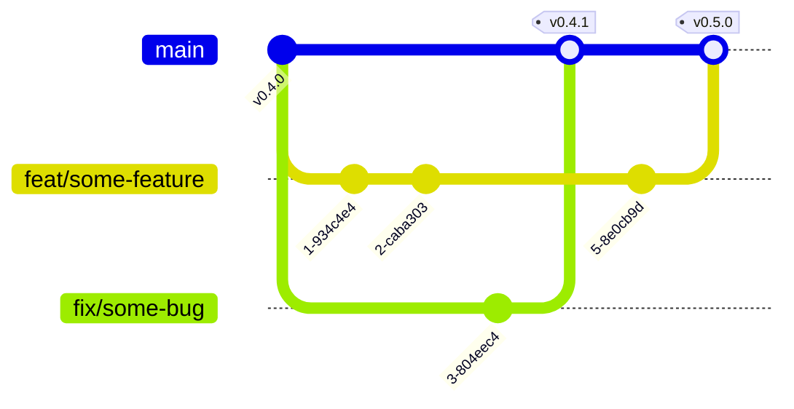
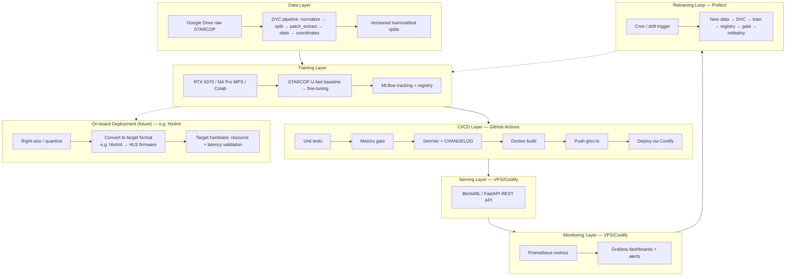
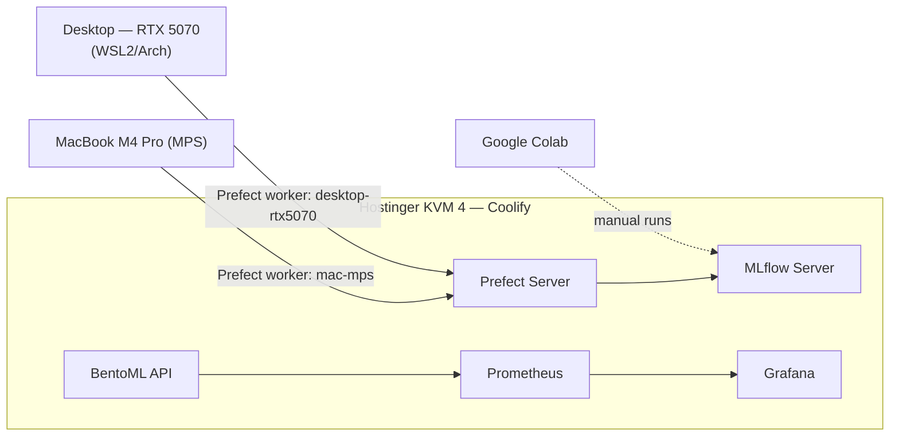
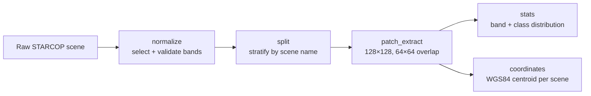
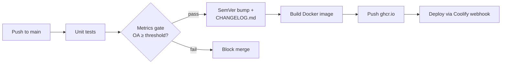
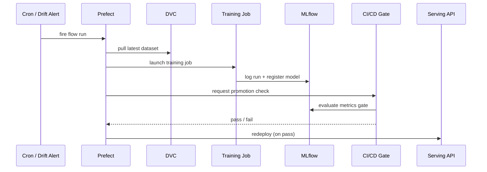
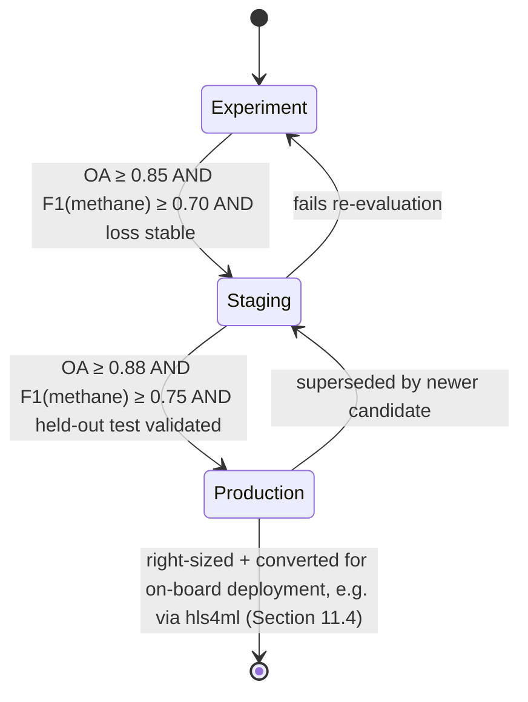
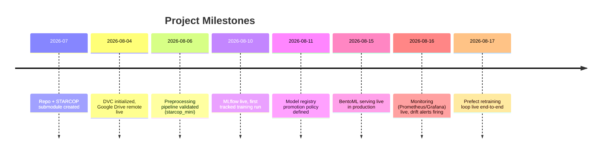
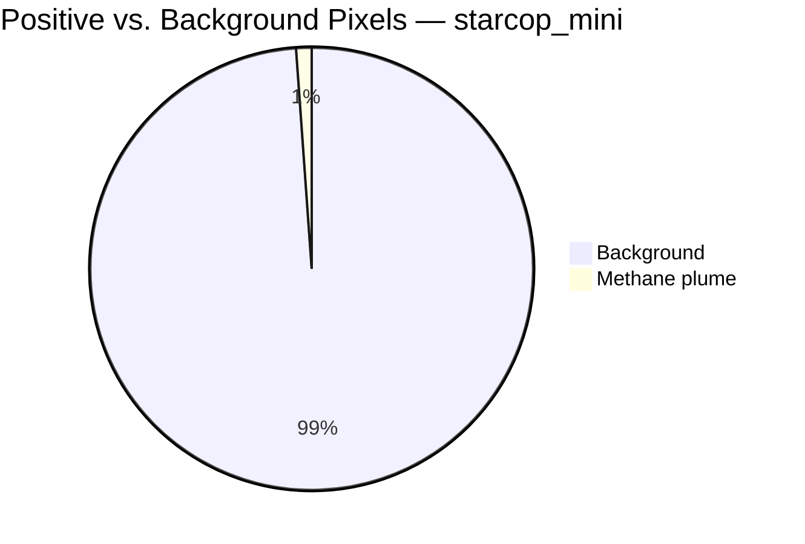

# Documentation Reorganization Plan

> **Goal**: Split this repo's sprawling documentation (one 1,230-line living plan + 3 satellite plan docs + a mixed-purpose `docs/` folder) into three clean tiers — a small root `README.md`, a public MkDocs site on GitHub Pages, and an `internal-docs/` folder for implementation journal / operational runbooks — with **zero information loss**.
> **Status**: 🟡 Plan drafted, not yet executed
> **Source material being reorganized** (not deleted by this plan — the user deletes them manually once satisfied): `mlops-methane-detection-plan.md`, `codecov-coverage-upload-plan.md`, `starcop-raw-pipeline-plan.md`, `training-runbook.md`, plus the current `docs/` folder.
> **Reference style**: [`douglas-martins/hsi-study` README](https://github.com/douglas-martins/hsi-study/blob/master/README.md) — badges, GFM alerts, collapsible sections, Mermaid diagrams, tight tables. Its academic-narrative structure (Abstract → Problem Statement → Methodology → Results) becomes the **MkDocs landing page**, not the root README, per the decisions below.

> [!IMPORTANT]
> This file is itself the deliverable being asked for: a **plan**, not the reorganized docs. Executing it happens later, in small steps (Section 9). Nothing outside this file has been touched yet.

> [!IMPORTANT]
> **Project framing — read this before anything else.** This MLOps infrastructure is a means, not the end. The actual deliverable of this Master's project is a **trained methane-detection model that runs on-board/embedded hardware** — not just a cloud REST API. The pipeline exists to make model iteration fast and reproducible: train and validate candidate architectures quickly on `starcop_mini`, graduate a candidate to a full `starcop_raw` training run once it clears the Staging thresholds already defined in `docs/model-registry.md` (OA ≥ 0.85, F1(methane) ≥ 0.70, stable loss) — and beyond that, the winning model still has to be right-sized for on-board deployment before the thesis is actually done. **FPGA-style acceleration via [hls4ml](https://fastmachinelearning.org/hls4ml/) is one concrete example of that on-board target, used throughout this plan for specificity — it is not the only option, and the final approach isn't locked in.** Every public-facing page this plan creates — `docs/index.md` and `docs/methodology.md` especially — must read as **"here's the model, how it was built, and how it runs on-board"**, not "here's an MLOps platform." Section 11 covers how the actual model-iteration and on-board-deployment work gets documented going forward, once this reorg is done.

---

## Table of Contents

1. [Decisions Locked In](#1-decisions-locked-in)
2. [Target Repository Structure](#2-target-repository-structure)
3. [Content Routing Map](#3-content-routing-map)
4. [Root README.md Specification](#4-root-readmemd-specification)
5. [CONTRIBUTING.md Specification](#5-contributingmd-specification)
6. [MkDocs Site Specification](#6-mkdocs-site-specification)
7. [Internal Docs Specification](#7-internal-docs-specification)
8. [GitHub Alert Style Guide](#8-github-alert-style-guide)
9. [Execution Steps](#9-execution-steps)
10. [Open Questions / TODO](#10-open-questions--todo)
11. [Follow-Up: Model Experimentation Roadmap](#11-follow-up-model-experimentation-roadmap)
12. [Appendix — Drafted Mermaid Diagrams](#12-appendix--drafted-mermaid-diagrams)

---

## 1. Decisions Locked In

Resolved with the user before drafting this plan — restated here so the plan is self-contained for whoever (human or AI agent) executes it later. A second round of answers (theme, CONTRIBUTING.md, changelog embedding, etc.) is folded directly into the relevant sections below and closed out in Section 10. A third round (project framing — the model is the deliverable, targeting on-board/embedded deployment, not the infrastructure — with FPGA/hls4ml used throughout as one illustrative example, not the only option) is folded in above and drives Section 11.

| # | Question | Decision |
|---|---|---|
| 1 | Where does the hsi-study-style academic narrative (abstract, problem statement, methodology, results) live? | **MkDocs landing page** (`docs/index.md`). Root `README.md` stays minimal — title, badges, one-paragraph pitch, links out. |
| 2 | Public MkDocs vs. internal-only — what's the rule? | **Stable reference → public. Journal → internal.** Architecture, dataset registry, model registry policy, dataset report, baseline metrics, and *resolved decisions as one-line outcomes* go to MkDocs. Task-by-task narrative, bug-fix logs, readiness audits, agent-prompt-hints, TODO/completion checklists, and credentials-adjacent setup guides stay internal. |
| 3 | Where does MkDocs read from, given `docs/` currently holds internal-leaning files? | **`docs/` becomes the MkDocs source** (`docs_dir`, the default). Current internal-leaning files move to a new **`internal-docs/`** folder at repo root. |
| 4 | How should plan/decision tracking work going forward, once the giant plan.md is deleted? | **Deferred by the user** — they may convert this to Spec-Driven Development (SDD) specs later. This plan keeps continuity **simple and reversible**: one `internal-docs/plan.md` + one `internal-docs/decisions.md`, no elaborate ADR machinery imposed now. Not a blocker for this reorg. |
| 5 | Where does MkDocs get hosted? | **GitHub Pages**, on this project (confirmed by the user mid-session). No `mkdocs.yml` or Pages workflow exists yet — both are new, see Section 6.3. |
| 6 | What's the actual point of this whole project? | **The model.** The infrastructure (DVC/MLflow/CI-CD/serving/monitoring/retraining) exists to support fast, repeated model iteration: prove out candidate architectures cheaply on `starcop_mini`, then graduate the ones that clear the Staging gate to a full `starcop_raw` run. The thesis deliverable is the resulting model, not the pipeline around it. See Section 11. |
| 7 | What does "the model" actually need to run on? | **On-board/embedded hardware, not a full-precision cloud GPU.** The exact target isn't locked in — **FPGA-style acceleration via [hls4ml](https://fastmachinelearning.org/hls4ml/) is one concrete example** this plan uses for specificity (a Python package, Fast Machine Learning collective, translating Keras/PyTorch/ONNX models, optionally quantization-aware via QKeras/QONNX/HGQ, into FPGA firmware via High-Level Synthesis). Whichever on-board path is chosen, it's a real architectural constraint (supported ops, likely a smaller/quantized model than STARCOP's original U-Net, possibly Linux-only tooling) — not just a deployment detail. See Section 11.4. |

> [!NOTE]
> Decision 4 means Section 7 intentionally proposes the *lightest* viable internal structure. If the user later moves to SDD specs, that's a follow-up reorg of `internal-docs/` alone — it won't touch the README/MkDocs split established here.

---

## 2. Target Repository Structure

<table><tr><td>

**Before**

```
README.md                          (comprehensive, everything mixed in)
mlops-methane-detection-plan.md    (1230 lines, journal + reference mixed)
codecov-coverage-upload-plan.md
starcop-raw-pipeline-plan.md
training-runbook.md
CHANGELOG.md
docs/
├── baseline_metrics.md
├── dataset_report.md
├── dvc-setup.md
├── environment_notes.md
├── model_registry_policy.md
├── dvc-remote-comparison.html
├── badges/*.svg
└── baseline_validation/*.png, metrics.json
```

</td><td>

**After**

```
README.md                    (small — title, badges, pitch, links)
CONTRIBUTING.md               (new — dev workflow, branching, PR conventions)
CHANGELOG.md                  (unchanged, root — semantic-release writes here)
mkdocs.yml                    (new)
docs/                         (MkDocs source — public, GH Pages)
├── index.md                  (paper-style landing page — leads with the model)
├── methodology.md            (incl. mini→raw research strategy + on-board target)
├── dataset.md
├── results.md
├── model-registry.md
├── decisions.md              (resolved outcomes only, one-liners)
├── changelog.md              (embeds CHANGELOG.md via plugin)
├── pipeline/
│   ├── overview.md           (full architecture, mermaid)
│   ├── data-layer.md
│   ├── training.md
│   ├── ci-cd.md
│   ├── serving.md
│   ├── monitoring.md
│   ├── retraining.md
│   └── onboard-deployment.md  (future — see Section 11.4, not built in this reorg)
├── badges/*.svg                (unchanged — dual-purpose: README + site)
└── assets/baseline_validation/*.png, metrics.json
internal-docs/                  (NOT published — journal + runbooks)
├── plan.md                     (trimmed living plan: phase/task status)
├── decisions.md                 (full D-01..D-10 rationale + Answers Log)
├── status.md                   (progress tracker + completion checklist)
├── model-experiments.md         (created later — see Section 11, not part of this reorg)
├── setup/
│   ├── dvc-setup.md
│   ├── environment-notes.md
│   └── mlflow-client-setup.md
├── runbooks/
│   ├── training.md              (from training-runbook.md)
│   └── starcop-raw-pipeline.md
└── plans/                       (archived design docs, as executed)
    ├── codecov-coverage-upload.md
    ├── starcop-raw-pipeline.md
    └── dvc-remote-comparison.md      (HTML → Markdown)
.github/workflows/
└── docs.yml                     (new — build + deploy MkDocs to GH Pages)
```

</td></tr></table>

> [!TIP]
> `docs/badges/*.svg` don't move. They're generated by `make badges`/`make badges-env-b` and referenced by relative path from `README.md` today; leaving them under `docs/` keeps that working *and* lets MkDocs pages reference them too (e.g. a "Build Status" note on the CI/CD page). No Makefile changes needed.

---

## 3. Content Routing Map

The ledger that guarantees nothing gets lost when the four source files are deleted. Organized by source document, one row per topic/section — not line-by-line (the plan doc is 1,230 lines; routing at section granularity keeps this map usable). `§N` in this section always refers to the *original* `mlops-methane-detection-plan.md`'s own numbering, not this document's.

### `mlops-methane-detection-plan.md`

| Section | Destination | Notes |
|---|---|---|
| Header status block ("Last Updated" narrative) | `internal-docs/plan.md` | Rolling audit-trail content — internal by nature. |
| §1 Project Context — goal statement | `docs/index.md` (paper page) + `README.md` pitch | Reframed to lead with the model (and its on-board target) as deliverable, per this plan's own framing update — not a verbatim copy. |
| §1 Project Context — "Current state" bullets | `internal-docs/status.md` | Point-in-time checklist, superseded by §6 Progress Tracker anyway. |
| §2 Infrastructure Overview (Compute Resources, VPS Services, Storage Strategy tables) | `docs/pipeline/overview.md` | Stable, reader-useful facts → public. Becomes source for the infra Mermaid diagram (§12.2). |
| §3 Open Decisions — table | **Split**: outcome one-liners → `docs/decisions.md`; full rationale → `internal-docs/decisions.md` | D-06/D-07 (still 🔲 open — Windows/NVIDIA desktop path and Google Colab) carried to `internal-docs/decisions.md` flagged open, to be resolved later; note that *if* FPGA-style on-board work (hls4ml, one candidate example) is pursued, its Linux-only tooling would be a relevant input to D-07 — see Section 11.4. |
| §4 Architecture ASCII diagram | `docs/pipeline/overview.md` | Redrawn as a Mermaid flowchart — see §12.1. |
| §5 Phase 0 — Foundations (all tasks) | `internal-docs/plan.md` | Environment setup, submodule pattern, semantic-release config — operational, not "how the system works". |
| §5 Phase 0 — the "`vendor/starcop/` is composition-only, never edited" principle | `docs/pipeline/overview.md` (as a `[!IMPORTANT]` callout) **and** `CONTRIBUTING.md` (Architecture Conventions) | Architectural design principle that explains the shape of `src/` — worth surfacing both to readers and to contributors. |
| §5 Phase 1 — Data Layer: DVC OAuth/credential setup | `internal-docs/setup/dvc-setup.md` | Credentials-adjacent. |
| §5 Phase 1 — Data Layer: preprocessing pipeline *design* (5 stages: normalize/split/patch_extract/stats/coordinates) | `docs/pipeline/data-layer.md` | Architecture-level, mirrors hsi-study's own "Preprocessing Pipeline" flowchart — see §12.3. |
| §5 Phase 2 — Experiment Tracking: MLflow deployment specifics (Coolify, Postgres, B2, migration saga) | `internal-docs/plan.md` | Deploy mechanics + a multi-step incident (resource migration) — journal. |
| §5 Phase 2 — what gets tracked per run (params/metrics/artifacts/tags) | `docs/pipeline/training.md` | Reader-useful "how it works" summary, not the debugging narrative. |
| §5 Phase 3 — Training Pipeline: model/bands/augmentation design | `docs/methodology.md` + `docs/pipeline/training.md` | Split: modeling choices → Methodology; pipeline mechanics → pipeline page. |
| §5 Phase 3 — machine-specific launch scripts, `WANDB_MODE` quirk (D-09), TDD/real-fixtures convention | `internal-docs/runbooks/training.md` **and** `CONTRIBUTING.md` (Development) | Operational how-to internally; the TDD/real-fixtures-over-mocks convention also belongs in CONTRIBUTING.md as a contributor-facing rule. |
| §5 Phase 4 — CI/CD: pipeline stages (test → gate → version bump → build → push → deploy) | `docs/pipeline/ci-cd.md` | Architecture-level flow — see §12.4. |
| §5 Phase 4 — coverage/codecov specifics, readiness-review bug logs | `internal-docs/plan.md` + `internal-docs/plans/codecov-coverage-upload.md` | Journal. |
| §5 Phase 5 — Serving: API description (BentoML, input/output contract) | `docs/pipeline/serving.md` | Reference-quality once written; note ENVI-format input gap as TODO (Section 10). This is the *cloud* serving path — the on-board/embedded path (Section 11.4, FPGA/hls4ml being one candidate example) is a separate, not-yet-started future page. |
| §5 Phase 5 — Coolify deployment, webhook secrets | `internal-docs/setup/` (new file if needed) | Credentials-adjacent. |
| §5 Phase 6 — Monitoring: what's monitored (drift, latency, error rate, spectral stats) + drift-detection design | `docs/pipeline/monitoring.md` | Architecture-level. |
| §5 Phase 6 — Grafana/Prometheus deployment, contact points | `internal-docs/plan.md` | Deploy mechanics. |
| §5 Phase 7 — Retraining Loop design (trigger → DVC pull → train → registry → gate → redeploy) | `docs/pipeline/retraining.md` | Architecture-level — see §12.5. |
| §5 Phase 7 — Prefect worker deployment (launchd, per-machine work pools, D-10) | `internal-docs/plan.md` | Deploy mechanics. |
| Every task's **Agent prompt hint** | `internal-docs/plan.md` (or dropped) | Meta/process artifact for AI-agent execution — not reader-facing. Keep only if still useful for future agent-driven work; otherwise archive-and-drop. |
| §6 Progress Tracker | `internal-docs/status.md` | Full task-level table. Public phase-level status was considered and **explicitly declined by the user** — not carried to MkDocs at all (see Section 10). |
| §7 Dataset Registry (primary + candidate datasets) | `docs/dataset.md` | Merge with `docs/dataset_report.md` content — see Section 6.2. |
| §8 Answers Log | `internal-docs/decisions.md` | Merged with §3's full rationale. |
| §9 Completion Checklist | `internal-docs/status.md` | Living TODO list. |

### Other root plan files

| File | Destination | Notes |
|---|---|---|
| ~~`codecov-coverage-upload-plan.md`~~ | **Removed — user decision, Step 9.3** | User deemed this unnecessary during execution ("we can ignore this codecov doc") and deleted the source file directly; not routed to `internal-docs/plans/`. Not part of this plan's own Step 9.11 hand-off list (that file was already deleted by the time this step ran). |
| `starcop-raw-pipeline-plan.md` (481 lines) — design/build-order/real-run diagnostics | `internal-docs/plans/starcop-raw-pipeline.md` | Journal. |
| `starcop-raw-pipeline-plan.md` — "how to re-run this pipeline" section (lines ~377–481 per the research pass) | `internal-docs/runbooks/starcop-raw-pipeline.md` | Genuine how-to, but credentials/paths make it internal, not public. |
| `training-runbook.md` (163 lines) | `internal-docs/runbooks/training.md` | Credentials-adjacent (env vars, machine-specific paths). |
| `training-runbook.md` — "known limitation" note | `internal-docs/runbooks/training.md` (stays with the rest of the file, no split) | **Resolved by Step 9.2**: re-read in full — it's STARCOP's own `run_validation` raising `KeyError` on small/skewed test splits (assumes both "easy" and "hard" no-plume examples exist), caught and logged as a warning by `train.py`; the MLflow-tracked training/metrics have already fully succeeded by that point. Doesn't affect how results are interpreted, so no `[!WARNING]` on `docs/results.md`. |

### `docs/` (current)

| File | Destination | Notes |
|---|---|---|
| `docs/baseline_metrics.md` | `docs/results.md` | Reference-quality, near-verbatim. |
| `docs/dataset_report.md` | `docs/dataset.md` | Merge with §7 Dataset Registry. |
| `docs/dvc-setup.md` | `internal-docs/setup/dvc-setup.md` | Already explicitly credential-safe ("no real IDs/secrets embedded") but still an internal how-to. |
| `docs/environment_notes.md` | `internal-docs/setup/environment-notes.md` | Env-var tables (internal) + MPS bug-fix journal (internal). |
| `docs/model_registry_policy.md` | `docs/model-registry.md` | Reference-quality, near-verbatim. Add the Mermaid state diagram (§12.6). Doubles as the promotion gate referenced by Section 11's mini→raw strategy. |
| `docs/dvc-remote-comparison.html` | `internal-docs/plans/dvc-remote-comparison.md` | Convert HTML → Markdown table; supports D-01, referenced from `internal-docs/decisions.md`. |
| `docs/badges/*.svg` | **Stays at `docs/badges/`** | Dual-use, no move needed (see Section 2 note). |
| `docs/baseline_validation/*.png`, `metrics.json` | `docs/assets/baseline_validation/` | Image assets for `docs/results.md`; update relative links after move. |

### Files that stay put, unchanged

`CHANGELOG.md` (root — semantic-release writes here; embedded into `docs/changelog.md`, linked from `README.md`).

### New content (not routed from an existing source)

- **`CONTRIBUTING.md`** (Section 5) — assembled from conventions currently scattered as implicit practice across the plan doc (TDD/real-fixtures, Conventional Commits, `vendor/starcop` composition rule, two-environment setup), not routed from one section.
- **`docs/methodology.md`'s "Research Strategy" subsection** — synthesized from the project's stated framing (this update) rather than copied from one section of the source plan: explains the `starcop_mini` → `starcop_raw` iteration approach, and the on-board/embedded end target (FPGA via hls4ml as one candidate example), conceptually, for readers.
- **`internal-docs/model-experiments.md`** — new, and explicitly **out of scope for this reorg**. This is the living tracker for actual model-iteration and on-board-conversion work (candidates tried, results, promotion decisions). See Section 11 for why it's deferred rather than built now.
- **`docs/pipeline/onboard-deployment.md`** — new, also explicitly **out of scope for this reorg** (no content exists yet — this work hasn't started, and the toolchain isn't chosen). Reserved as a nav slot for when it does. See Section 11.4.

> [!NOTE]
> The `training-runbook.md` "known limitation" row above was resolved by Step 9.2 (re-read directly, not just summarized) — see that row's updated Notes for the actual finding and destination.

---

## 4. Root README.md Specification

Small, by decision #1. Target: comparable in length to the *current* README's first ~15 lines, not its full ~140.

```markdown
# Methane Detection — end-to-end deep learning pipeline

[badges: tests-env-a, coverage-env-a, tests-env-b, coverage-env-b, codecov, lint, docs-deploy]

> **[Master's Final Project]** — Semantic Segmentation of Methane Plumes using CNN on
> Hyperspectral Imagery. [TODO: institution / advisor / one-line paper citation.]

A CNN-based methane plume detector, built on the STARCOP baseline and targeting
**on-board/embedded deployment** — the model is the deliverable. (FPGA-style
acceleration via [hls4ml](https://fastmachinelearning.org/hls4ml/) is one
candidate approach being explored, not the only option.) This repo also carries
the full MLOps pipeline (DVC, MLflow, CI/CD, BentoML serving, Prometheus/Grafana
monitoring, Prefect retraining) that makes iterating toward it fast and
reproducible: candidates are proven out cheaply on a small dataset before a
full-scale training run.

## 📖 Documentation

Full documentation — methodology, dataset, results, architecture, model registry policy —
lives at **[the MkDocs site](TODO: GitHub Pages URL once deployed)**.

## Quick Start

Minimal clone + environment bootstrap (2–4 commands), linking to
[CONTRIBUTING.md](CONTRIBUTING.md) for anything beyond that.

## Contributing

See [CONTRIBUTING.md](CONTRIBUTING.md).

## License

MIT — see [LICENSE](LICENSE).
```

> [!IMPORTANT]
> The current README's **Repository Structure**, **Getting Started** (both environments), **Testing**, **Dataset**, **Implementation Plan**, and **Infrastructure** sections move to either the MkDocs site (`docs/pipeline/overview.md`, mostly) or the new `CONTRIBUTING.md` (Section 5) — not both. Recommendation: keep the two `uv venv`/`uv sync` blocks (4 lines total) in the README as "Quick Start" since they're the single most common thing a repo visitor wants immediately, and move everything else (testing commands, badge regeneration, full env var list, branching/PR conventions) into `CONTRIBUTING.md`.

---

## 5. CONTRIBUTING.md Specification

New file, confirmed in the second round of decisions. Structure adapted from the reference [`nexdom-healthtech/uimed-vue` CONTRIBUTING.md](https://github.com/nexdom-healthtech/uimed-vue/blob/beta/CONTRIBUTING.md) — same shape (Development → Architecture → Documentation → Opening a Pull Request → Publishing), but the **branching model is deliberately simplified**, not copied verbatim (see the callout below).

```markdown
# Contributing to Methane Detection

After cloning, read this before touching anything — this repo runs **two isolated
Python environments** and one **never-edit** rule that shapes most of `src/`.

*Commit using [Conventional Commits](https://www.conventionalcommits.org/en/v1.0.0/) —
this repo's release automation (python-semantic-release) parses your commit type
directly into version bumps and CHANGELOG.md entries.*

## Development

### Environments

- **Environment A** (`vendor/starcop/.venv`, Python 3.10, torch 1.13.1) — the
  original STARCOP stack, reference-only.
- **Environment B** (`.venv`, Python 3.12, torch ≥2.5) — active development.
- **[TODO] Environment C** — may be needed if FPGA-style on-board work (Section
  11.4; `hls4ml` is one candidate approach, not the only option) moves forward:
  `hls4ml` requires Linux and does not support Windows/macOS natively.
  Not designed yet; flagged here so it isn't a surprise later.

[Setup commands — same two `uv venv`/`uv sync` blocks as the README.]

### Scripts

| Command | What it does |
|---|---|
| `make test-env-a` | Run the Environment A suite |
| `make test-env-b` | Run the Environment B suite |
| `make coverage` / `make coverage-env-b` | Run with coverage, write junit + coverage XML |
| `make badges` / `make badges-env-b` | Regenerate `docs/badges/*.svg` |
| `make docs-serve` | Serve the MkDocs site locally |
| `make docs-build` | Build the MkDocs site |

### Testing conventions

- **Test-first (RED → GREEN → REFACTOR)** — this repo's established pattern for
  every non-trivial change.
- **Real fixtures over mocks** — prefer a real tmp-path DVC repo, a real tiny
  GeoTIFF, a real sqlite-backed MLflow store over `Mock()`/interaction checks.
  Fakes (small hand-written stand-ins exposing only the used surface) are fine;
  broad mocking is not.
- Tests live in `__tests__/` folders next to the module they cover; shared
  fixtures in the root `conftest.py`.

## Architecture

> [!IMPORTANT]
> **`vendor/starcop/` is never edited — not even transiently, not even to write a
> test.** It's a pinned git submodule. Everything that needs to change STARCOP's
> behavior does it from outside: subclassing, runtime attribute overrides, or
> `types.MethodType` monkeypatching on one instance. See `docs/pipeline/overview.md`
> for the full rationale.

- No `__init__.py` in `src/` — flat import convention throughout.
- `_vendor_starcop*.py` shim modules are the only files allowed to
  `sys.path.insert(0, "vendor/starcop")`; everything else imports from the shim.

## Documentation

- **Public docs** (`docs/`, published via MkDocs to GitHub Pages) — architecture,
  methodology, dataset, results, model registry policy. Stable, reader-facing only.
- **Internal docs** (`internal-docs/`) — implementation journal, decision log,
  credentials-adjacent setup guides, runbooks, and the live model-experiments
  tracker. Not published, but not secret — it's a curation boundary, not an
  access-control one.
- Use GitHub-style alerts (`[!NOTE]`, `[!TIP]`, `[!IMPORTANT]`, `[!WARNING]`,
  `[!CAUTION]`) and Mermaid diagrams where they clarify structure or flow — see
  this repo's `docs-reorganization-plan.md` Section 8 for the alert taxonomy and
  Section 12 for diagram-type examples.

To preview docs locally: `make docs-serve`.

## Opening a Pull Request

This is a small research/thesis project on **trunk-based development against a
single long-lived branch, `main`** — no `alpha`/`beta` release channels (there's
no published package with pre-release consumers). Branch from `main`, PR back to
`main`, delete the branch after merge.



- `main` is protected against direct pushes — always PR.
- CI (`lint.yml`, `tests.yml`, `commitlint.yml`) must pass before merge.
- On merge, `release.yml` (python-semantic-release) computes the version bump
  from Conventional Commit types (`feat`→minor, `fix`/`perf`→patch), regenerates
  `CHANGELOG.md`, tags, and publishes a GitHub Release — automatically, no
  manual version bookkeeping.

## Publishing

Both the Docker image (`cd.yml` → `ghcr.io` → Coolify deploy) and this
documentation site (`docs.yml` → GitHub Pages) deploy automatically on merge to
`main`. No manual publish steps.
```

> [!NOTE]
> **Deliberate divergence from the reference file**: `uimed-vue` is a published library with real pre-release consumers, so its `alpha`/`beta`/`main` three-tier branching earns its complexity. This project has none of that — one contributor-facing branch (`main`), feature branches, PRs, semantic-release on merge. Copying the three-tier model here would be process theater. If the project ever needs a pre-release channel (e.g. a `beta` model-serving deployment), revisit this section then, not preemptively.

---

## 6. MkDocs Site Specification

### 6.1 `mkdocs.yml` plan

```yaml
site_name: Methane Detection — MLOps Pipeline
site_url: https://douglas-martins.github.io/methane-detection/   # TODO confirm exact GH Pages URL
repo_url: https://github.com/douglas-martins/methane-detection
theme:
  name: material   # confirmed by the user
  features: [navigation.tabs, navigation.sections, content.code.copy, toc.follow]
plugins:
  - search
  - include-markdown   # mkdocs-include-markdown-plugin — embeds CHANGELOG.md into docs/changelog.md
markdown_extensions:
  - admonition            # renders GFM-style alerts
  - pymdownx.superfences: # required for Mermaid fenced code blocks
      custom_fences:
        - {name: mermaid, class: mermaid, format: !!python/name:pymdownx.superfences.fence_code_format}
  - tables
  - toc: {permalink: true}
nav:
  - Home: index.md
  - Methodology: methodology.md
  - Dataset: dataset.md
  - Results: results.md
  - Pipeline:
      - Overview: pipeline/overview.md
      - Data Layer: pipeline/data-layer.md
      - Training: pipeline/training.md
      - CI/CD: pipeline/ci-cd.md
      - Serving: pipeline/serving.md
      - Monitoring: pipeline/monitoring.md
      - Retraining Loop: pipeline/retraining.md
      # - On-board Deployment: pipeline/onboard-deployment.md   # add once Section 11.4 has real content
  - Model Registry: model-registry.md
  - Design Decisions: decisions.md
  - Changelog: changelog.md
```

### 6.2 Page-by-page content & diagram plan

| Page | Primary sources | Structure (hsi-study-inspired where noted) | Diagram |
|---|---|---|---|
| `index.md` | Plan §1, README overview paragraph, [TODO paper metadata] | **Abstract (leads with: the model is the deliverable, target is on-board/embedded deployment)** → Problem Statement → **Research Strategy** (mini→raw iteration + on-board conversion — FPGA/hls4ml as one example, one paragraph, links to Methodology) → Key Contributions → Repository Structure snapshot, styled like hsi-study's README | Optional: Mermaid `timeline` of project milestones (§12.7) |
| `methodology.md` | Plan §5 Phase 1 (pipeline design) + Phase 3 (model/bands/augmentation) + this plan's framing update | Preprocessing pipeline → Model architecture → Training config → **Research Strategy: fast iteration on `starcop_mini`, promote to `starcop_raw` on clearing the Staging gate, then right-size + convert the winner for on-board deployment** (new subsection, mirrors Section 11's roadmap at a conceptual level; names FPGA/hls4ml as one candidate approach, not the only one), mirroring hsi-study's "Methodology" section | Flowchart (§12.3, preprocessing stages) |
| `dataset.md` | Plan §7 Dataset Registry + `docs/dataset_report.md` | Datasets table → class imbalance → per-band stats → geographic coverage → data-quality flags | Pie chart, class distribution (§12.8) |
| `results.md` | `docs/baseline_metrics.md` + baseline validation images | Baseline model comparison table + sample masks; **grows over time as Section 11's experiments produce results, eventually including post-conversion (e.g. hls4ml) accuracy** | (images, no diagram needed) |
| `pipeline/overview.md` | Plan §2 + §4 | Infra tables + full pipeline diagram | Flowchart, 6-layer architecture (§12.1) |
| `pipeline/data-layer.md` | Plan §5 Phase 1 | DVC pipeline stages, dataset versioning | Flowchart (reuse/link §12.3) |
| `pipeline/training.md` | Plan §5 Phase 2 (what's tracked) + Phase 3 (pipeline mechanics) | What MLflow logs per run; W&B/MLflow dual-logging | — |
| `pipeline/ci-cd.md` | Plan §5 Phase 4 | Test → gate → version → build → push → deploy | Flowchart, left-to-right pipeline (§12.4) |
| `pipeline/serving.md` | Plan §5 Phase 5 | BentoML API contract, input/output format — the *cloud* serving path | Sequence diagram (client → API → model) — draft during execution once `src/serving/` is read in full |
| `pipeline/monitoring.md` | Plan §5 Phase 6 | What's monitored, drift-detection design | — |
| `pipeline/retraining.md` | Plan §5 Phase 7 | Trigger → pull → train → registry → gate → redeploy | Sequence diagram, cross-system (§12.5) |
| `pipeline/onboard-deployment.md` *(future, not built now)* | Section 11.4, once real work exists | Right-sizing/quantization approach → conversion toolchain (e.g. hls4ml) → target backend → resource/latency results | TBD once real conversion data exists |
| `model-registry.md` | `docs/model_registry_policy.md` | Promotion criteria, metric mapping — **this is the literal gate Section 11's mini→raw roadmap checks candidates against** | State diagram, Experiment→Staging→Production (§12.6) |
| `decisions.md` | Plan §3 (outcomes only) | One row per decision, outcome + one-line why, link to `internal-docs/decisions.md` on GitHub for full rationale (public repo, so that link resolves even though the page isn't in the site nav) | — |
| `changelog.md` | `CHANGELOG.md` | `` (or equivalent per the plugin's syntax) — embedded, not linked, confirmed in the second round of decisions | — |

### 6.3 GitHub Pages deployment

New `.github/workflows/docs.yml`: on push to `main` (path-filtered to `docs/**`, `mkdocs.yml`), build with `mkdocs build --strict`, deploy via `actions/deploy-pages` (or `mkdocs gh-deploy`). Needs `pages: write` / `id-token: write` permissions and a repo Pages source set to "GitHub Actions". Mirrors the existing `.github/workflows/{lint,tests,release,cd}.yml` conventions already in this repo.

---

## 7. Internal Docs Specification

`internal-docs/` — visible on GitHub (public repo) but **not** part of the curated MkDocs nav. Per decision #4, kept deliberately simple.

- **`plan.md`** — one living file: phase/task status + prose notes, trimmed of resolved-task bug-fix narratives (those get one-line summaries, not full blow-by-blow). Direct descendant of `mlops-methane-detection-plan.md` §5.
- **`decisions.md`** — D-01..D-10 full rationale + Answers Log, merged. Open decisions (D-06/D-07 — Windows/NVIDIA desktop training path, Google Colab) clearly flagged at the top as still open, to be resolved later, now with a note that *if* FPGA-style on-board work (hls4ml, one candidate example) is pursued, its Linux-only requirement would be a relevant input (Section 11.4).
- **`status.md`** — Progress Tracker (§6) + Completion Checklist (§9) from the current plan.
- **`model-experiments.md`** — **not created by this reorg**; the future living tracker for actual model-iteration and on-board-conversion work. See Section 11.
- **`setup/`** — `dvc-setup.md`, `environment-notes.md`, plus any Phase 5 Coolify/webhook setup notes not yet in a dedicated file.
- **`runbooks/`** — `training.md`, `starcop-raw-pipeline.md`. Anything answering "how do I actually run X on my machine."
- **`plans/`** — archived, as-executed design docs: `codecov-coverage-upload.md`, `starcop-raw-pipeline.md` (design portion), `dvc-remote-comparison.md`.

> [!TIP]
> Since the repo is public, nothing in `internal-docs/` needs to be *secret* — the split is about **curation**, not access control. The research pass found no live credentials anywhere in the source docs (only env-var names and explicit placeholders), so this move is safe as a plain `git mv`.

---

## 8. GitHub Alert Style Guide

GFM alert syntax (rendered by GitHub and by `mkdocs-material`'s `admonition` extension) — use consistently across the new docs:

```markdown
> [!NOTE]
> Informational — context worth knowing, no action needed.

> [!TIP]
> A helpful suggestion or shortcut.

> [!IMPORTANT]
> Something the reader must know to use this correctly (e.g. the `vendor/starcop/`
> composition-only rule).

> [!WARNING]
> Risky if ignored — e.g. "don't commit `.dvc/config.local`."

> [!CAUTION]
> Negative/irreversible consequences — e.g. "deleting the MLflow Postgres volume
> loses run history."
```

Applied in this plan already (Sections 1, 2, 3, 4, 5, 6). Carry the same taxonomy into the MkDocs pages, `CONTRIBUTING.md`, and `internal-docs/` — e.g. `docs/pipeline/overview.md` gets an `[!IMPORTANT]` for the composition-only principle; `internal-docs/setup/dvc-setup.md` gets a `[!WARNING]` about the 7-day OAuth token expiry.

---

## 9. Execution Steps

Small, sequenced, each independently verifiable — matching this repo's existing task-list convention (Goal / Steps / Validation).

---

### STEP 9.1 — Scaffold the folder structure

- **Goal**: Create `internal-docs/` and the new `docs/` subfolders, no content yet.
- **Steps**: `mkdir -p internal-docs/{setup,runbooks,plans} docs/pipeline docs/assets`; `git mv docs/dvc-setup.md internal-docs/setup/`; `git mv docs/environment_notes.md internal-docs/setup/environment-notes.md`.
- **Validation**: `git status` shows moves, not deletes+adds (preserves history); `ls` matches Section 2's target tree so far.

### STEP 9.2 — Re-read ambiguous sources before routing them

- **Goal**: Resolve the one open flag from Section 3 (`training-runbook.md`'s "known limitation" note) and confirm nothing else was mis-summarized by the research pass.
- **Steps**: Read `training-runbook.md` and `starcop-raw-pipeline-plan.md` in full (not summary); decide the limitation note's final home per the rule in Section 3's closing warning.
- **Validation**: Routing map in Section 3 updated if the read changes any destination.

### STEP 9.3 — Write `internal-docs/` content ✅ Done

- **Goal**: All journal/operational content has its new home, verbatim or lightly trimmed (not rewritten from scratch).
- **Steps**: Draft `internal-docs/plan.md`, `decisions.md`, `status.md` from `mlops-methane-detection-plan.md`'s corresponding sections (trim resolved-task narratives per Section 7); `git mv`+adapt `training-runbook.md` → `internal-docs/runbooks/training.md`; extract starcop-raw's "how to re-run" section → `internal-docs/runbooks/starcop-raw-pipeline.md`; `git mv` the rest of `starcop-raw-pipeline-plan.md` and `codecov-coverage-upload-plan.md` → `internal-docs/plans/`; convert `docs/dvc-remote-comparison.html` → `internal-docs/plans/dvc-remote-comparison.md` (table content, drop the styled HTML). **Do not** create `model-experiments.md` here — see Section 11.
- **Deviations from the plan as written, discovered during execution**:
  - **`git mv` wasn't applicable** — Step 9.1's readiness check already found all four root source files (plus `docs/dvc-remote-comparison.html`) are untracked, never committed, so there was no history for `git mv` to preserve. `internal-docs/plan.md`/`decisions.md`/`status.md`/`runbooks/training.md`/`plans/starcop-raw-pipeline.md`/`runbooks/starcop-raw-pipeline.md`/`plans/dvc-remote-comparison.md` were all written fresh via `Write`, with the root originals left untouched (consistent with this plan's own "not deleted by this plan" rule).
  - **`codecov-coverage-upload-plan.md` was not routed** — the user explicitly decided during execution this archival wasn't necessary. It stays unrouted at the repo root; Section 3's row above reflects this.
- **Validation**: Every row in Section 3 marked "internal" (except the now-skipped codecov row) has a landing file — confirmed: `internal-docs/{plan,decisions,status}.md`, `internal-docs/runbooks/{training,starcop-raw-pipeline}.md`, `internal-docs/plans/{starcop-raw-pipeline,dvc-remote-comparison}.md` all exist with real content, not stubs. `internal-docs/setup/{dvc-setup,environment-notes}.md` from Step 9.1 still in place.

### STEP 9.4 — Scaffold MkDocs page stubs (visually marked WIP) ✅ Done

- **Goal**: Every "public" page from Section 3/6.2 exists as a real file with working nav — so `mkdocs.yml` (Step 9.5) has a complete site to build against and the GH Pages deploy (Step 9.6) has something real to publish — but each page is a **stub**, not real content. Full content-writing is deliberately deferred to Step 9.4b below, so this step stays small, fast, and independently mergeable (a buildable-but-honest site beats a half-populated one that looks finished).
- **Steps**: Create the same page set as originally planned — `index.md`, `methodology.md`, `dataset.md`, `results.md`, `model-registry.md`, `decisions.md`, then the 7 `pipeline/*.md` pages (still **not** `pipeline/onboard-deployment.md` — no real content exists, Section 11.4). Each stub file gets: an `H1` title, one line describing what the page will cover (lifted from Section 6.2's "Primary sources"/"Structure" columns — enough that the nav isn't just empty labels), and a prominent WIP marker directly under the title:

  ```markdown
  > [!WARNING]
  > 🚧 **Work in progress** — this page is a placeholder. Full content is coming in a follow-up pass.
  ```

  No internal step numbers (e.g. "Step 9.4b") in the banner text itself — those are this repo's own internal task-tracking vocabulary and won't mean anything to a public reader once this reorg is finished and `docs-reorganization-plan.md` itself is gone.

  `[!WARNING]` chosen over `[!NOTE]` from Section 8's taxonomy specifically for its stronger visual weight in `mkdocs-material` (orange, not blue) — a stub page being mistaken for a finished one is the failure mode this banner exists to prevent, so it should be hard to miss, not merely informational.
- **Validation**: `mkdocs build --strict` (once 9.5 sets up the config) succeeds — full nav renders, no broken links, every page loads. Every page visibly shows the WIP banner at the top when rendered locally (`make docs-serve`).
- **Confirmed**: all 13 stub pages created — `docs/{index,methodology,dataset,results,model-registry,decisions}.md` and `docs/pipeline/{overview,data-layer,training,ci-cd,serving,monitoring,retraining}.md`. `docs/changelog.md` deliberately **not** created here — that's Step 9.5's deliverable (the include-directive file, not prose). `mkdocs build --strict` itself can't run yet (no `mkdocs.yml` until Step 9.5) — deferred, not skipped.

### STEP 9.4b — Write full MkDocs page content

- **Goal**: Replace every stub from Step 9.4 with real content, per Section 6.2 — including the model-first, on-board-target framing on `index.md` and the Research Strategy subsection on `methodology.md`. This is the original Step 9.4 as first drafted, run as its own pass once the stubbed site (9.4–9.6) is live rather than blocking the site's first deploy.
- **Steps**: One page at a time — `index.md`, `methodology.md`, `dataset.md` (merge dataset_report + registry), `results.md` (move baseline_metrics + images), `model-registry.md`, `decisions.md` (outcomes table), then the 7 `pipeline/*.md` pages. Apply GH alerts per Section 8 where called out in Section 3/6.2. Remove each page's WIP banner (Step 9.4) as its real content lands — do this per-page, not as one final sweep, so a partially-updated site never silently claims a still-stub page is finished.
- **Validation**: `mkdocs build --strict` still passes after each page — run it per page to catch drift early rather than all at once. A reader landing on `index.md` should understand the model — and its on-board target — is the point within the first paragraph. No page should carry both real content and the WIP banner at the same time.

### STEP 9.5 — Set up MkDocs tooling ✅ Done

- **Goal**: `mkdocs.yml` per Section 6.1, buildable locally, including the CHANGELOG.md embed.
- **Steps**: Add `mkdocs`, `mkdocs-material`, `mkdocs-include-markdown-plugin`, `pymdownx` extras to a new `docs` dependency group in root `pyproject.toml` (mirrors the existing `dev` group pattern); write `mkdocs.yml`; write `docs/changelog.md` with the include directive; add `make docs-serve` / `make docs-build` targets to the `Makefile`, matching existing target-naming conventions.
- **Unplanned fix along the way**: `make docs-build --strict` initially failed — `docs/hls4ml-methane-model-hypotheses.md` (929 lines, appeared in `docs/` outside this reorg's own edits) had 3 broken relative links and, per Section 11/decision #2, its model-hypothesis research-journal content is internal by this plan's own public/internal rule anyway. Moved (not copied) to `internal-docs/plans/hls4ml-methane-model-hypotheses.md` per the user's direction — clears the build error and correctly homes the content.
- **Package name note**: the plan's `pymdownx` extra doesn't exist on PyPI under that name — installed as `pymdown-extensions` (the real package `pymdownx` is the Python import name of), which is what actually provides the `pymdownx.superfences` Mermaid fence support `mkdocs.yml` configures.
- **Validation**: ✅ `uv sync --group docs` installs cleanly. `make docs-build` (strict) succeeds — only benign `INFO`-level "not in nav" notices for the three not-yet-routed legacy `docs/*.md` files (`baseline_metrics.md`, `dataset_report.md`, `model_registry_policy.md`), which Step 9.4b routes away. Mermaid rendering confirmed via a throwaway fenced block (`<pre class="mermaid">`-equivalent renders, removed after confirming — no page has a real diagram yet since content is still stubbed per Step 9.4). `make docs-serve` confirmed live at `http://127.0.0.1:8000/methane-detection/` (path-prefixed per `site_url`) — `/`, `/changelog/`, and `/pipeline/overview/` all return 200, the Changelog page shows real `v0.19.0` content (not a stub), and a stub page's WIP banner renders correctly.

### STEP 9.6 — GitHub Pages deploy workflow

- **Goal**: `.github/workflows/docs.yml` live, deploying on push to `main`.
- **Steps**: Write the workflow per Section 6.3; set repo Settings → Pages → Source → GitHub Actions; do one manual `workflow_dispatch` run to confirm before relying on the path-filtered auto-trigger.
- **Validation**: Site reachable at the GH Pages URL; update that URL into `mkdocs.yml`'s `site_url` and into the new `README.md` (Section 4's TODO).

### STEP 9.7 — Rewrite root README.md

- **Goal**: Small README per Section 4's skeleton.
- **Steps**: Replace content; keep the badge row; fill in the GH Pages link from 9.6; link to the new `CONTRIBUTING.md`; leave paper-metadata TODOs exactly as marked (user fills in later, per the second round of decisions).
- **Validation**: README renders correctly on GitHub; every link in it resolves (no 404s to not-yet-created pages).

### STEP 9.8 — Write CONTRIBUTING.md

- **Goal**: `CONTRIBUTING.md` per Section 5's skeleton, at repo root.
- **Steps**: Fill in the environment/scripts tables from the real `Makefile` targets and `pyproject.toml` dependency groups (don't hand-copy from this plan — verify against the actual files at execution time, in case they've drifted); confirm the `gitGraph` diagram renders; cross-link from `README.md` (already done in 9.7) and from `docs/pipeline/overview.md`'s composition-only callout.
- **Validation**: `CONTRIBUTING.md` renders correctly on GitHub (gitGraph diagram included); every command in its Scripts table actually runs successfully.

### STEP 9.9 — Cross-linking and badge pass

- **Goal**: No dead links anywhere across `README.md`, `CONTRIBUTING.md`, `docs/`, `internal-docs/`.
- **Steps**: Grep all trees for `](docs/` / `](../` style relative links broken by the moves; fix. Confirm `docs/badges/*.svg` still render in both the README and (optionally) a `docs/pipeline/ci-cd.md` badges row.
- **Validation**: A link-checker pass (e.g. `mkdocs build --strict` catches internal doc links; a simple `grep -r "](.*\.md)"` + manual spot check covers the rest) turns up nothing broken.

### STEP 9.10 — Content-loss audit

- **Goal**: Confirm every fact from the four source files has a home before they're deleted.
- **Steps**: Walk Section 3's routing map top to bottom; for each row, confirm the destination file actually contains that content now (not just that a file exists).
- **Validation**: Audit checklist in this step fully checked off; report back to the user explicitly rather than assuming.

### STEP 9.11 — Hand-off

- **Goal**: User reviews and manually deletes `mlops-methane-detection-plan.md`, `codecov-coverage-upload-plan.md`, `starcop-raw-pipeline-plan.md`, `training-runbook.md`.
- **Steps**: None for the agent — explicitly the user's action, per their instruction not to delete these files.
- **Validation**: N/A (user-performed).

> [!NOTE]
> Once Step 9.11 is done, the next planning artifact is **not** part of this reorg — it's the model-experimentation and on-board-deployment roadmap described in Section 11, deliberately deferred so this plan stays scoped to documentation structure, not research planning.

---

## 10. Open Questions / TODO

Most of the first-round open questions were resolved by the user in a second round of answers — captured here for a clean audit trail, plus what's still genuinely open.

**Resolved (second round)**:

- ✅ **Paper metadata** (title, abstract, advisor/institution, dates, publication link) — confirmed left as `[TODO]` placeholders in `docs/index.md` and `README.md`; the user will fill these in later. Not blocking execution.
- ✅ **MkDocs theme** — `mkdocs-material`, confirmed. Reflected in Section 6.1.
- ✅ **Phase-level status on the public site** — declined. No status/progress content goes to MkDocs; `internal-docs/status.md` is the only home for it.
- ✅ **Public "Contributing" page** — yes, as a root `CONTRIBUTING.md` (not an MkDocs page), spec'd in Section 5, styled after the `uimed-vue` reference with a simplified single-branch model.
- ✅ **`docs/changelog.md` embedding mechanism** — embed (via `mkdocs-include-markdown-plugin`), not link. Reflected in Section 6.1/6.2.
- ✅ **D-06 / D-07** (RTX 5070 desktop training path: WSL2 vs Arch; Colab vs local) — confirmed to carry forward into `internal-docs/decisions.md` as still-open, to be resolved later (covers the Windows/NVIDIA desktop path and Google Colab). Not this plan's job to resolve; not a docs gap.

**Resolved (third round)**:

- ✅ **What's the actual point of this project** — the model, targeting on-board/embedded deployment, not the infrastructure. FPGA-style acceleration via hls4ml is used throughout this plan as one concrete example of that target, **not the only option** — the user explicitly flagged this mid-session. This plan states the framing up front (see the header, and Decisions 6–7) and reflects it in `docs/index.md`, `docs/methodology.md`, and the README pitch (Sections 4, 6.2). The detailed "how" — including which on-board approach actually gets chosen — is deliberately deferred to Section 11, not fleshed out inline here.

**Resolved (Step 9.2)**:

- ✅ **`training-runbook.md`'s "known limitation" note** — re-read in full: it's STARCOP's own `run_validation` raising `KeyError` on small/skewed test splits, caught and logged as a warning by `train.py`, with the MLflow-tracked training/metrics already fully succeeded by that point. Doesn't affect result interpretation, so it stays entirely internal in `internal-docs/runbooks/training.md` — no `docs/results.md` callout needed. See Section 3.

**Still open**:

- [ ] **`site_url` in `mkdocs.yml`** — exact GH Pages URL, confirm once Step 9.6 deploys (`https://douglas-martins.github.io/methane-detection/` is the placeholder assumption).
- [ ] **`docs/pipeline/serving.md`'s sequence diagram** — deferred until `src/serving/` is read in full during Step 9.4, so the diagram reflects the real request/response contract instead of a guess.
- [ ] **`internal-docs/model-experiments.md`'s exact format** — Section 11 sketches its purpose and rough shape but deliberately doesn't fully design it here; that's its own planning pass, after this reorg lands.
- [ ] **Which on-board deployment approach is actually chosen** — FPGA/hls4ml is one example used throughout this plan for concreteness; the real decision (FPGA vs. another embedded target, and if FPGA, which toolchain) isn't made here. If hls4ml specifically is chosen: Section 11.4 flags it's Linux-only and needs a vendor HLS backend (Vivado/Vitis/Intel/Catapult/oneAPI); whether that means a third `uv` environment, a container, or folding into resolving D-07 is not decided here either.

---

## 11. Follow-Up: Model Experimentation Roadmap

> [!IMPORTANT]
> **This section is documentation of intent, not an execution step.** Nothing in Section 9 creates `internal-docs/model-experiments.md` or `docs/pipeline/onboard-deployment.md`, and nothing here runs any training or on-board conversion. This section exists so the model-iteration and on-board-deployment strategy — the actual point of the project — is written down now, in the same place as the docs restructuring it depends on, rather than lost between conversations. Turning this into its own detailed plan (mirroring this document's Goal/Steps/Validation shape) is the natural next step once Section 9 is done.
>
> Throughout this section, **FPGA-style acceleration via hls4ml is used as one concrete, worked example of "on-board deployment" — not a decision that it's the chosen path.** The actual approach (FPGA vs. another embedded target, and which toolchain) is genuinely undecided; see Section 11.5.

### 11.1 The strategy, stated plainly

1. **Iterate fast on `starcop_mini`.** Small dataset (18 scenes), fast training runs (TASK-3.2 already proved ~2× speedup on the Mac's MPS backend vs. CPU), cheap MLflow-logged experiments. This is where new architectures, band combinations, loss functions, and augmentation choices get tried and compared — the loop this whole pipeline (Phases 1–2) was built to make painless.
2. **Gate on the existing Staging criteria before scaling up.** `docs/model-registry.md` already defines this: OA ≥ 0.85, F1(methane) ≥ 0.70, stable loss (no NaN/Inf, bounded variance). A candidate only earns a full-dataset run once it clears this bar on `starcop_mini` — the gate that already exists for a different purpose (registry promotion) doubles as the mini→raw promotion criterion.
3. **Validate on `starcop_raw` (the full dataset) once a candidate looks real.** 141,218 train patches vs. `starcop_mini`'s much smaller set, and a materially different class imbalance (~314:1 positive:background on `starcop_raw` vs. ~87:1 on `starcop_mini`, per TASK-1.3's dataset report) — a candidate that clears Staging on the easier mini distribution still has to prove itself here, evaluated against the Production criteria (OA ≥ 0.88, F1(methane) ≥ 0.75, held-out test set).
4. **A model that clears Production is a candidate for on-board deployment — not yet the finished thesis deliverable.** Step 5 is what actually finishes it.
5. **Convert and validate the winning model for on-board deployment.** Right-size and/or quantize it for the chosen target, convert it to that target's deployable format, and confirm resource utilization/latency are feasible. **Worked example, not the only path**: via [hls4ml](https://fastmachinelearning.org/hls4ml/) — quantize with QKeras/QONNX/HGQ, convert to FPGA HLS firmware, validate on the target HLS backend. This — not the MLflow Production gate — is the actual finish line for the thesis, whichever on-board approach is ultimately chosen.

### 11.2 What this implies for `internal-docs/model-experiments.md` (not built yet)

A living tracker, analogous in spirit to `internal-docs/plan.md`/`decisions.md` (an evolving journal, not a stable reference) — rough shape to refine when it's actually written:

- One row per candidate: architecture/config summary, `starcop_mini` MLflow run ID, Staging-gate result (pass/fail + which metric), decision (promoted to `starcop_raw` / not), `starcop_raw` run ID if promoted, Production-gate result.
- For candidates that clear Production: on-board approach chosen, right-sizing/quantization method used, conversion status, resource utilization estimate (e.g. LUTs/DSPs/BRAM if FPGA, or the backend-equivalent otherwise), latency estimate, post-conversion accuracy delta vs. the float model.
- A running note on what's been tried and ruled out, so future-session-you (or an AI agent picking this up cold) doesn't re-try a dead end.
- Explicitly **internal**, not MkDocs — it's a live research journal, not a finished reference page, consistent with the split rule in decision #2.

### 11.3 What this implies for the public docs (already reflected above)

- `docs/methodology.md` gets a **Research Strategy** subsection (Section 6.2) stating the mini→raw approach and the on-board end target conceptually — written once, doesn't change every time a new candidate is tried.
- `docs/results.md` is the page that grows over time as real candidates clear both gates — it starts as just the STARCOP baseline comparison (from `docs/baseline_metrics.md`) and gains a row per successful candidate, eventually including post-conversion (e.g. quantized, on-FPGA) accuracy alongside the float-model number.
- `docs/index.md`'s Abstract leads with the model and its on-board target, not the pipeline, so a first-time reader immediately understands what this project is actually for.
- `docs/pipeline/onboard-deployment.md` (Section 6.2, currently a reserved nav slot with no content) becomes real once on-board conversion work actually starts — documents the right-sizing/quantization approach, the conversion pipeline, the chosen target/toolchain, and resource/latency results.

### 11.4 On-board deployment — hls4ml as a worked example of what's involved

The winning model isn't done when it clears the Production gate on `starcop_raw` — the real target is an **on-board-deployable** implementation. This subsection uses [hls4ml](https://fastmachinelearning.org/hls4ml/) (an FPGA-focused package maintained by the Fast Machine Learning collective, translating Keras/PyTorch/ONNX models into FPGA firmware via High-Level Synthesis) as a **concrete worked example** — one candidate approach among others (e.g. other embedded/edge accelerators), not a chosen path. Constraints worth stating now, even though none of them get resolved in this docs plan, and even though the final approach may differ from this example entirely:

- **Framework/op support**: hls4ml (stable release 1.3.0 as of this writing) supports Keras, PyTorch, and ONNX/QONNX frontends, and natively handles MLP and 1D/2D CNN architectures. STARCOP's U-Net-style encoder-decoder with skip connections needs checking against hls4ml's actual supported layer set — **not assumed to work out of the box**; this may force a simpler or restructured architecture for the on-board candidate specifically.
- **Quantization-aware training** (QKeras / QONNX / HGQ) is the realistic path to a resource-feasible FPGA model — full-precision float32 rarely fits. Likely means a *dedicated* quantization-aware training pass on top of whatever wins the `starcop_raw` gate, not a direct conversion of the winning checkpoint.
- **Tooling is Linux-only** — hls4ml does not support Windows/macOS natively (WSL is the documented workaround). This directly interacts with **D-07** (WSL2 vs. Arch Linux for the Desktop RTX 5070 machine, still open in `internal-docs/decisions.md`) — hls4ml work tips the scale toward a Linux-based environment regardless of which way D-07 resolves for training itself.
- **A vendor HLS toolchain is required** alongside hls4ml itself (Vivado/Vitis HLS, Intel HLS, Catapult HLS, or oneAPI) — a genuinely new piece of infrastructure; license and installation not evaluated yet.

### 11.5 Explicitly not decided here

- The actual list of candidate architectures/variants to try — that's modeling work, not a docs question, and belongs in `internal-docs/model-experiments.md` once it exists.
- Which HLS backend/target FPGA to target, and whether that choice is driven by lab/university hardware access already available or still needs sourcing.
- Whether hls4ml's Linux-only requirement folds into resolving D-07, or whether a third, dedicated environment (separate from Env A/B) is needed specifically for hls4ml + HLS toolchain work — flagged in Section 10, not designed.
- Whether `internal-docs/model-experiments.md` and `docs/pipeline/onboard-deployment.md` get their own creation tasks in this repo's *next* planning document, or get folded into whatever resolves D-06/D-07 first. Flagged, not assumed.

---

## 12. Appendix — Drafted Mermaid Diagrams

Ready-to-adapt drafts, one per diagram cited above, chosen for fit (not defaulted to `flowchart` everywhere):

### 12.1 Architecture overview → `flowchart` (layered pipeline, matches the current ASCII diagram's shape)



### 12.2 Infrastructure topology → `flowchart` (nodes/edges fit compute→services mapping better than a table alone)



### 12.3 Preprocessing pipeline → `flowchart LR` (directly mirrors hsi-study's own preprocessing diagram style)



### 12.4 CI/CD pipeline → `flowchart LR` (sequential gate, left-to-right reads naturally)



### 12.5 Retraining loop → `sequenceDiagram` (best fit — it's a cross-system call sequence, not a static structure)



### 12.6 Model registry lifecycle → `stateDiagram-v2` (promotion criteria are transition guards — a state machine, not a flow)



> [!NOTE]
> This is also, literally, the mini→raw promotion gate described in Section 11 — "Staging" is the bar a candidate clears on `starcop_mini`, "Production" is what a `starcop_raw` run has to prove, and the new terminal transition marks that Production still isn't the finish line — on-board conversion is.

### 12.7 Project milestones (optional, for `docs/index.md`) → `timeline`



### 12.8 Class imbalance → `pie` (proportion is the point — a pie reads faster than a bar for a two-class split)



> [!NOTE]
> Add a second pie (or a grouped bar, if comparing two datasets side-by-side matters more than each one's internal split) for `starcop_raw`'s 0.32%/99.68% split during Step 9.4 — the ~3.6× imbalance-ratio difference between the two datasets is itself a citable finding from the original dataset report, and directly relevant to Section 11's mini→raw strategy (a candidate tuned on mini's easier imbalance may need loss-function adjustments before it's fair to evaluate on raw).

---

*This plan routes every identified piece of content from the four source files and the current `docs/` folder into one of: root README, `CONTRIBUTING.md`, MkDocs site, or `internal-docs/`. Section 3 is the audit ledger — Step 9.10 exists specifically to verify it before anything gets deleted. Section 11 is where the actual point of the project — a model that runs on-board, with FPGA/hls4ml as one worked example of how — gets its own planning trail, deliberately kept separate from this reorg's scope.*
