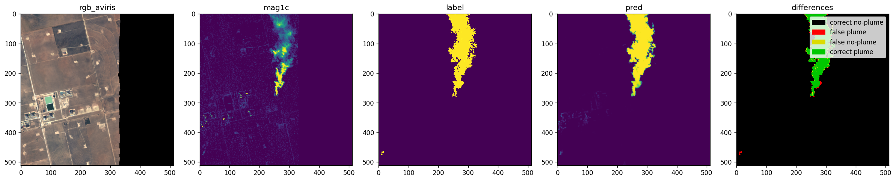
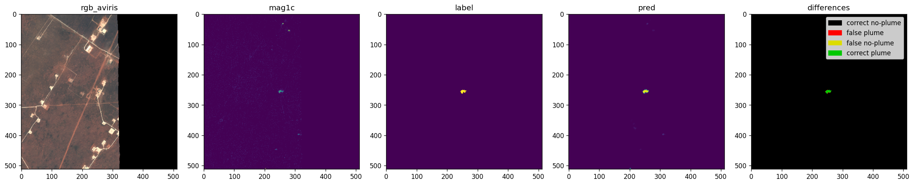
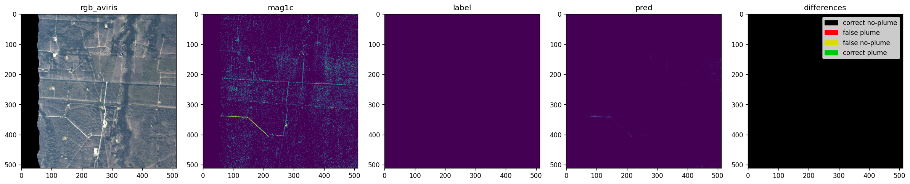

# Results

This project reproduces [STARCOP](https://www.nature.com/articles/s41598-023-44918-6)
(Růžička et al., *Scientific Reports* 2023), a machine learning model that finds
methane plumes in airborne hyperspectral and multispectral imagery, the kind of
early leak detection that matters for climate accountability, since methane traps
roughly 80 times more heat than CO₂ over a 20-year span.

> [!IMPORTANT]
> The numbers on this page are **not** a new model this project trained. They're
> the paper's own released checkpoints, evaluated here against the paper's own
> full held-out test set (342 scenes), a reproduction check, confirming the
> released models actually perform as reported before anything gets built on
> top of them.

## How well does it work?

Three model variants are evaluated, matching the paper's own released checkpoints,
two hyperspectral (**HyperSTARCOP**, using AVIRIS-NG imagery) and one multispectral
(**MultiSTARCOP**, simulating WorldView-3, a more widely available but lower-signal
sensor). Reproduction numbers below come straight from the evaluation pipeline's own
output, not retyped by hand, they regenerate automatically every time the benchmark
is re-run.



> [!NOTE]
> Every reproduction number lands close to the paper's own reported range, mostly
> within about one standard deviation of the paper's 5-run average expected,
> since each checkpoint here is one specific run, not an average of five.
> `mag1c + rgb` (HyperSTARCOP's strongest variant) reproduces the tightest;
> MultiSTARCOP, evaluated on a sensor with a fundamentally weaker methane signal,
> reproduces its own comparatively lower numbers just as faithfully.

## See it in action

Three real scenes from the held-out test set, run through the strongest variant
(`mag1c + rgb`) live via the deployed API, not a cherry-picked demo, the model's
own highest-confidence pick in each category.

> [!TIP]
> Each image reads left to right: true-color imagery, the mag1c enhancement that
> makes methane visible to the model, the ground-truth label, the model's
> prediction, and a difference map (🟢 correctly found plume, ⚫ correctly
> clear, 🔴 false alarm and 🟡 missed).

**A large plume, caught cleanly.** The predicted shape closely tracks the true
plume boundary.

**A small plume, still caught.** Weak, low-concentration leaks are the harder
case, easy to miss entirely, and this is exactly the kind of detection that
matters most for catching leaks early.

**A clean scene, correctly cleared.** No plume in the label, none predicted,
the entire frame reads as correct no-plume. Avoiding false alarms matters as
much as catching real leaks; a model that cries wolf constantly is not one
anyone can act on.

## What do these numbers mean

- **Strong-plume F1**: how well the model finds large, high-emission-rate
  leaks. Balances catching real plumes against not raising false alarms;
- **Weak-plume F1**: the same balance, but for small, low-concentration
  leaks, the harder and arguably more important case, since these are the
  ones easiest to miss;
- **FPR (false positive rate)**: how often a genuinely clean scene gets
  wrongly flagged as having a leak. Lower is better;
- **AUPRC (Area Under the Precision-Recall Curve)**:
  a single score summarizing how well the model ranks real
  plumes above false alarms across every possible confidence threshold, not
  just one fixed cutoff.

## How this was verified

Two checks, both real, both automated:

1. **Offline accuracy**: each checkpoint's predictions across all 342
   held-out test scenes are compared against the paper's own ground-truth
   labels, producing the table above;
2. **Live API agreement**: for a handful of curated scenes, the *actually
   deployed* inference API is sent the same input and its response is
   compared pixel-for-pixel against the offline result, confirming the
   served model behaves identically to what was benchmarked, not just that
   the benchmark itself ran correctly.

The live check only applies to the two HyperSTARCOP variants, MultiSTARCOP
isn't served in production today.

| Variant | Live API check |
| --- | --- |
| `mag1c + rgb` | ✅ passed |
| `mag1c only` | ✅ passed |
| MultiSTARCOP (Varon) | ℹ️ out of scope, not deployed live |

> [!NOTE]
> A failed or skipped check would be stated here plainly, not omitted, this
> page never claims a verification that didn't actually happen.

## Historical: STARCOP mini-set smoke test

> [!WARNING]
> The numbers below predate the full benchmark above and are **not
> comparable** to it, a different, much smaller test set (9 scenes vs. 342)
> and pooled-pixel metrics instead of the paper's own per-tile stratified
> ones. Kept here for the historical record only.

| Model | Overall Accuracy | Balanced Accuracy | F1 (methane) | IoU (methane) |
|---|---|---|---|---|
| **HyperSTARCOP** (AVIRIS hyperspectral, 4ch: mag1c + 3 TOA bands) | 0.9965 | 0.9594 | 0.9065 | 0.8290 |
| **MultiSTARCOP** (WorldView-3 multispectral ratio bands) | 0.9844 | 0.6504 | 0.4197 | 0.2656 |

## Under the hood

This benchmark runs on an [MLflow](https://mlflow.org) tracking server for the
permanent record of every evaluation, a [Prefect](https://www.prefect.io) flow
that regenerates it end to end on demand, and a [BentoML](https://www.bentoml.com)
service for the live API check above. See `docs/pipeline/` for the
infrastructure write-up, this page is about the model, not the platform.
